# CareLog

**Health monitoring for you and your loved ones**

CareLog is a healthcare monitoring platform designed for elderly patients and their care teams. It enables caregivers (family members) to create patient profiles, invite attendants, and monitor vitals — while attendants and patients can log daily health readings with offline-first reliability.

## Key Features

- **Multi-role support** — Caregivers, Attendants, Patients, and Doctors each get a tailored experience
- **6 vital types** — Blood Pressure, Blood Glucose, Temperature, Weight, Heart Rate (Pulse), SpO2 (Oxygen)
- **Offline-first** — Readings are stored locally and synced when connectivity is available
- **Care team management** — Invite attendants and manage family members
- **Trends & history** — View vitals over 7, 30, or 90 days with per-vital filtering
- **FHIR R4 compliant** — Clinical data follows healthcare interoperability standards
- **Alerts & thresholds** — Configurable limits with push notifications

## Architecture

```
Clients (Android, iOS, Web) → API Gateway → Lambda Functions → RDS PostgreSQL / S3
                                                              ↕
                                                         SQS (async)
```

| Component | Technology |
|-----------|-----------|
| Android | Kotlin, Jetpack Compose, Hilt, Room DB, HAPI FHIR |
| iOS | Swift, SwiftUI, Spezi Framework, FHIRModels |
| Web Portal | React, TypeScript, Vite, AWS Amplify |
| Backend | Node.js 20, AWS Lambda (24 functions) |
| Auth | AWS Cognito (4 user groups) |
| Database | PostgreSQL 15 (RDS), S3 (FHIR observations) |
| Infrastructure | Terraform, KMS encryption, SSM bastion |

## App Walkthrough (Android)

### 1. Sign In / Registration

New users register as a **Caregiver** (family member). The registration flow collects name, email, and password, then verifies via email code.

<p align="center">
  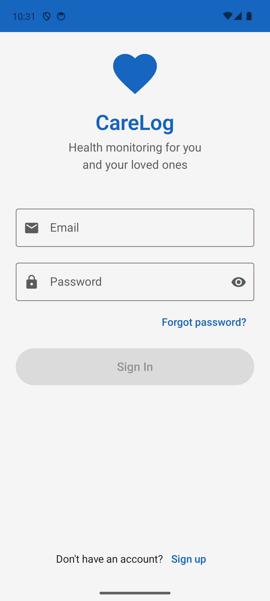
  &nbsp;&nbsp;
  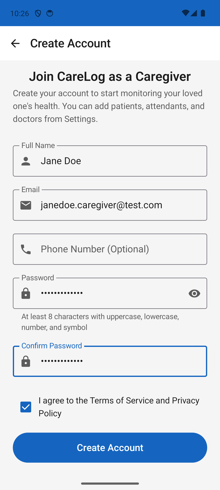
  &nbsp;&nbsp;
  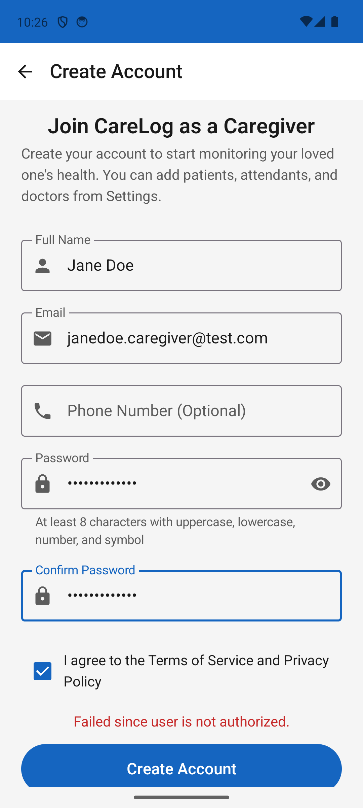
</p>

### 2. Caregiver Dashboard

After signing in, the caregiver sees their dashboard with the patient they're monitoring. Quick-access buttons for **Thresholds** and **Reminders** sit at the top, followed by vitals cards showing the latest readings.

<p align="center">
  
  &nbsp;&nbsp;
  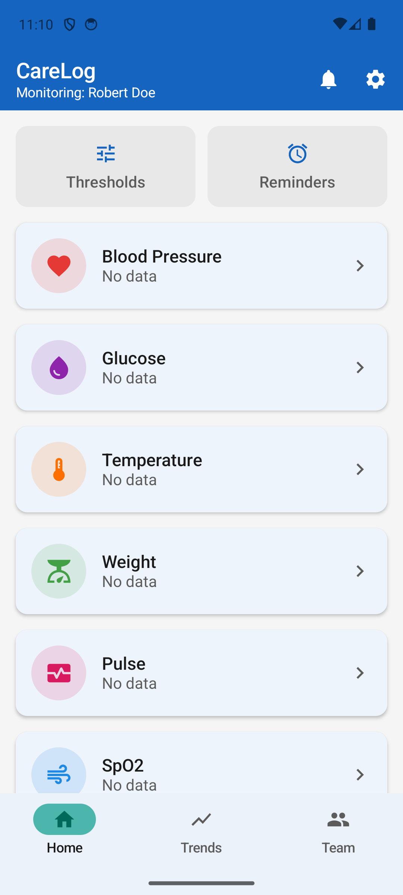
</p>

### 3. Add a Patient

Caregivers create a patient profile with medical details — name, date of birth, gender, blood type, medical conditions, allergies, and current medications.

<p align="center">
  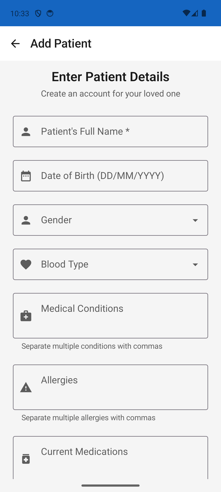
  &nbsp;&nbsp;
  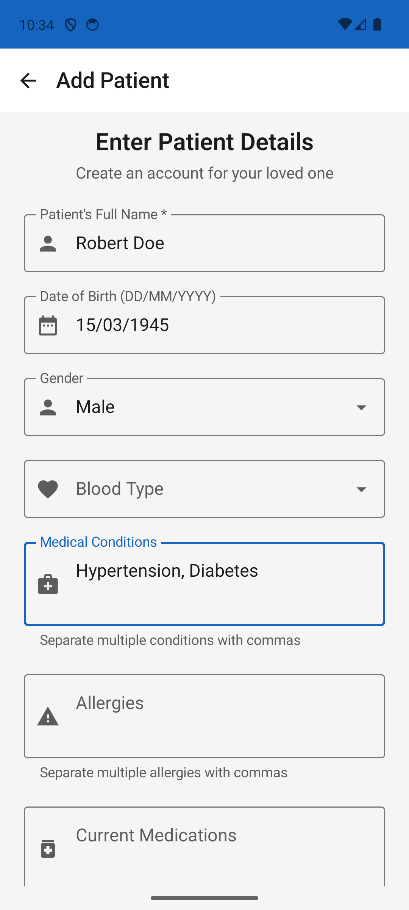
</p>

### 4. Care Team Management

The **Team** tab shows attendants and family members. Caregivers can invite new attendants by email, and manage the care team for their patient.

<p align="center">
  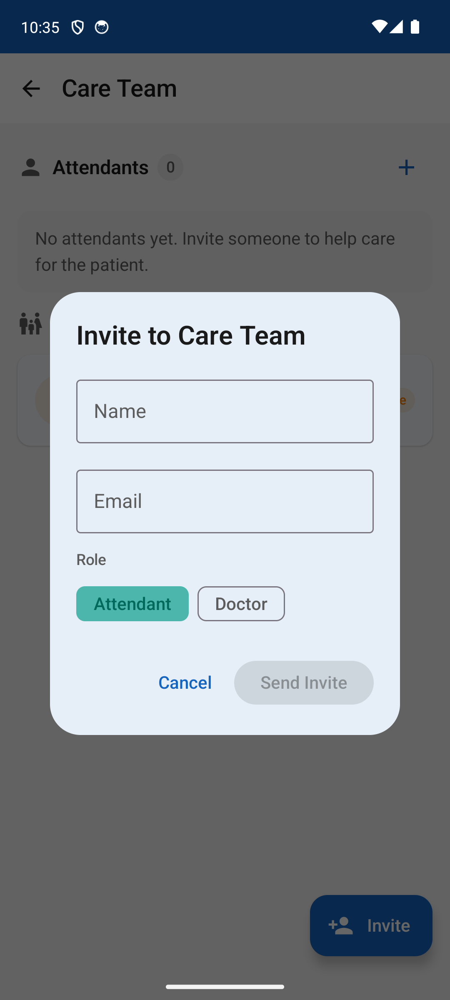
  &nbsp;&nbsp;
  
  &nbsp;&nbsp;
  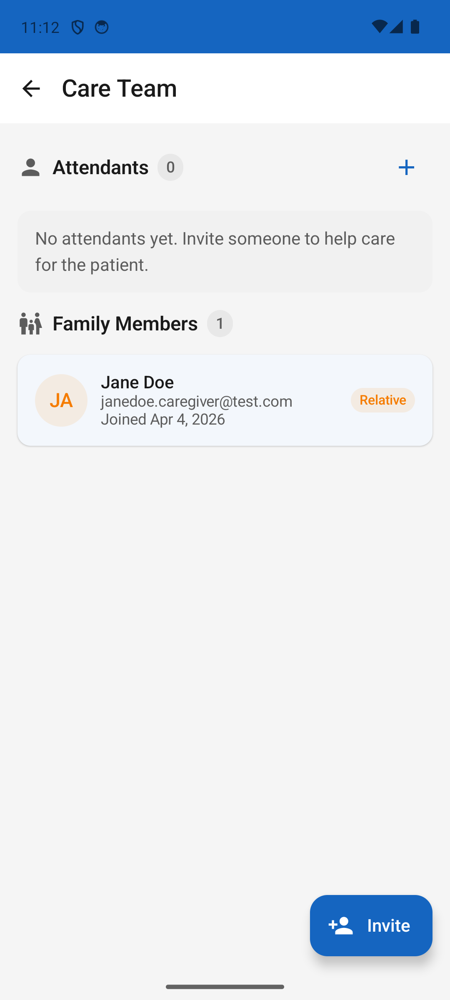
</p>

### 5. Attendant Dashboard — Log Vitals

Attendants see a grid of vitals they can log for the patient. Tapping a card opens the entry form for that vital type.

<p align="center">
  
</p>

#### Blood Pressure

<p align="center">
  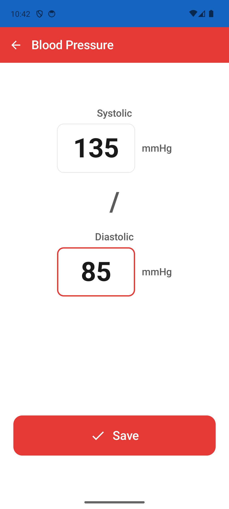
  &nbsp;&nbsp;
  
</p>

#### Blood Glucose

<p align="center">
  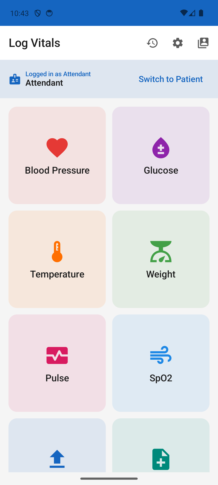
</p>

#### Temperature, Weight, Pulse, SpO2

<p align="center">
  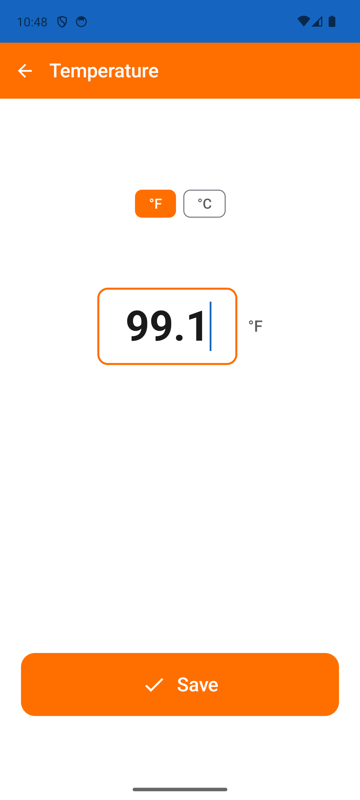
  &nbsp;&nbsp;
  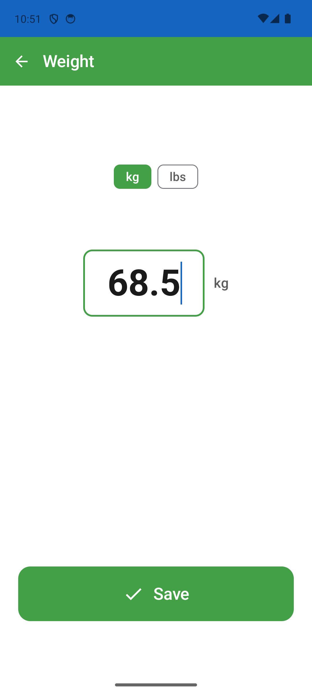
  &nbsp;&nbsp;
  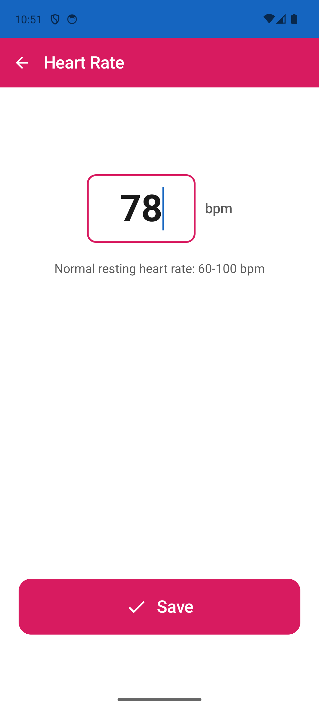
  &nbsp;&nbsp;
  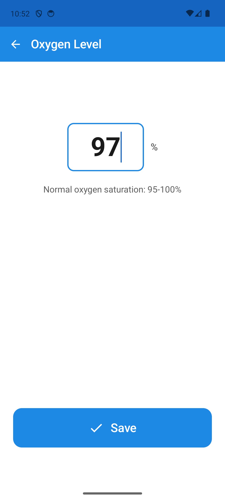
</p>

### 6. Patient View

Attendants can switch to the **Patient** persona to see the patient's own dashboard, showing all vitals with their latest values at a glance.

<p align="center">
  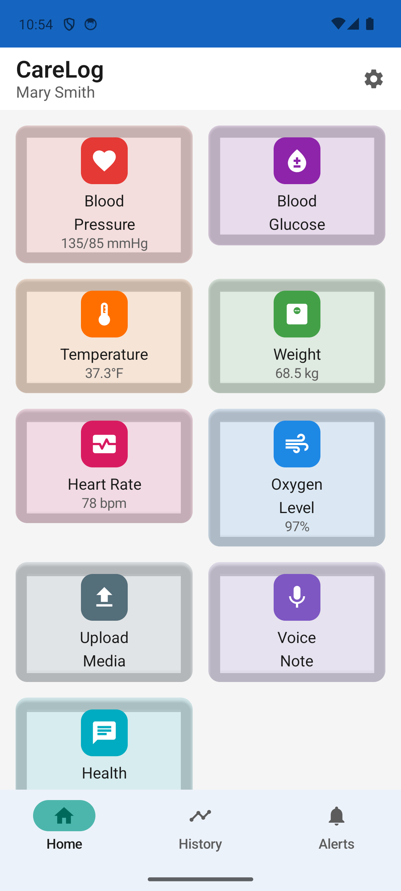
  &nbsp;&nbsp;
  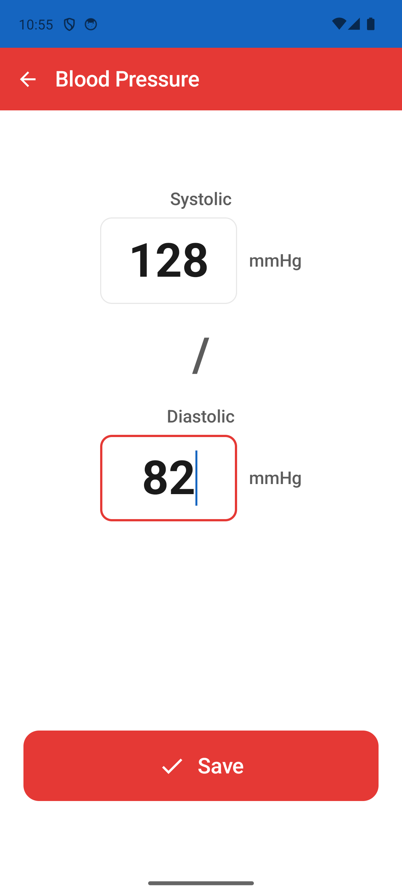
</p>

### 7. History

The **History** view shows all recorded readings in chronological order with green sync indicators. Filter by vital type using the tabs at the top.

<p align="center">
  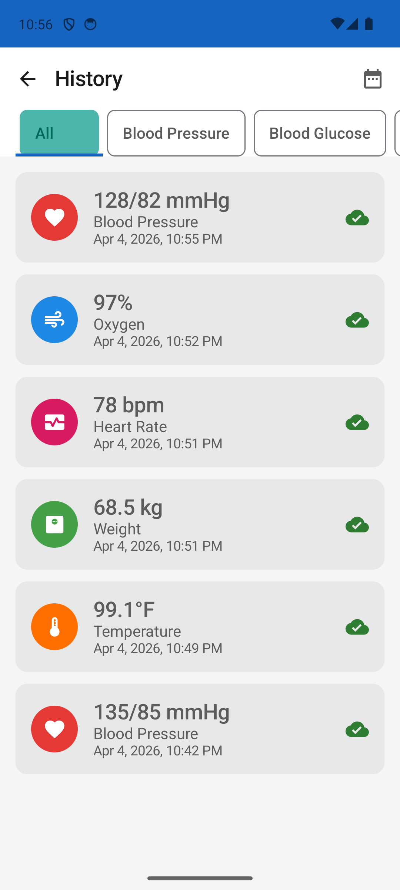
</p>

### 8. Trends

The **Trends** view displays vitals over configurable time periods (7, 30, or 90 days) with tabs for each vital type.

<p align="center">
  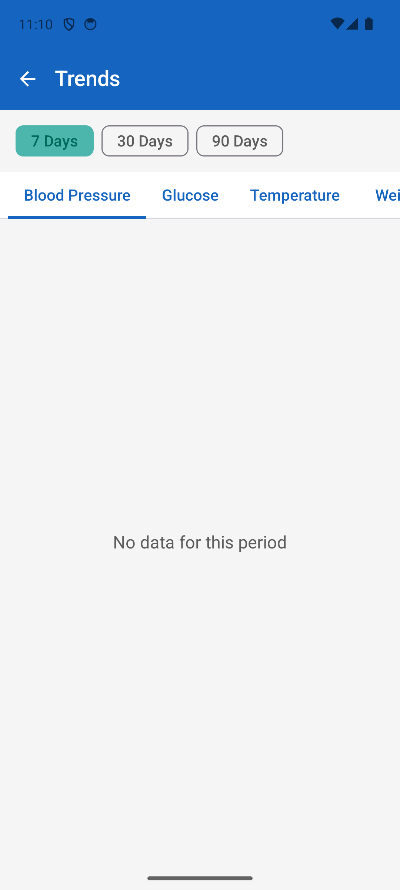
</p>

## Project Structure

```
matika/
├── android/                  # Android app (Kotlin/Jetpack Compose)
├── ios/                      # iOS app (Swift/SwiftUI/Spezi)
├── web-portal/               # Doctor portal (React/TypeScript/Vite)
├── backend/
│   ├── lambdas/              # 24 Lambda functions
│   └── database/migrations/  # Flyway SQL migrations
├── infrastructure/
│   └── terraform/            # IaC for all AWS resources
├── docs/                     # PRD, implementation plans, screenshots
└── scripts/                  # Utility scripts
```

## Getting Started

### Prerequisites

- Android Studio Hedgehog+ (for Android)
- Xcode 15+ (for iOS)
- Node.js 20+ (for web portal and Lambdas)
- Terraform 1.5+ (for infrastructure)
- AWS CLI configured with `ap-south-1` region

### Android

```bash
cd android
./gradlew assembleDebug
```

### iOS

```bash
cd ios/CareLog
xcodebuild -scheme CareLog -destination 'platform=iOS Simulator,name=iPhone 15 Pro' build
```

### Web Portal

```bash
cd web-portal
npm install
npm run dev
```

### Backend

Each Lambda has its own `package.json`:
```bash
cd backend/lambdas/<function-name>
npm install
```

Deploy via Terraform:
```bash
cd infrastructure/terraform/environments/dev
terraform init && terraform plan && terraform apply
```

### Configuration

After infrastructure changes, update app configs with live AWS values:
```bash
./scripts/update-app-config.sh          # defaults to dev environment
./scripts/update-app-config.sh staging  # or target another environment
```

## Security & Compliance

- **Region:** ap-south-1 (India) for DPDP Act data residency
- **Encryption:** KMS at rest, TLS in transit
- **Database access:** SSM Session Manager via bastion host only
- **Auth:** AWS Cognito with 4 user groups (`patients`, `attendants`, `relatives`, `doctors`)
- **Secrets:** AWS Secrets Manager for database credentials

## License

Proprietary. All rights reserved.
