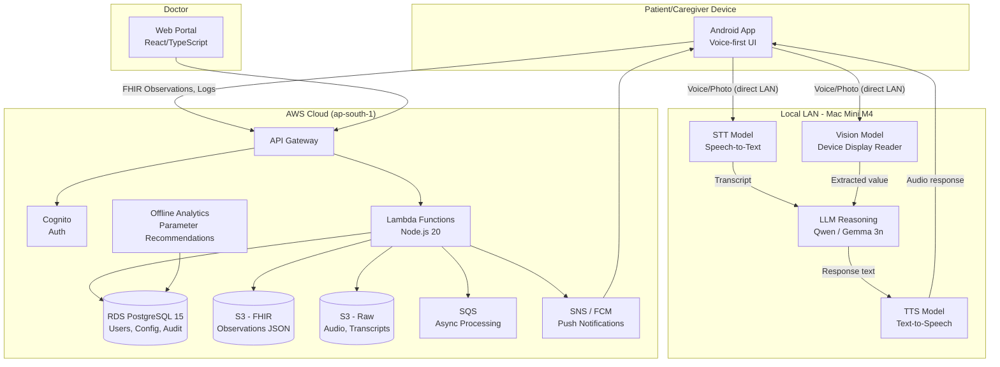
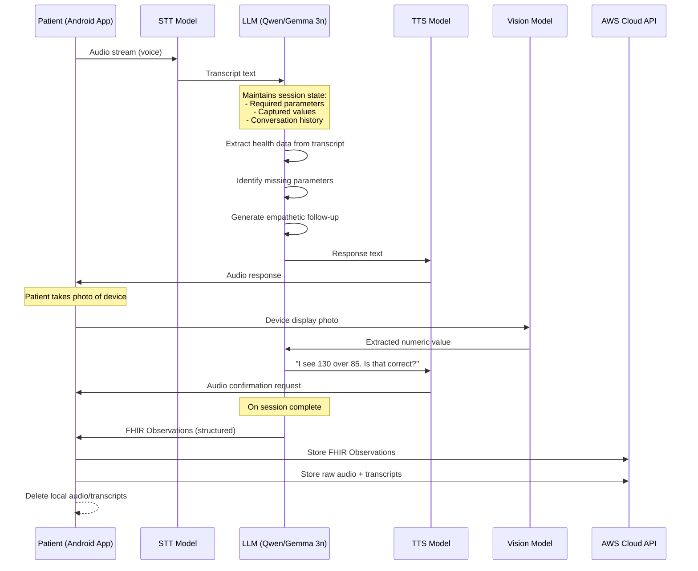
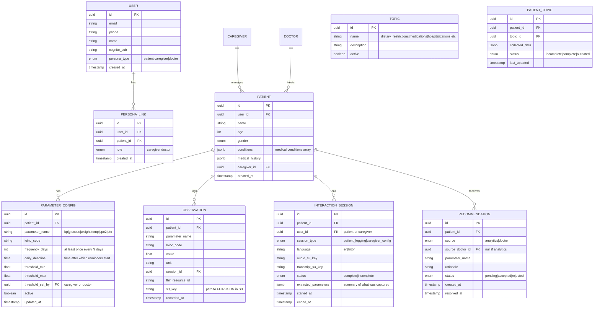

# CareLog — Product Requirements Document

**Version:** 1.0
**Date:** April 2026
**Status:** Approved for Pilot
**Classification:** Confidential

---

## Table of Contents

1. [Executive Summary](#1-executive-summary)
2. [Problem Statement](#2-problem-statement)
3. [Goals & Success Metrics](#3-goals--success-metrics)
4. [User Personas](#4-user-personas)
5. [Core Requirements](#5-core-requirements)
6. [Core Features](#6-core-features)
7. [Core Components](#7-core-components)
8. [App/User Flows](#8-appuser-flows)
9. [Tech Stack](#9-tech-stack)
10. [Data Model](#10-data-model)
11. [Implementation Plan](#11-implementation-plan)
12. [Security & Compliance](#12-security--compliance)
13. [Risks & Mitigations](#13-risks--mitigations)
14. [Open Questions](#14-open-questions)

---

## 1. Executive Summary

CareLog is a conversational, voice-first health monitoring platform for elderly patients, their caregivers, and attending physicians. Instead of requiring patients to navigate forms and input fields, CareLog uses natural language conversation — in English, Hindi, or Bengali — to extract, validate, and record structured health data. The caregiver configures what to monitor and how often; the patient simply talks; the doctor reviews structured, longitudinal data via a web portal. AI models (STT, TTS, LLM reasoning, vision) run locally on a Mac Mini M4 on the patient's LAN for low-latency inference, while all persistent data flows to an AWS cloud backend. The initial release is a pilot deployment for friends and family.

---

## 2. Problem Statement

### The Problem

Elderly patients do not think in terms of forms, fields, or structured inputs. They think and communicate in stories — how they feel, what they experienced, what they remember measuring. Traditional health logging systems force them into rigid workflows that are:

- **Cognitively demanding** — navigating UI hierarchies, selecting correct fields, entering precise values
- **Error-prone** — mistyped values, skipped fields, incorrect units
- **Frequently abandoned** — friction leads to inconsistent logging, which degrades clinical utility

### Who It Affects

- **Patients** (elderly, often non-tech-savvy) who need to log vitals regularly but struggle with structured interfaces
- **Caregivers** (family members) who need visibility into the patient's health and control over what is monitored
- **Doctors** who need structured, longitudinal data to make clinical decisions but don't have time to parse raw notes

### Why Existing Solutions Fall Short

| Existing Approach | Limitation |
|---|---|
| Manual health diaries | Unstructured, illegible, no alerts, no trend analysis |
| Form-based health apps | High friction for elderly users; require literacy with mobile UIs |
| Wearable-only monitoring | Limited to what the device can measure; no subjective symptoms, no context |
| Telehealth platforms | Require scheduled appointments; not designed for daily monitoring |

CareLog inverts the paradigm: instead of making users adapt to structured systems, the system adapts to how users naturally communicate.

---

## 3. Goals & Success Metrics

### Goals

- Enable elderly patients to log health vitals through natural voice conversation with minimal friction
- Allow caregivers to design and evolve monitoring protocols conversationally
- Deliver structured, FHIR-compliant clinical data to doctors via a web portal
- Achieve end-to-end response latency (speech in → voice response out) at P95 < 2 seconds
- Support English, Hindi, and Bengali from launch
- Comply with HIPAA and India's DPDP Act

### Success Metrics (Pilot Phase)

| Metric | Target |
|---|---|
| Session completion rate | > 80% of initiated sessions result in all required parameters logged |
| Data accuracy | > 95% of extracted values match patient-intended values (post-confirmation) |
| Daily adherence | > 70% of days with complete parameter logs within configured deadlines |
| Response latency (P95) | < 2 seconds end-to-end |
| Patient satisfaction | Qualitative — patients find it easier than manual logging |

---

## 4. User Personas

CareLog serves three distinct personas. The caregiver is the administrative hub; the patient is the primary data source; the doctor is the clinical consumer.

| Persona | Interface | Primary Role | Key Needs | Pain Points |
|---|---|---|---|---|
| **Patient** | Android mobile app (voice-first) | Logs health data through conversation | Low-friction interaction; native language support; gentle reminders | Forgets values; intimidated by technology; finds forms confusing |
| **Caregiver** | Android mobile app (voice-first) | Configures monitoring protocols; onboards patient and doctor; receives alerts | Visibility into patient's health; control over what is tracked; anomaly alerts | Cannot always be physically present; needs confidence that logging is happening |
| **Doctor** | Web portal | Reviews structured longitudinal data; sets clinical thresholds; recommends parameters | Structured trends and charts; ability to override thresholds; no interaction overhead | Doesn't have time for unstructured data; needs clinically actionable summaries |

### Relationships

- One caregiver per patient (1:1)
- One or more doctors per patient
- Caregiver onboards both the patient and the doctor
- Doctor can view and modify monitoring protocols (parameters, thresholds) but cannot onboard users

---

## 5. Core Requirements

### Functional Requirements

| ID | Requirement | Priority | Notes |
|---|---|---|---|
| FR-01 | Conversational voice-first health data logging for patients | **Must** | Primary interaction modality |
| FR-02 | Conversational voice-first protocol configuration for caregivers | **Must** | Parameters, frequency, deadlines |
| FR-03 | Multi-language support: English, Hindi, Bengali | **Must** | STT, TTS, and LLM must handle all three |
| FR-04 | Photo-based device reading (glucometer, BP monitor, etc.) | **Must** | Vision model extracts value; patient confirms |
| FR-05 | FHIR R4 Observation generation directly from conversation | **Must** | No intermediate unstructured storage |
| FR-06 | Raw interaction logging (audio + transcripts) to cloud | **Must** | For audit, compliance, and analytics |
| FR-07 | Caregiver-configured per-parameter frequency and daily deadline | **Must** | Hourly reminders after deadline |
| FR-08 | Push notifications to caregiver for anomalies and missed measurements | **Must** | Via Firebase Cloud Messaging |
| FR-09 | Doctor web portal with structured longitudinal patient view | **Must** | Trends, charts, FHIR data |
| FR-10 | Doctor can modify monitoring parameters and thresholds | **Must** | Reflected in patient's next session |
| FR-11 | Caregiver onboards patient and doctor via invite links (SMS + email) | **Must** | Login credentials included |
| FR-12 | Model endpoint health check from mobile app | **Must** | Periodic check that Mac Mini models are up |
| FR-13 | System-recommended parameter additions (from offline analytics) | **Should** | Presented conversationally to caregiver |
| FR-14 | Doctor-recommended parameter additions (via web portal) | **Should** | Logged in backend, surfaced to caregiver |
| FR-15 | Cross-session continuity (new parameters introduced gently) | **Should** | Patient asked if they were informed |
| FR-16 | Edge case handling: implausible values, unreported symptoms, emergencies | **Should** | See Section 6.5 |
| FR-17 | Text input as fallback for voice | **Should** | For noisy environments or preference |
| FR-18 | Direct Bluetooth device integration | **Won't** | Future roadmap |
| FR-19 | iOS mobile app | **Won't** | Android only at launch |
| FR-20 | Offline mode | **Won't** | Online-only; requires Mac Mini connectivity |
| FR-21 | In-app messaging between caregiver and doctor | **Won't** | Deferred |
| FR-22 | Doctor onboarding patients directly | **Won't** | Caregiver is the sole onboarding hub |

### Non-Functional Requirements

| Category | Requirement | Target |
|---|---|---|
| Latency | End-to-end conversational response (speech → voice reply) | P95 < 2 seconds |
| Availability | Cloud backend uptime | 99.9% |
| Availability | Mac Mini model endpoint uptime | Best-effort (household device) |
| Security | Data encryption in transit | TLS 1.2+ |
| Security | Data encryption at rest | AES-256 / SSE-KMS |
| Compliance | HIPAA | Required |
| Compliance | India DPDP Act | Required |
| Accessibility | Touch targets | Minimum 48x48dp; 72dp+ for primary actions |
| Accessibility | Contrast | WCAG AA minimum (4.5:1) |
| Languages | Supported at launch | English, Hindi, Bengali |
| Platform | Android minimum version | Android 9 (API 28)+ |

---

## 6. Core Features

### 6.1 Conversational Health Logging (Patient)

The patient interacts with CareLog through a voice-first conversational interface. The system uses a dynamic conversational protocol anchored to the caregiver-configured parameter set.

**How it works:**
- System begins with an open-ended prompt (e.g., "How are you feeling today?")
- Patient responds freely in their native language (English, Hindi, or Bengali)
- System extracts any health data mentioned (values, symptoms, measurements)
- System confirms extracted values with the patient
- System identifies missing required parameters and asks one follow-up question at a time
- Conversation continues until all required parameters are captured or the patient ends the session
- All confirmed values are written as FHIR R4 Observation resources

**Acceptance Criteria:**
- [ ] Patient can initiate a voice conversation session from the app home screen
- [ ] System correctly extracts numeric health values from natural speech in all 3 languages
- [ ] System confirms each extracted value before recording it
- [ ] System asks about uncaptured required parameters one at a time
- [ ] Session produces valid FHIR R4 Observation resources for each captured parameter
- [ ] Raw audio and transcripts are logged to the cloud backend
- [ ] Audio and transcripts are deleted from the Mac Mini after upload

### 6.2 Photo-Based Device Reading

When a patient cannot recall a measurement value, the system suggests taking a photo of the device display.

**How it works:**
- System detects that a measurement was taken but the value is unknown
- System prompts the patient to photograph the device screen
- Vision model on Mac Mini extracts the numeric value from the image
- System reads the extracted value back to the patient for confirmation
- On confirmation, the value is recorded as a FHIR Observation

**Acceptance Criteria:**
- [ ] System correctly prompts for a photo when a value is missing
- [ ] Vision model extracts numeric values from common device displays (glucometer, BP monitor, thermometer, pulse oximeter, weighing scale)
- [ ] Extracted value is read back to patient for verbal confirmation before recording
- [ ] If extraction fails or is ambiguous, system asks the patient to re-take the photo or provide the value verbally

### 6.3 Conversational Protocol Configuration (Caregiver)

The caregiver defines and evolves the monitoring protocol through conversation, not forms.

**How it works:**
- During initial setup, the system asks the caregiver about the patient: name, age, gender, conditions, medical history, doctors involved
- The caregiver speaks naturally; the system extracts and structures the data
- The system solicits the set of health parameters to track (e.g., BP, blood sugar, weight, temperature, SpO2)
- For each parameter, the caregiver sets a logging frequency (e.g., "at least once daily", "at least once every 3 days")
- The caregiver sets a daily deadline — a time after which the patient starts receiving hourly reminders
- Parameters can be added or removed at any time through conversation
- The system maintains a set of dev-configured **topics** (e.g., dietary restrictions, medication changes) and weaves questions about incomplete or outdated topics into conversations organically

**Acceptance Criteria:**
- [ ] Caregiver can set up a patient profile entirely through voice conversation
- [ ] Caregiver can add/remove health parameters conversationally
- [ ] Caregiver can set per-parameter frequency (at least once every N days)
- [ ] Caregiver can set a daily logging deadline for the patient
- [ ] Changes to the protocol are reflected in the patient's next session
- [ ] System-maintained topics grow the patient profile over time without explicit "update" workflows

### 6.4 Reminder and Alert System

**Reminders (to patient):**
- Caregiver configures a max time of day (daily deadline) for logging
- If the patient has not completed logging by the deadline, hourly push notifications begin
- Reminders continue until the patient completes a session

**Alerts (to caregiver):**
- Anomalous readings (outside threshold) trigger a push notification to the caregiver
- Missed measurements (parameter not logged within configured frequency window) trigger a push notification to the caregiver
- Alerts are delivered via Firebase Cloud Messaging

**Acceptance Criteria:**
- [ ] Patient receives hourly push reminders starting from the configured daily deadline if logging is incomplete
- [ ] Caregiver receives push notification within 60 seconds of an anomalous reading being recorded
- [ ] Caregiver receives push notification when a parameter's configured frequency window expires without a log
- [ ] Caregiver can view logs on-demand in the app (no automatic summary notifications)

### 6.5 Edge Case Handling

The conversational system must handle the following edge cases gracefully:

| Edge Case | System Behavior |
|---|---|
| **Implausible value** (e.g., BP 300/200) | System flags the value as unusual, reads it back, and asks the patient to re-check and confirm or correct |
| **New unreported symptom** | System acknowledges the symptom, records it as a FHIR Observation (coded if possible, free-text if not), and notes it for the caregiver/doctor |
| **Emergency/urgent concern** | System advises the patient to contact their caregiver or emergency services; logs the interaction and sends an immediate alert to the caregiver |
| **Patient confused or unresponsive** | System pauses, offers to try again later, and notifies the caregiver that the session was incomplete |
| **Value mentioned but not recalled** | System suggests taking a photo of the device display (see 6.2) |

**Acceptance Criteria:**
- [ ] System detects and challenges physiologically implausible values before recording
- [ ] Unreported symptoms are captured and surfaced to caregiver/doctor
- [ ] Emergency keywords trigger caregiver alert and appropriate patient guidance
- [ ] Incomplete sessions are logged and caregiver is notified

### 6.6 System-Guided Parameter Recommendations

Two sources feed parameter recommendations:

1. **Offline analytics system** — mines patient data and daily logs to suggest new parameters (e.g., "Patient is diabetic and only logging one glucose value per day — recommend splitting into fasting and post-meal readings")
2. **Doctor recommendations** — logged through the web portal

Recommendations are presented conversationally to the caregiver. The caregiver can accept or reject them. If accepted, the parameter set is updated and the system gently introduces the new parameter in the patient's next session.

**Acceptance Criteria:**
- [ ] Recommendations from the analytics system are presented to the caregiver during their next conversation
- [ ] Doctor recommendations logged in the web portal are surfaced to the caregiver
- [ ] Caregiver can accept or reject recommendations conversationally
- [ ] Accepted parameters are introduced gently in the patient's next session (patient is asked if they were informed)

### 6.7 Doctor Web Portal

A web-based interface for doctors to review structured patient data without interacting with the conversational system.

**Capabilities:**
- View patient list with last-activity timestamps
- Per-patient longitudinal view: vitals trends, charts, FHIR Observations timeline
- Modify monitoring protocol: add/remove parameters, set/override clinical thresholds
- Recommend new parameters (surfaced to caregiver)

**Not in v0 (deferred):**
- Messaging between doctor and caregiver
- Doctor-initiated patient onboarding

**Acceptance Criteria:**
- [ ] Doctor can log in to the web portal and view their linked patients
- [ ] Doctor can view time-series charts of patient vitals with configurable date ranges
- [ ] Doctor can add/remove parameters and set thresholds; changes are reflected in the patient's next session
- [ ] Doctor can add parameter recommendations that are surfaced to the caregiver

### 6.8 Model Endpoint Health Check

The mobile app periodically verifies that the Mac Mini model endpoints are reachable and healthy.

**Acceptance Criteria:**
- [ ] App checks model endpoint health on launch and at configurable intervals
- [ ] If any endpoint is unreachable, the app displays a clear status message to the user
- [ ] App does not allow a conversational session to start if required model endpoints are down

---

## 7. Core Components

### 7.1 System Architecture



### 7.2 Component Responsibilities

| Component | Responsibility |
|---|---|
| **Android App** | Voice-first UI for patient and caregiver; direct communication with Mac Mini for model calls; FHIR resource construction; interaction logging to cloud; push notification receipt |
| **Mac Mini M4 (STT)** | Converts patient/caregiver speech to text in English, Hindi, Bengali. Ephemeral processing — no data retained. |
| **Mac Mini M4 (LLM)** | Drives conversational logic: parameter extraction, follow-up question generation, protocol state management, FHIR resource structuring. Candidates: Qwen, Gemma 3n. Ephemeral processing. |
| **Mac Mini M4 (TTS)** | Converts LLM response text to natural speech in the patient's language. Ephemeral processing. |
| **Mac Mini M4 (Vision)** | Extracts numeric values from photos of medical device displays. Ephemeral processing. |
| **API Gateway** | Single entry point for all cloud API calls; Cognito authorizer for authentication |
| **Cognito** | Identity and access management; 3 user groups: `patients`, `caregivers`, `doctors`; custom attributes for persona routing |
| **Lambda Functions** | Business logic: patient CRUD, FHIR storage, invite flows, alert evaluation, threshold management, interaction logging |
| **RDS (PostgreSQL 15)** | Users, persona links, parameter configs, frequency/threshold settings, consent records, audit metadata |
| **S3 (FHIR)** | FHIR R4 Observation JSON files at `observations/{patientId}/{YYYY}/{MM}/{DD}/{id}.json` (KMS encrypted) |
| **S3 (Raw)** | Raw audio recordings and transcripts at `interactions/{patientId}/{YYYY}/{MM}/{DD}/{sessionId}/` (KMS encrypted) |
| **SQS** | Async processing queue for alerts, recommendations pipeline, and deferred tasks |
| **SNS / FCM** | Push notifications to caregiver for anomalies and missed measurements |
| **Offline Analytics** | Separate system with read access to patient data; generates parameter recommendations |
| **Web Portal** | React/TypeScript app for doctors; Cognito auth; reads FHIR data via API Gateway |

### 7.3 Conversational Engine Architecture

The conversational engine runs on the Mac Mini M4 and orchestrates the interaction flow:



---

## 8. App/User Flows

### 8.1 Caregiver Registration and Patient Onboarding

1. Caregiver downloads the CareLog Android app
2. Caregiver creates their own account (email/phone + password via AWS Cognito)
3. System initiates a conversational onboarding flow:
   - "Tell me about the patient you'd like to set up monitoring for"
   - Caregiver speaks naturally about the patient (name, age, gender, conditions, medical history)
   - System extracts and confirms structured data from the conversation
4. System creates the patient account with extracted details
5. System asks the caregiver about monitoring parameters:
   - "What health measurements would you like to track?"
   - Caregiver mentions parameters (e.g., "blood pressure, sugar, weight, temperature, SpO2")
   - For each parameter, system asks about frequency ("How often should blood pressure be logged?")
   - System asks about the daily deadline ("What time should logging be completed by?")
6. App download link and login credentials are sent to the patient via SMS and email
7. Patient profile and monitoring protocol are saved to the cloud backend

### 8.2 Doctor Onboarding

1. Caregiver navigates to care team settings
2. Caregiver enters doctor's details (name, email, phone)
3. System sends the doctor an invite link via SMS and email with login credentials
4. Doctor registers on the web portal using the provided credentials
5. Doctor is linked to the patient and gains access to the patient's FHIR data

### 8.3 Patient Daily Logging Session

1. Patient opens the CareLog app (or responds to a reminder notification)
2. App checks Mac Mini model endpoint health
   - If endpoints are down: display status message, do not start session
   - If endpoints are healthy: proceed
3. Patient taps "Start Conversation" or uses a voice trigger
4. System greets the patient and asks an open-ended question: "How are you feeling today?"
5. Patient responds freely in their preferred language (English, Hindi, or Bengali)
6. System extracts any health data from the response:
   - If a value is mentioned: "I heard your blood pressure is 130 over 85. Is that right?"
   - If a measurement is mentioned without a value: "You mentioned you checked your sugar. Do you remember the reading, or would you like to take a photo of the meter?"
   - If a new symptom is mentioned: system acknowledges and records it
7. System identifies remaining required parameters and asks about them one at a time
8. For each captured value:
   - System confirms the value with the patient
   - On confirmation, a FHIR R4 Observation is constructed
9. If the patient requests a photo capture:
   - App opens the camera
   - Patient photographs the device display
   - Vision model extracts the value
   - System reads the value back for confirmation
10. When all required parameters are captured (or patient ends the session):
    - FHIR Observations are pushed to the cloud backend
    - Raw audio and transcripts are pushed to the cloud backend
    - Audio and transcripts are deleted from the Mac Mini
    - If any parameters are missing, the session is marked incomplete and the caregiver is notified

### 8.4 Caregiver Protocol Update

1. Caregiver opens the app and initiates a conversation
2. System checks for pending items:
   - Parameter recommendations from the offline analytics system
   - Doctor-recommended parameter additions
   - Incomplete or outdated topics in the patient profile
3. System presents recommendations conversationally: "Based on your father's recent readings, the system suggests tracking fasting glucose separately from post-meal glucose. Would you like to add that?"
4. Caregiver accepts or rejects each recommendation verbally
5. Caregiver can also proactively add/remove parameters or change frequencies
6. Updated protocol is saved to the cloud backend
7. Patient's next session reflects the changes (with gentle introduction)

### 8.5 Reminder and Alert Flow

1. System checks daily at the configured deadline whether the patient has completed logging
2. If incomplete: patient receives a push notification ("Time to log your health readings")
3. If still incomplete after 1 hour: another push notification
4. Reminders repeat hourly until the patient completes a session
5. When a logged value falls outside the threshold:
   - Caregiver receives a push notification immediately (e.g., "Dad's blood pressure is 165/100 — above the 140/90 threshold")
6. When a parameter's frequency window expires without a log:
   - Caregiver receives a push notification (e.g., "Dad hasn't logged his weight in 4 days — configured for every 3 days")

### 8.6 Doctor Review Flow

1. Doctor logs in to the web portal
2. Doctor sees their patient list with last-activity timestamps
3. Doctor selects a patient to view:
   - Time-series vitals charts (configurable date range)
   - FHIR Observation timeline
   - Current monitoring protocol (parameters, frequencies, thresholds)
4. Doctor can modify the protocol:
   - Add or remove parameters
   - Set or override thresholds
   - Add a parameter recommendation (surfaced to caregiver)
5. Changes are saved to the backend and reflected in the patient's next session

---

## 9. Tech Stack

### 9.1 Mobile App (Patient + Caregiver)

| Layer | Technology | Justification |
|---|---|---|
| Platform | Android (API 28+) | Primary target demographic; single-platform simplicity for pilot |
| Language | Kotlin | Modern Android standard; Jetpack Compose support |
| UI Framework | Jetpack Compose | Declarative UI; accessibility-first primitives; large touch targets |
| DI | Hilt | Standard Android dependency injection |
| State Management | ViewModel + StateFlow | Lifecycle-aware, reactive state |
| Networking (Cloud) | Retrofit2 + OkHttp | Mature HTTP client; interceptors for Cognito auth headers |
| Networking (Mac Mini) | Retrofit2 / gRPC | Direct LAN calls to model endpoints |
| Auth | AWS Amplify (Cognito) | Managed auth flows; token refresh |
| FHIR | HAPI FHIR (Android) | FHIR R4 resource construction and validation |
| Push Notifications | Firebase Cloud Messaging | Standard Android push infrastructure |

### 9.2 Local Model Serving (Mac Mini M4)

| Layer | Technology | Justification |
|---|---|---|
| Hardware | Mac Mini M4 | Sufficient for running multiple small/medium models; cost-effective; household deployment |
| Model Serving | Ollama / llama.cpp / MLX | Native Apple Silicon support; low-latency inference |
| LLM Candidates | Qwen, Gemma 3n | Strong multilingual support (Hindi, Bengali, English); efficient on Apple Silicon |
| STT | Whisper (or equivalent) | Multilingual speech recognition; can run locally on M4 |
| TTS | Piper / Coqui (or equivalent) | Low-latency, natural-sounding multilingual TTS |
| Vision | LLaVA / Qwen-VL (or equivalent) | Extracts text/numbers from device display photos |
| API Layer | REST / gRPC endpoint | Serves model inference to the Android app over LAN |

### 9.3 Cloud Backend (AWS — ap-south-1)

| Layer | Technology | Justification |
|---|---|---|
| API Entry Point | Amazon API Gateway | Single entry point; Cognito authorizer |
| Compute | AWS Lambda (Node.js 20) | Serverless; scales to zero for pilot; per-invocation billing |
| Auth | Amazon Cognito | 3 user groups; custom attributes; JWT tokens |
| Relational DB | Amazon RDS (PostgreSQL 15) | Users, configs, thresholds, consent, audit metadata |
| FHIR Storage | Amazon S3 (KMS encrypted) | FHIR R4 Observation JSON files; cost-effective for pilot scale |
| Raw Storage | Amazon S3 (KMS encrypted) | Audio recordings, transcripts, device photos |
| Async Queue | Amazon SQS | Alert evaluation, recommendation pipeline |
| Push Notifications | Amazon SNS + Firebase FCM | Caregiver alerts |
| Scheduling | Amazon EventBridge | Reminder deadline checks, periodic tasks |
| Infrastructure | Terraform | Full IaC; single `terraform apply` deployment |
| DB Access | EC2 Bastion + SSM | No exposed DB endpoints; port-forwarding via Session Manager |
| DB Migrations | Flyway | Versioned SQL migrations |
| Secrets | AWS Secrets Manager | DB credentials, API keys |

### 9.4 Web Portal (Doctor)

| Layer | Technology | Justification |
|---|---|---|
| Framework | React + TypeScript | Existing web portal codebase; Vite build |
| Build | Vite | Fast builds; HMR for development |
| Charting | Chart.js or Recharts | Time-series vitals visualization |
| Auth | AWS Amplify (Cognito) | Consistent auth with mobile app |
| API | Fetch + Amplify auth headers | REST calls to API Gateway |
| Path Aliases | `@/*` → `src/*` | Configured in tsconfig.json and vite.config.ts |

---

## 10. Data Model

### 10.1 Core Entities



### 10.2 Storage Strategy

| Data Type | Storage | Format | Encryption |
|---|---|---|---|
| User accounts, configs, thresholds, audit | RDS PostgreSQL 15 | Relational | SSL in transit, KMS at rest |
| FHIR R4 Observations | S3 | JSON files at `observations/{patientId}/{YYYY}/{MM}/{DD}/{id}.json` | SSE-KMS |
| Raw audio recordings | S3 | Audio files at `interactions/{patientId}/{YYYY}/{MM}/{DD}/{sessionId}/audio/` | SSE-KMS |
| Transcripts | S3 | Text/JSON at `interactions/{patientId}/{YYYY}/{MM}/{DD}/{sessionId}/transcript.json` | SSE-KMS |
| Device display photos | S3 | Images at `interactions/{patientId}/{YYYY}/{MM}/{DD}/{sessionId}/photos/` | SSE-KMS |
| FHIR CarePlan (doctor) | S3 | JSON files at `careplans/{patientId}/{id}.json` | SSE-KMS |

### 10.3 FHIR Resource Mapping

| Health Parameter | FHIR Resource | LOINC Code | Unit |
|---|---|---|---|
| Blood Pressure (Systolic) | Observation | 8480-6 | mmHg |
| Blood Pressure (Diastolic) | Observation | 8462-4 | mmHg |
| Blood Glucose | Observation | 2339-0 | mg/dL |
| Blood Glucose (Fasting) | Observation | 1558-6 | mg/dL |
| Blood Glucose (Post-prandial) | Observation | 1521-4 | mg/dL |
| Body Weight | Observation | 29463-7 | kg |
| Body Temperature | Observation | 8310-5 | degC |
| SpO2 | Observation | 2708-6 | % |
| Heart Rate / Pulse | Observation | 8867-4 | /min |

---

## 11. Implementation Plan

### 11.1 Phase Overview

| Phase | Name | Focus | Duration |
|---|---|---|---|
| P0 | Foundation | Project skeleton, auth, Mac Mini model serving, basic LAN connectivity | Weeks 1-3 |
| P1 | Conversational Core | STT + LLM + TTS pipeline, patient conversation flow, FHIR extraction | Weeks 4-8 |
| P2 | Caregiver Experience | Caregiver onboarding, protocol configuration, reminders, alerts | Weeks 9-12 |
| P3 | Doctor Portal | Web portal enhancements for new data model, thresholds, recommendations | Weeks 13-15 |
| P4 | Integration & Polish | End-to-end flows, edge cases, multilingual testing, health checks | Weeks 16-18 |
| P5 | Compliance & Pilot | Security hardening, compliance audit, pilot deployment | Weeks 19-22 |

### 11.2 Phase Detail

#### P0 — Foundation (Weeks 1-3)

**Goal:** Establish the project skeleton, model serving infrastructure, and connectivity between mobile app and Mac Mini.

**Deliverables:**
- Mac Mini M4 setup: install model serving framework (Ollama / MLX), deploy initial STT, LLM, TTS, and Vision models
- Model API endpoints exposed on LAN (REST or gRPC)
- Android app skeleton: Kotlin + Jetpack Compose, Hilt DI, Cognito auth integration
- Health check endpoint on Mac Mini; health check polling in Android app
- Cloud backend: verify existing Cognito, API Gateway, RDS, S3 infrastructure supports new data model
- Database migration: add `parameter_config`, `interaction_session`, `recommendation`, `topic`, `patient_topic` tables

**Dependencies:** Mac Mini M4 hardware available; model weights downloaded

**Exit Criteria:** Android app authenticates via Cognito, pings Mac Mini health endpoint successfully, and displays connection status.

---

#### P1 — Conversational Core (Weeks 4-8)

**Goal:** Patient can complete a full voice-based health logging session that produces FHIR Observations.

**Deliverables:**
- STT integration: audio stream from Android app → Mac Mini STT → transcript
- LLM conversation engine: session state management, parameter extraction, follow-up generation, FHIR Observation construction
- TTS integration: LLM response text → Mac Mini TTS → audio playback in app
- Vision integration: photo capture in app → Mac Mini vision model → extracted value → confirmation flow
- Conversation UI: voice recording indicator, waveform visualization, photo capture, session summary
- FHIR Observation construction using HAPI FHIR library
- Interaction logging: raw audio + transcript upload to S3 via API Gateway
- Cleanup: delete audio/transcript from Mac Mini after successful upload
- Support for English (primary), with Hindi and Bengali STT/TTS model integration
- LLM prompt engineering for multilingual parameter extraction and empathetic conversation

**Dependencies:** P0 complete; STT/TTS models with Hindi and Bengali support identified and tested

**Exit Criteria:** Patient speaks in Hindi, system extracts a BP reading, confirms it verbally, produces a valid FHIR Observation in S3, and logs the raw interaction. P95 latency < 2 seconds.

---

#### P2 — Caregiver Experience (Weeks 9-12)

**Goal:** Caregiver can onboard a patient, configure monitoring protocol, and receive alerts — all conversationally.

**Deliverables:**
- Caregiver conversational onboarding: patient profile creation through voice conversation
- Parameter configuration conversation: add/remove parameters, set frequencies, set daily deadline
- Invite flow: patient receives app download link + credentials via SMS and email
- Doctor invite flow: doctor receives web portal invite via SMS and email
- Reminder engine: EventBridge rule checks daily deadlines; hourly push notifications to patient via FCM
- Alert engine: threshold evaluation on new Observations; push notification to caregiver
- Missed measurement detection: frequency window expiry check; push notification to caregiver
- Caregiver on-demand log viewing screen
- Topic system: dev-configured topics woven into caregiver conversations

**Dependencies:** P1 complete; FCM configured for Android app

**Exit Criteria:** Caregiver sets up a patient and monitoring protocol via conversation; patient receives credentials; after patient logs a value above threshold, caregiver receives a push notification within 60 seconds.

---

#### P3 — Doctor Portal (Weeks 13-15)

**Goal:** Doctor can review patient data, modify protocols, and recommend parameters via the web portal.

**Deliverables:**
- Update web portal patient view with new data model (conversational sessions, interaction logs)
- Vitals time-series charts with threshold overlay lines
- Protocol management UI: add/remove parameters, set/override thresholds
- Parameter recommendation submission (stored in `recommendation` table, surfaced to caregiver)
- Doctor onboarding acceptance flow (register via invite link)

**Dependencies:** P2 complete; existing web portal codebase

**Exit Criteria:** Doctor sets a BP threshold override; caregiver is presented with the change in their next conversation; a breaching value triggers a caregiver alert.

---

#### P4 — Integration & Polish (Weeks 16-18)

**Goal:** End-to-end flows work reliably across all three personas; edge cases are handled; multilingual support is validated.

**Deliverables:**
- End-to-end testing: caregiver onboards patient → patient logs daily → doctor reviews
- Edge case implementation: implausible values, emergency detection, confused patient, new symptoms
- Cross-session continuity: new parameters introduced gently to patient
- Multilingual validation: full conversation flows in English, Hindi, and Bengali
- Recommendation flow: analytics-sourced and doctor-sourced recommendations → caregiver conversation → patient session update
- Model endpoint health check: graceful degradation when Mac Mini is unreachable
- Performance optimization: P95 < 2 seconds across all language pairs
- UI polish: accessibility audit, touch targets, contrast, voice interaction feedback

**Dependencies:** P3 complete; offline analytics system producing recommendations

**Exit Criteria:** All user flows pass end-to-end in all 3 languages; edge cases handled gracefully; P95 latency < 2 seconds.

---

#### P5 — Compliance & Pilot (Weeks 19-22)

**Goal:** Security hardened, compliance verified, deployed to pilot users.

**Deliverables:**
- DPDP consent flow at onboarding: versioned consent text, explicit accept, stored consent record
- Data export flow: FHIR Bundle export for patient on request
- Account deletion flow: cascade delete across RDS, S3
- Verify all data stored in ap-south-1 (DPDP data localisation)
- HIPAA: BAA with AWS, audit logging via CloudTrail, PHI encryption verified
- Mac Mini security: verify no persistent patient data; network security (LAN only, no internet exposure)
- Certificate pinning on all API calls
- No PHI in device logs or crash reports
- Penetration testing (if scope warrants for pilot)
- Pilot deployment: set up Mac Minis for pilot households; onboard pilot users
- Pilot feedback collection and iteration

**Dependencies:** P4 complete; BAA process initiated early

**Exit Criteria:** Pilot users (friends and family) are actively using the system; no critical security findings; compliance requirements met.

---

### 11.3 Timeline

```
Phase                          │ Wk 1-3 │ Wk 4-8 │ Wk 9-12 │ Wk 13-15 │ Wk 16-18 │ Wk 19-22
───────────────────────────────┼────────┼────────┼─────────┼──────────┼──────────┼─────────
P0  Foundation                 │ ████   │        │         │          │          │
P1  Conversational Core        │        │ █████  │         │          │          │
P2  Caregiver Experience       │        │        │ ████    │          │          │
P3  Doctor Portal              │        │        │         │ ███      │          │
P4  Integration & Polish       │        │        │         │          │ ███      │
P5  Compliance & Pilot         │        │        │         │          │          │ ████
```

---

## 12. Security & Compliance

### 12.1 HIPAA

| Requirement | Implementation |
|---|---|
| BAA with AWS | Execute before any real PHI is stored; use synthetic data until signed |
| PHI encryption in transit | TLS 1.2+ on all connections (app ↔ cloud, app ↔ Mac Mini) |
| PHI encryption at rest | AES-256 / SSE-KMS for S3 and RDS |
| Audit logging | CloudTrail for all API access; interaction sessions logged with full audit trail |
| Access controls | Cognito groups enforce minimum necessary access; IAM roles scoped per Lambda |
| Data retention | Defined per HIPAA requirements; configurable retention policies on S3 |
| Breach notification | Operational runbook to be documented |

### 12.2 India DPDP Act

| Requirement | Implementation |
|---|---|
| Explicit consent | Collected from caregiver (on behalf of patient) at onboarding; versioned consent text; stored in RDS |
| Data localisation | All patient data stored in AWS ap-south-1 (Mumbai) |
| Data principal rights | Patient/caregiver can request data export (FHIR Bundle) or deletion |
| Purpose limitation | Data collected only for health monitoring; no secondary use without re-consent |

### 12.3 Mac Mini Security

| Concern | Mitigation |
|---|---|
| Patient data at rest | No persistent data — audio/transcripts pushed to cloud and deleted from Mac Mini |
| Network exposure | Mac Mini serves models on LAN only; no internet-facing endpoints |
| Physical access | Household device; relies on physical security of the home |
| Model weights | Pre-downloaded; no patient data in model weights |

### 12.4 Application Security

| Measure | Details |
|---|---|
| Certificate pinning | On all API calls from mobile app to cloud |
| No PHI in logs | Device logs, analytics, and crash reports stripped of PHI |
| Device passcode | App requires device passcode/biometric to be enabled |
| Token management | JWT access tokens (1hr) + refresh tokens (30 days); stored in Android Keystore |
| Cognito groups | `patients`, `caregivers`, `doctors` — enforce role-based access |

### 12.5 Infrastructure Security (Existing)

- **RDS:** Private subnet, SSL enforced, KMS encryption at rest, bastion SSM access only
- **S3:** Public access blocked, bucket policy enforces TLS, SSE-KMS, lifecycle tiering
- **Secrets:** RDS password in AWS Secrets Manager (32 chars, auto-generated)
- **CloudTrail:** Multi-region audit trail, 7-year immutable retention
- **KMS:** Auto-rotation enabled on all customer-managed keys
- **Bastion:** SSM Session Manager only (no SSH keys, no inbound rules), IMDSv2 enforced

---

## 13. Risks & Mitigations

### Technical Risks

| Risk | Severity | Likelihood | Mitigation |
|---|---|---|---|
| P95 < 2s latency not achievable with local models | High | Medium | Profile each model component; optimize STT/TTS model selection for speed; pipeline STT→LLM→TTS instead of sequential blocking; consider quantized models |
| Hindi/Bengali STT accuracy insufficient | High | Medium | Evaluate multiple STT models (Whisper variants, IndicWhisper); collect test utterances in target accents; fine-tune if needed |
| Vision model fails on diverse device displays | Medium | Medium | Build a test dataset of common glucometers, BP monitors, thermometers; fall back to manual/voice entry gracefully |
| Mac Mini hardware failure | High | Low | Household device; recommend UPS; app clearly communicates when models are unavailable; no data loss (all data in cloud) |
| LLM extracts incorrect values from speech | High | Medium | Always confirm extracted values with the patient before recording; double-check implausible values; log all interactions for audit |
| Multiple models competing for Mac Mini resources | Medium | Medium | Profile memory and compute usage per model; schedule inference to avoid contention; consider model-specific optimization (quantization, batching) |

### Business Risks

| Risk | Severity | Likelihood | Mitigation |
|---|---|---|---|
| Elderly patients uncomfortable talking to a machine | High | Medium | Empathetic conversation design; caregiver introduces the system; gradual onboarding; support text fallback |
| Caregiver adoption friction | Medium | Low | Voice-first setup reduces friction; minimal mandatory fields; can evolve protocol over time |
| Pilot scope creep | Medium | Medium | Strict prioritization (MoSCoW); pilot is friends and family only; defer Won't items |

### Operational Risks

| Risk | Severity | Likelihood | Mitigation |
|---|---|---|---|
| Mac Mini requires technical setup per household | Medium | High | Provide setup guide; pre-configure before deployment; model health check in app |
| Model updates require physical access to Mac Mini | Medium | Medium | Remote management via SSH/screen sharing over LAN; script model updates |
| Internet outage prevents cloud logging | Medium | Medium | App queues FHIR Observations and interaction logs locally until connectivity resumes (limited buffer; not full offline mode) |

---

## 14. Open Questions

| # | Question | Context | Decision Needed By |
|---|---|---|---|
| 1 | Which specific STT model best handles Hindi and Bengali with elderly speech patterns? | Accuracy is critical for trust; elderly speakers may have unclear pronunciation | P1 start |
| 2 | Which specific TTS model sounds most natural in Hindi and Bengali? | Naturalness affects patient comfort and trust | P1 start |
| 3 | Should the LLM conversation run as a single model or a pipeline of specialized models? | Single model is simpler; pipeline may be more accurate for extraction vs. conversation | P1 start |
| 4 | How should the offline analytics system interface with the main backend? | Needs read access to patient data; writes recommendations | P3 start |
| 5 | What is the Mac Mini network configuration for typical households? | Static IP? mDNS? App needs reliable discovery of Mac Mini on LAN | P0 start |
| 6 | Should the app buffer interactions locally during brief internet outages? | Currently specified as online-only, but brief outages are common | P1 start |
| 7 | What is the consent model for voice recording? | Recording patient's voice has privacy implications beyond text data | P0 start |
| 8 | How are model weights distributed and updated across pilot households? | Manual USB? Network download? Pre-configured Mac Minis? | P5 start |
| 9 | Should the doctor portal show raw transcripts, or only structured FHIR data? | Transcripts provide context but may contain noise | P3 start |
| 10 | What happens when the patient speaks a language different from the configured one mid-session? | Multilingual patients may code-switch between Hindi and English | P1 start |
| 11 | Direct Bluetooth device integration — which devices and protocols? | Deferred to future; need to scope when the time comes | Post-pilot |
| 12 | iOS app — timeline and approach? | Deferred to post-pilot; will inform tech stack decisions | Post-pilot |

---

*CareLog PRD v1.0 — April 2026 — Pilot Release — CONFIDENTIAL*
