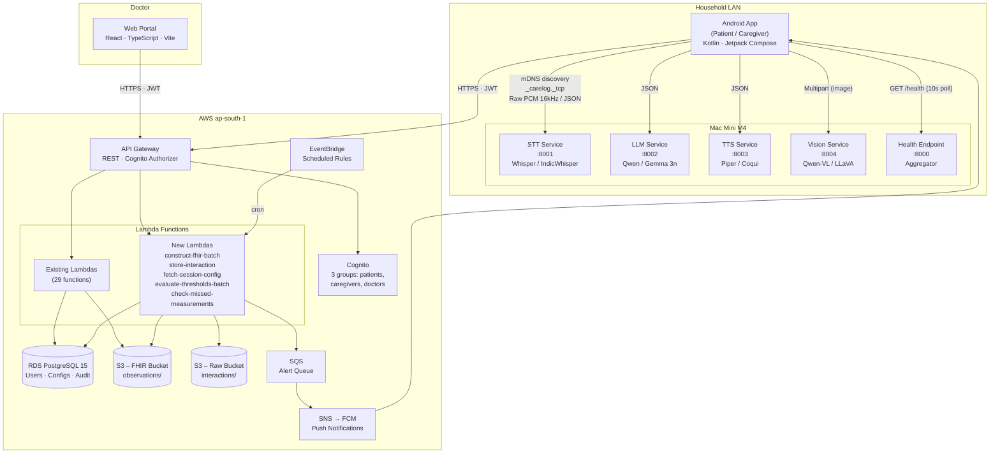
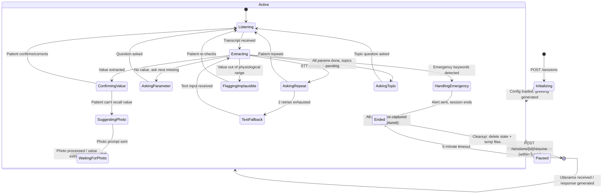
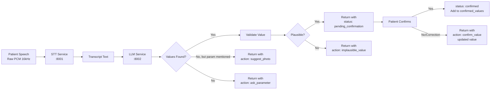
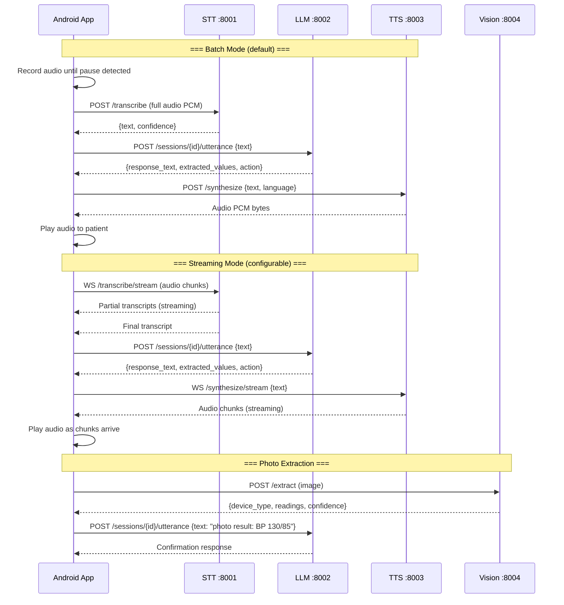
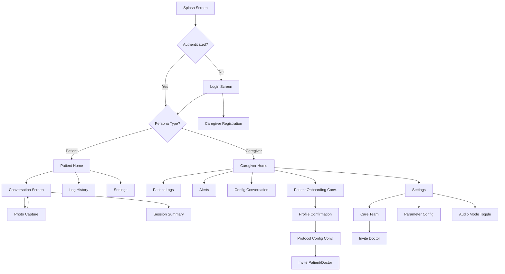
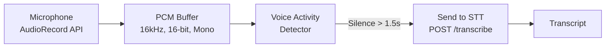
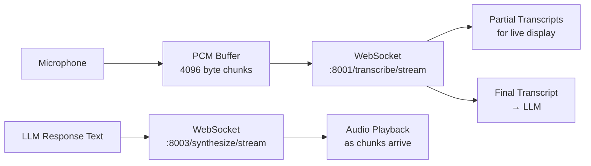
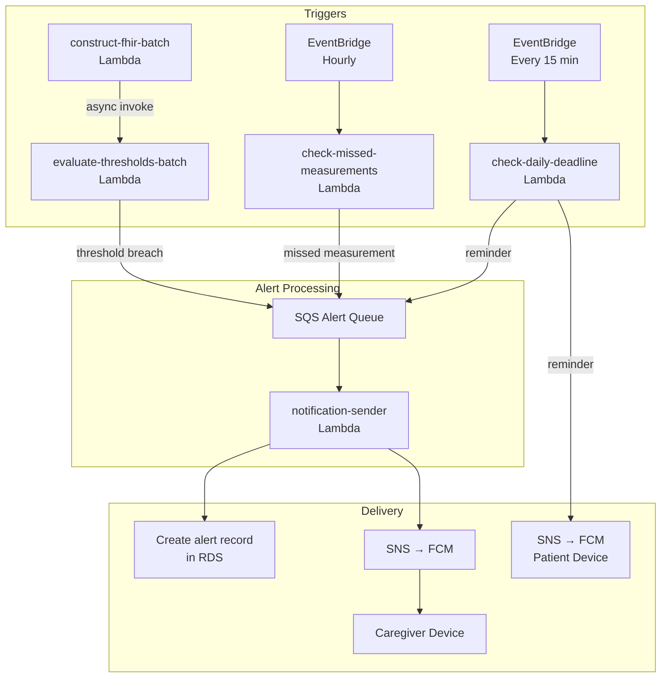
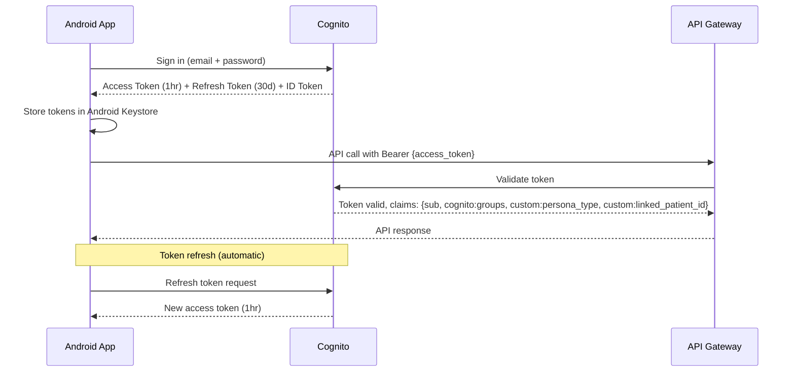
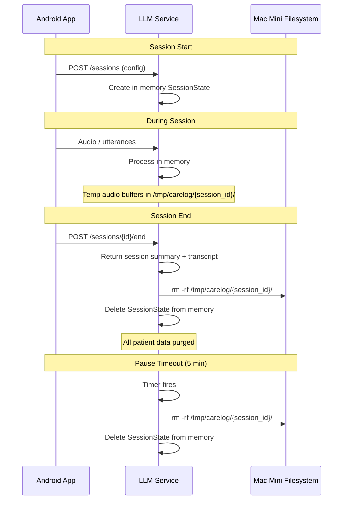

# CareLog — Technical Specification

**Version:** 1.0
**Date:** April 2026
**Status:** Approved for Pilot
**Classification:** Confidential
**Source PRD:** `docs/carelog_prd.md` v1.0

---

## Table of Contents

1. [Overview](#1-overview)
2. [System Context Diagram](#2-system-context-diagram)
3. [Service Inventory](#3-service-inventory)
4. [API Contracts](#4-api-contracts)
5. [Data Schemas](#5-data-schemas)
6. [Conversation Engine Design](#6-conversation-engine-design)
7. [Model Serving Architecture](#7-model-serving-architecture)
8. [Mobile App Architecture](#8-mobile-app-architecture)
9. [Web Portal Changes](#9-web-portal-changes)
10. [Notification & Alert Engine](#10-notification--alert-engine)
11. [Security Implementation](#11-security-implementation)
12. [Testing Strategy](#12-testing-strategy)
13. [Implementation Phases](#13-implementation-phases)
14. [Deployment & Operations](#14-deployment--operations)
15. [Appendix](#15-appendix)

---

## 1. Overview

CareLog is a conversational health monitoring system that replaces form-based vitals logging with a voice-first, LLM-driven interaction for elderly patients. The system comprises four deployable boundaries: (1) an Android mobile app serving both patients and caregivers, (2) a set of AI model services (STT, TTS, LLM, Vision) running as independent processes on a household Mac Mini M4 accessible over the LAN, (3) a serverless AWS backend (API Gateway, Lambda, RDS, S3, SQS, SNS) that stores all persistent data, constructs FHIR R4 resources, evaluates thresholds, and dispatches notifications, and (4) a React web portal for doctors to review structured patient data and modify monitoring protocols. The mobile app communicates directly with the Mac Mini for real-time conversational inference (discovered via mDNS/Bonjour) and with the AWS backend for all persistent operations. Audio, transcripts, and extracted values flow from the conversation through the app to the cloud; the Mac Mini retains no patient data after session cleanup.

---

## 2. System Context Diagram



### Communication Protocols

| Path | Protocol | Format | Auth |
|---|---|---|---|
| App ↔ Mac Mini STT | HTTP (LAN) | Raw PCM 16kHz (batch) or WebSocket (streaming) | None (LAN-only, mDNS-scoped) |
| App ↔ Mac Mini LLM | HTTP (LAN) | JSON | None |
| App ↔ Mac Mini TTS | HTTP (LAN) | JSON request → PCM/WAV audio response | None |
| App ↔ Mac Mini Vision | HTTP (LAN) | Multipart form (image) → JSON | None |
| App ↔ Mac Mini Health | HTTP (LAN) | JSON | None |
| App ↔ API Gateway | HTTPS (WAN) | JSON | Cognito JWT (Bearer) |
| Web Portal ↔ API Gateway | HTTPS (WAN) | JSON | Cognito JWT (Bearer) |
| Lambda ↔ RDS | PostgreSQL (SSL) | SQL | Secrets Manager credentials |
| Lambda ↔ S3 | AWS SDK (HTTPS) | JSON/Binary | IAM Role |
| Lambda ↔ SQS | AWS SDK (HTTPS) | JSON | IAM Role |
| EventBridge → Lambda | AWS invocation | JSON event | IAM Role |

---

## 3. Service Inventory

### 3.1 Mac Mini M4 Services

| Service | Port | Runtime | Model Candidates | Responsibility | Memory Budget |
|---|---|---|---|---|---|
| **Health Aggregator** | 8000 | Python / FastAPI | — | Aggregates health status from all model services; single endpoint for app polling | ~50 MB |
| **STT Service** | 8001 | Python / FastAPI | Whisper large-v3, IndicWhisper | Converts audio (Raw PCM 16kHz) to text; supports English, Hindi, Bengali | ~3 GB |
| **LLM Service** | 8002 | Python / FastAPI (or llama.cpp server) | Qwen 2.5 7B, Gemma 3n | Conversational reasoning, parameter extraction, session state management | ~8 GB |
| **TTS Service** | 8003 | Python / FastAPI | Piper, Coqui XTTS | Converts text to speech audio; multilingual | ~2 GB |
| **Vision Service** | 8004 | Python / FastAPI | Qwen-VL, LLaVA | Extracts readings from device display photos | ~3 GB |

**Total estimated memory:** ~16 GB (fits within Mac Mini M4's 16/24 GB unified memory)

### 3.2 AWS Lambda Functions

#### Existing Lambdas (Modified)

| Lambda | Modification |
|---|---|
| **sync-observation** | No change — batch path now handled by `construct-fhir-batch` |
| **invite-attendant** | Rename to `invite-caregiver` or deprecate; update Cognito group from `attendants` to `caregivers` |
| **invite-doctor** | No change |
| **accept-invite** | Update to handle `caregivers` group (was `attendants`/`relatives`) |
| **post-confirmation** | Update group assignment logic for `caregivers` |
| **create-patient** | Update to set `custom:persona_type` = `caregiver` (was `relative`) |
| **threshold-crud** | Extend to support batch threshold evaluation trigger |
| **alert-crud** | Extend alert types with `missed_measurement` |
| **reminder-crud** | Update to store `daily_deadline` and `frequency_days` fields |
| **notification-sender** | Update FCM payload schema for detailed notifications |
| **patient-summary** | Extend response with latest interaction session metadata |
| **care-team** | Remove attendant references; add caregiver fields |
| **device-token** | No change |

#### New Lambdas

| Lambda | Runtime | Responsibility | Trigger |
|---|---|---|---|
| **construct-fhir-batch** | Node.js 20 | Receives batch of extracted values from a session; constructs individual FHIR R4 Observations; stores in S3; triggers threshold evaluation | API Gateway POST |
| **store-interaction** | Node.js 20 | Receives raw audio + transcript + session metadata; stores in S3 raw bucket; creates `interaction_session` record in RDS | API Gateway POST |
| **fetch-session-config** | Node.js 20 | Returns patient's parameter configs, frequencies, thresholds, active topics, conversation prompts, and language setting | API Gateway GET |
| **evaluate-thresholds-batch** | Node.js 20 | Evaluates all values from a session against thresholds; creates alert records; enqueues SQS messages for notification-sender | Invoked by `construct-fhir-batch` (async) |
| **check-missed-measurements** | Node.js 20 | Scans all active parameter configs; identifies overdue measurements; creates alerts; enqueues notifications | EventBridge (hourly) |
| **check-daily-deadline** | Node.js 20 | Scans patients whose daily deadline has passed without a complete session; sends reminder via FCM | EventBridge (every 15 min) |
| **manage-recommendations** | Node.js 20 | CRUD for parameter recommendations (from doctor portal or analytics system) | API Gateway |

### 3.3 Mobile App

| Component | Technology | Description |
|---|---|---|
| **Android App** | Kotlin, Jetpack Compose, Hilt, Retrofit2 | Single app for patient and caregiver personas; voice-first conversation UI; dual network (LAN + WAN) |

### 3.4 Web Portal

| Component | Technology | Description |
|---|---|---|
| **Doctor Web Portal** | React, TypeScript, Vite | Existing portal extended with protocol management tabs |

---

## 4. API Contracts

### 4.1 Mac Mini Model APIs

All Mac Mini APIs are HTTP REST over LAN. No authentication (mDNS-scoped, LAN-only). All endpoints return `503 Service Unavailable` if the model is not loaded.

#### 4.1.1 Health Aggregator — `GET :8000/health`

**Polling interval:** 10 seconds

**Response 200:**
```json
{
  "status": "healthy",
  "services": {
    "stt": { "status": "up", "port": 8001 },
    "llm": { "status": "up", "port": 8002 },
    "tts": { "status": "up", "port": 8003 },
    "vision": { "status": "up", "port": 8004 }
  }
}
```

**Response 503 (partial degradation):**
```json
{
  "status": "degraded",
  "services": {
    "stt": { "status": "up", "port": 8001 },
    "llm": { "status": "down", "port": 8002 },
    "tts": { "status": "up", "port": 8003 },
    "vision": { "status": "up", "port": 8004 }
  }
}
```

#### 4.1.2 STT Service — Batch Mode — `POST :8001/transcribe`

**Latency budget:** < 800ms for 10s of audio

**Request:**
```
Content-Type: audio/pcm
X-Sample-Rate: 16000
X-Language: hi  (en | hi | bn)

<raw PCM bytes>
```

**Response 200:**
```json
{
  "text": "mera blood pressure 130 over 85 hai",
  "language": "hi",
  "duration_ms": 4200,
  "segments": [
    {
      "start_ms": 0,
      "end_ms": 4200,
      "text": "mera blood pressure 130 over 85 hai",
      "confidence": 0.94
    }
  ]
}
```

**Error Codes:**

| Code | Meaning |
|---|---|
| 400 | Invalid audio format or missing headers |
| 503 | Model not loaded |

#### 4.1.3 STT Service — Streaming Mode — `WebSocket :8001/transcribe/stream`

**Connection:** `ws://<mac-mini>:8001/transcribe/stream?language=hi&sample_rate=16000`

**Client → Server:** Raw PCM audio chunks (4096 bytes per frame)

**Server → Client:**
```json
{
  "type": "partial",
  "text": "mera blood pressure"
}
```
```json
{
  "type": "final",
  "text": "mera blood pressure 130 over 85 hai",
  "confidence": 0.94,
  "duration_ms": 4200
}
```

**Control messages:**

| Client sends | Meaning |
|---|---|
| `{"type": "end"}` | Signal end of audio stream |

#### 4.1.4 LLM Service — Session Management

##### Create Session — `POST :8002/sessions`

**Request:**
```json
{
  "session_type": "patient_logging",
  "patient_id": "uuid",
  "language": "hi",
  "config": {
    "parameters": [
      {
        "name": "blood_pressure",
        "loinc_codes": ["8480-6", "8462-4"],
        "unit": "mmHg",
        "frequency_days": 1,
        "threshold_min": [90, 60],
        "threshold_max": [140, 90]
      },
      {
        "name": "blood_glucose",
        "loinc_codes": ["2339-0"],
        "unit": "mg/dL",
        "frequency_days": 1,
        "threshold_min": [70],
        "threshold_max": [200]
      }
    ],
    "topics": [
      {
        "id": "uuid",
        "name": "medications",
        "description": "Current medications and recent changes",
        "status": "incomplete",
        "last_collected": null
      }
    ],
    "system_prompt": "You are CareLog, a compassionate health companion...",
    "patient_name": "Ramesh",
    "last_session_summary": "Yesterday: BP 128/82, glucose 135"
  }
}
```

**Response 201:**
```json
{
  "session_id": "uuid",
  "greeting_text": "नमस्ते रमेश जी! आज आप कैसा महसूस कर रहे हैं?",
  "state": "active"
}
```

##### Send Utterance — `POST :8002/sessions/{sessionId}/utterance`

**Latency budget:** < 600ms (LLM portion of the 2s total pipeline)

**Request:**
```json
{
  "text": "mera blood pressure 130 over 85 hai",
  "turn_number": 2
}
```

**Response 200:**
```json
{
  "response_text": "मैंने सुना कि आपका blood pressure 130/85 है। क्या यह सही है?",
  "extracted_values": [
    {
      "parameter": "blood_pressure_systolic",
      "loinc_code": "8480-6",
      "value": 130,
      "unit": "mmHg",
      "status": "pending_confirmation"
    },
    {
      "parameter": "blood_pressure_diastolic",
      "loinc_code": "8462-4",
      "value": 85,
      "unit": "mmHg",
      "status": "pending_confirmation"
    }
  ],
  "session_state": {
    "confirmed_values": [],
    "pending_confirmation": ["blood_pressure_systolic", "blood_pressure_diastolic"],
    "remaining_parameters": ["blood_glucose"],
    "topics_addressed": [],
    "turn_count": 2
  },
  "action": "confirm_value",
  "requires_photo": false
}
```

**Confirmation turn example (patient says "haan sahi hai"):**

**Response 200:**
```json
{
  "response_text": "बहुत अच्छा! Blood pressure 130/85 save कर लिया है। आपने आज sugar check किया?",
  "extracted_values": [],
  "session_state": {
    "confirmed_values": [
      {
        "parameter": "blood_pressure_systolic",
        "loinc_code": "8480-6",
        "value": 130,
        "unit": "mmHg",
        "status": "confirmed"
      },
      {
        "parameter": "blood_pressure_diastolic",
        "loinc_code": "8462-4",
        "value": 85,
        "unit": "mmHg",
        "status": "confirmed"
      }
    ],
    "pending_confirmation": [],
    "remaining_parameters": ["blood_glucose"],
    "topics_addressed": [],
    "turn_count": 3
  },
  "action": "ask_parameter",
  "requires_photo": false
}
```

**Action types:**

| Action | Meaning |
|---|---|
| `greeting` | Initial greeting, open-ended prompt |
| `confirm_value` | Value extracted, awaiting patient confirmation |
| `ask_parameter` | Asking about a missing parameter |
| `suggest_photo` | Suggesting patient take a photo of device |
| `ask_topic` | Probing an incomplete topic |
| `implausible_value` | Flagging a suspicious reading |
| `emergency` | Emergency detected — advise patient |
| `session_summary` | All parameters captured; summarizing |
| `ask_repeat` | Didn't understand; asking patient to repeat (retry 1 or 2) |
| `fallback_text` | After 2 failed repeats; requesting text input |

##### End Session — `POST :8002/sessions/{sessionId}/end`

**Request:**
```json
{
  "reason": "user_stopped"
}
```

**Reason values:** `user_stopped`, `pause_timeout`, `all_captured`

**Response 200:**
```json
{
  "session_id": "uuid",
  "summary": {
    "confirmed_values": [
      {
        "parameter": "blood_pressure_systolic",
        "loinc_code": "8480-6",
        "value": 130,
        "unit": "mmHg"
      },
      {
        "parameter": "blood_pressure_diastolic",
        "loinc_code": "8462-4",
        "value": 85,
        "unit": "mmHg"
      }
    ],
    "missed_parameters": ["blood_glucose"],
    "topics_addressed": [],
    "turn_count": 5,
    "language": "hi",
    "duration_ms": 185000,
    "status": "incomplete"
  },
  "full_transcript": [
    {
      "turn": 1,
      "role": "system",
      "text": "नमस्ते रमेश जी! आज आप कैसा महसूस कर रहे हैं?"
    },
    {
      "turn": 2,
      "role": "patient",
      "text": "mera blood pressure 130 over 85 hai"
    },
    {
      "turn": 3,
      "role": "system",
      "text": "मैंने सुना कि आपका blood pressure 130/85 है। क्या यह सही है?"
    }
  ],
  "state": "ended"
}
```

**Note:** After this response, the LLM service deletes all in-memory session state and any temporary files.

##### Pause Session — `POST :8002/sessions/{sessionId}/pause`

**Response 200:**
```json
{
  "session_id": "uuid",
  "state": "paused",
  "timeout_seconds": 300
}
```

The session auto-transitions to `ended` after 300 seconds (5 minutes). The LLM service sends a cleanup notification internally.

##### Resume Session — `POST :8002/sessions/{sessionId}/resume`

**Response 200 (if within timeout):**
```json
{
  "session_id": "uuid",
  "state": "active",
  "response_text": "वापसी पर स्वागत है! हम कहाँ रुके थे — आपने sugar check किया?"
}
```

**Response 410 Gone (if timeout expired):**
```json
{
  "error": "session_expired",
  "message": "Session has timed out and been cleaned up"
}
```

#### 4.1.5 TTS Service — `POST :8003/synthesize`

**Latency budget:** < 400ms for a typical response sentence

**Request:**
```json
{
  "text": "मैंने सुना कि आपका blood pressure 130/85 है। क्या यह सही है?",
  "language": "hi",
  "format": "pcm",
  "sample_rate": 16000
}
```

**Response 200:**
```
Content-Type: audio/pcm
X-Sample-Rate: 16000
X-Duration-Ms: 3200

<raw PCM bytes>
```

**Streaming mode — `WebSocket :8003/synthesize/stream`:**

**Connection:** `ws://<mac-mini>:8003/synthesize/stream?language=hi&sample_rate=16000`

**Client → Server:**
```json
{
  "text": "मैंने सुना कि आपका blood pressure 130/85 है।",
  "language": "hi"
}
```

**Server → Client:** Raw PCM audio chunks streamed as binary frames.

#### 4.1.6 Vision Service — `POST :8004/extract`

**Latency budget:** < 1000ms

**Request:**
```
Content-Type: multipart/form-data

image: <JPEG/PNG file>
device_hint: "glucometer" (optional)
```

**Response 200:**
```json
{
  "device_type": "blood_pressure_monitor",
  "confidence": 0.92,
  "readings": [
    {
      "label": "systolic",
      "value": 130,
      "unit": "mmHg",
      "bounding_box": { "x": 45, "y": 120, "w": 80, "h": 40 }
    },
    {
      "label": "diastolic",
      "value": 85,
      "unit": "mmHg",
      "bounding_box": { "x": 45, "y": 170, "w": 80, "h": 40 }
    },
    {
      "label": "pulse",
      "value": 72,
      "unit": "bpm",
      "bounding_box": { "x": 45, "y": 220, "w": 60, "h": 35 }
    }
  ],
  "raw_text_detected": "130 85 72"
}
```

**Error Codes:**

| Code | Meaning |
|---|---|
| 400 | Invalid image or unsupported format |
| 422 | Image processed but no readings could be extracted |
| 503 | Model not loaded |

### 4.2 Cloud API (API Gateway)

All cloud endpoints require Cognito JWT Bearer token. Base URL: `https://{api-id}.execute-api.ap-south-1.amazonaws.com/{stage}`

#### 4.2.1 Fetch Session Config — `GET /session-config/{patientId}`

**Auth:** Patient or caregiver (linked to patient)

**Response 200:**
```json
{
  "patient_id": "uuid",
  "patient_name": "Ramesh Kumar",
  "language": "hi",
  "timezone": "Asia/Kolkata",
  "parameters": [
    {
      "id": "uuid",
      "name": "blood_pressure",
      "loinc_codes": ["8480-6", "8462-4"],
      "unit": "mmHg",
      "frequency_days": 1,
      "daily_deadline": "18:00",
      "threshold_min": [90, 60],
      "threshold_max": [140, 90],
      "threshold_set_by": "doctor",
      "last_logged": "2026-04-24T09:30:00Z"
    }
  ],
  "topics": [
    {
      "id": "uuid",
      "name": "medications",
      "description": "Current medications and recent changes",
      "status": "incomplete",
      "collected_data": null,
      "last_updated": null
    }
  ],
  "prompts": {
    "patient_logging": "You are CareLog, a compassionate health companion...",
    "caregiver_config": "You are CareLog, helping a caregiver set up...",
    "caregiver_onboarding": "You are CareLog, helping a caregiver create a patient profile..."
  },
  "recommendations": [
    {
      "id": "uuid",
      "source": "doctor",
      "parameter_name": "blood_glucose_fasting",
      "rationale": "Patient is diabetic — recommend tracking fasting glucose separately",
      "status": "pending"
    }
  ],
  "last_session_summary": {
    "date": "2026-04-24T09:30:00Z",
    "confirmed_values": ["blood_pressure: 128/82", "blood_glucose: 135"],
    "status": "complete"
  }
}
```

#### 4.2.2 Store Interaction — `POST /interactions`

**Auth:** Patient or caregiver

**Request:**
```
Content-Type: multipart/form-data

metadata: {
  "patient_id": "uuid",
  "session_id": "uuid",
  "session_type": "patient_logging",
  "language": "hi",
  "started_at": "2026-04-25T09:00:00Z",
  "ended_at": "2026-04-25T09:03:05Z",
  "duration_ms": 185000,
  "status": "incomplete",
  "turn_count": 5,
  "transcript": [ ... full transcript array ... ],
  "vision_results": [ ... any photo extraction results ... ]
}
patient_audio: <audio file>
system_audio: <audio file>
device_photos[]: <image files>
```

**Response 201:**
```json
{
  "interaction_id": "uuid",
  "audio_s3_key": "interactions/uuid/2026/04/25/session-uuid/patient_audio.pcm",
  "transcript_s3_key": "interactions/uuid/2026/04/25/session-uuid/transcript.json",
  "status": "stored"
}
```

**Error Codes:**

| Code | Meaning |
|---|---|
| 400 | Missing required fields |
| 401 | Unauthorized |
| 413 | Payload too large (max 50 MB per request) |
| 500 | S3 or RDS write failure (client should retry) |

#### 4.2.3 Construct FHIR Batch — `POST /observations/batch`

**Auth:** Patient or caregiver

**Request:**
```json
{
  "patient_id": "uuid",
  "session_id": "uuid",
  "recorded_by": "uuid",
  "recorded_at": "2026-04-25T09:03:00Z",
  "values": [
    {
      "parameter": "blood_pressure_systolic",
      "loinc_code": "8480-6",
      "value": 130,
      "unit": "mmHg"
    },
    {
      "parameter": "blood_pressure_diastolic",
      "loinc_code": "8462-4",
      "value": 85,
      "unit": "mmHg"
    },
    {
      "parameter": "blood_glucose",
      "loinc_code": "2339-0",
      "value": 140,
      "unit": "mg/dL"
    }
  ]
}
```

**Response 201:**
```json
{
  "observations_created": 3,
  "observation_ids": ["uuid-1", "uuid-2", "uuid-3"],
  "s3_keys": [
    "observations/patient-uuid/2026/04/25/uuid-1.json",
    "observations/patient-uuid/2026/04/25/uuid-2.json",
    "observations/patient-uuid/2026/04/25/uuid-3.json"
  ],
  "threshold_evaluation": {
    "status": "triggered",
    "alerts": [
      {
        "parameter": "blood_glucose",
        "value": 140,
        "threshold_max": 130,
        "alert_type": "threshold_breach"
      }
    ]
  }
}
```

#### 4.2.4 Manage Recommendations — `GET/POST/PUT /patients/{patientId}/recommendations`

**GET — Auth:** Caregiver or doctor

**Response 200:**
```json
{
  "recommendations": [
    {
      "id": "uuid",
      "source": "analytics",
      "parameter_name": "blood_glucose_fasting",
      "loinc_code": "1558-6",
      "rationale": "Patient logs single daily glucose; splitting into fasting/post-meal improves clinical value",
      "suggested_frequency_days": 1,
      "status": "pending",
      "created_at": "2026-04-20T14:00:00Z"
    }
  ]
}
```

**POST (doctor creates) — Auth:** Doctor

**Request:**
```json
{
  "patient_id": "uuid",
  "parameter_name": "blood_glucose_fasting",
  "loinc_code": "1558-6",
  "rationale": "Please track fasting glucose separately",
  "suggested_frequency_days": 1
}
```

**PUT (caregiver accepts/rejects) — Auth:** Caregiver

**Request:**
```json
{
  "status": "accepted"
}
```

#### 4.2.5 Manage Parameter Configs — Updated `PUT /reminders/{patientId}`

**Auth:** Caregiver or doctor

Extended request schema to support new fields:

```json
{
  "vital_type": "blood_pressure",
  "frequency_days": 1,
  "daily_deadline": "18:00",
  "timezone": "Asia/Kolkata"
}
```

#### 4.2.6 Update Patient Language — `PUT /patients/{patientId}/language`

**Auth:** Caregiver

**Request:**
```json
{
  "language": "hi"
}
```

#### 4.2.7 Fetch Prompts — `GET /prompts`

**Auth:** Any authenticated user

**Response 200:**
```json
{
  "prompts": {
    "patient_logging": {
      "version": "1.2",
      "system_prompt": "You are CareLog, a compassionate health companion for elderly patients...",
      "updated_at": "2026-04-20T10:00:00Z"
    },
    "caregiver_config": {
      "version": "1.0",
      "system_prompt": "You are CareLog, helping a caregiver configure...",
      "updated_at": "2026-04-15T10:00:00Z"
    },
    "caregiver_onboarding": {
      "version": "1.1",
      "system_prompt": "You are CareLog, helping a caregiver register a new patient...",
      "updated_at": "2026-04-18T10:00:00Z"
    }
  }
}
```

#### 4.2.8 Store Topic Data — `POST /patients/{patientId}/topics/{topicId}`

**Auth:** Caregiver

**Request:**
```json
{
  "collected_data": {
    "medications": ["Metformin 500mg twice daily", "Amlodipine 5mg once daily"],
    "last_change": "Started Amlodipine 2 weeks ago"
  },
  "session_id": "uuid"
}
```

**Response 200:**
```json
{
  "topic_id": "uuid",
  "status": "complete",
  "fhir_resource_ids": ["uuid-1", "uuid-2"]
}
```

---

## 5. Data Schemas

### 5.1 New/Modified RDS Tables (SQL DDL)

```sql
-- V004__conversational_system.sql

-- ============================================================
-- Rename persona_type enum value: 'relative' → 'caregiver'
-- ============================================================
ALTER TYPE persona_type RENAME VALUE 'relative' TO 'caregiver';

-- Remove 'attendant' from persona_type if supported, else handle in app code
-- (PostgreSQL doesn't support DROP VALUE from enum; filter in application layer)

-- ============================================================
-- Rename Cognito group references in persona_links
-- ============================================================
UPDATE persona_links SET role = 'caregiver' WHERE role = 'relative';

-- ============================================================
-- New: interaction_sessions — raw conversation session metadata
-- ============================================================
CREATE TABLE interaction_sessions (
    id              UUID PRIMARY KEY DEFAULT gen_random_uuid(),
    patient_id      UUID NOT NULL REFERENCES patients(id) ON DELETE CASCADE,
    user_id         UUID NOT NULL REFERENCES users(id),
    session_type    VARCHAR(30) NOT NULL CHECK (session_type IN (
                        'patient_logging', 'caregiver_config', 'caregiver_onboarding'
                    )),
    language        VARCHAR(5) NOT NULL DEFAULT 'en' CHECK (language IN ('en', 'hi', 'bn')),
    status          VARCHAR(20) NOT NULL DEFAULT 'in_progress' CHECK (status IN (
                        'in_progress', 'paused', 'complete', 'incomplete'
                    )),
    turn_count      INTEGER NOT NULL DEFAULT 0,
    duration_ms     INTEGER,
    patient_audio_s3_key    TEXT,
    system_audio_s3_key     TEXT,
    transcript_s3_key       TEXT,
    extracted_summary       JSONB,
    started_at      TIMESTAMPTZ NOT NULL DEFAULT NOW(),
    ended_at        TIMESTAMPTZ,
    created_at      TIMESTAMPTZ NOT NULL DEFAULT NOW(),
    updated_at      TIMESTAMPTZ NOT NULL DEFAULT NOW()
);

CREATE INDEX idx_interaction_sessions_patient ON interaction_sessions(patient_id, started_at DESC);
CREATE INDEX idx_interaction_sessions_status ON interaction_sessions(status);

-- ============================================================
-- New: parameter_configs — caregiver-defined monitoring parameters
-- ============================================================
CREATE TABLE parameter_configs (
    id              UUID PRIMARY KEY DEFAULT gen_random_uuid(),
    patient_id      UUID NOT NULL REFERENCES patients(id) ON DELETE CASCADE,
    parameter_name  VARCHAR(50) NOT NULL,
    display_name    VARCHAR(100) NOT NULL,
    loinc_codes     TEXT[] NOT NULL,
    unit            VARCHAR(20) NOT NULL,
    frequency_days  INTEGER NOT NULL DEFAULT 1,
    daily_deadline  TIME NOT NULL DEFAULT '18:00',
    timezone        VARCHAR(50) NOT NULL DEFAULT 'Asia/Kolkata',
    threshold_min   NUMERIC[],
    threshold_max   NUMERIC[],
    threshold_set_by UUID REFERENCES users(id),
    active          BOOLEAN NOT NULL DEFAULT TRUE,
    created_at      TIMESTAMPTZ NOT NULL DEFAULT NOW(),
    updated_at      TIMESTAMPTZ NOT NULL DEFAULT NOW(),
    UNIQUE(patient_id, parameter_name)
);

CREATE INDEX idx_parameter_configs_patient ON parameter_configs(patient_id, active);

-- ============================================================
-- New: topics — dev-managed topic definitions
-- ============================================================
CREATE TABLE topics (
    id              UUID PRIMARY KEY DEFAULT gen_random_uuid(),
    name            VARCHAR(100) NOT NULL UNIQUE,
    description     TEXT NOT NULL,
    fhir_resource_type VARCHAR(50),
    active          BOOLEAN NOT NULL DEFAULT TRUE,
    created_at      TIMESTAMPTZ NOT NULL DEFAULT NOW(),
    updated_at      TIMESTAMPTZ NOT NULL DEFAULT NOW()
);

-- Seed initial topics
INSERT INTO topics (name, description, fhir_resource_type) VALUES
    ('medications', 'Current medications, dosages, and recent changes', 'MedicationStatement'),
    ('conditions', 'Active medical conditions and diagnoses', 'Condition'),
    ('allergies', 'Known allergies and adverse reactions', 'AllergyIntolerance'),
    ('dietary_restrictions', 'Dietary requirements and restrictions', 'NutritionOrder'),
    ('recent_hospitalizations', 'Recent hospital visits and procedures', 'Encounter'),
    ('emergency_contacts', 'Emergency contact information', 'RelatedPerson');

-- ============================================================
-- New: patient_topics — per-patient topic state
-- ============================================================
CREATE TABLE patient_topics (
    id              UUID PRIMARY KEY DEFAULT gen_random_uuid(),
    patient_id      UUID NOT NULL REFERENCES patients(id) ON DELETE CASCADE,
    topic_id        UUID NOT NULL REFERENCES topics(id),
    status          VARCHAR(20) NOT NULL DEFAULT 'incomplete' CHECK (status IN (
                        'incomplete', 'complete', 'outdated'
                    )),
    collected_data  JSONB,
    fhir_resource_ids TEXT[],
    last_updated    TIMESTAMPTZ,
    created_at      TIMESTAMPTZ NOT NULL DEFAULT NOW(),
    UNIQUE(patient_id, topic_id)
);

CREATE INDEX idx_patient_topics_patient ON patient_topics(patient_id);

-- ============================================================
-- New: recommendations — parameter recommendations
-- ============================================================
CREATE TABLE recommendations (
    id              UUID PRIMARY KEY DEFAULT gen_random_uuid(),
    patient_id      UUID NOT NULL REFERENCES patients(id) ON DELETE CASCADE,
    source          VARCHAR(20) NOT NULL CHECK (source IN ('analytics', 'doctor')),
    source_doctor_id UUID REFERENCES users(id),
    parameter_name  VARCHAR(50) NOT NULL,
    loinc_code      VARCHAR(20),
    rationale       TEXT NOT NULL,
    suggested_frequency_days INTEGER,
    status          VARCHAR(20) NOT NULL DEFAULT 'pending' CHECK (status IN (
                        'pending', 'accepted', 'rejected'
                    )),
    created_at      TIMESTAMPTZ NOT NULL DEFAULT NOW(),
    resolved_at     TIMESTAMPTZ,
    resolved_by     UUID REFERENCES users(id)
);

CREATE INDEX idx_recommendations_patient ON recommendations(patient_id, status);

-- ============================================================
-- New: conversation_prompts — centrally managed prompt templates
-- ============================================================
CREATE TABLE conversation_prompts (
    id              UUID PRIMARY KEY DEFAULT gen_random_uuid(),
    prompt_type     VARCHAR(30) NOT NULL UNIQUE CHECK (prompt_type IN (
                        'patient_logging', 'caregiver_config', 'caregiver_onboarding'
                    )),
    version         VARCHAR(10) NOT NULL,
    system_prompt   TEXT NOT NULL,
    created_at      TIMESTAMPTZ NOT NULL DEFAULT NOW(),
    updated_at      TIMESTAMPTZ NOT NULL DEFAULT NOW()
);

-- ============================================================
-- New: vision_results — device photo extraction results
-- ============================================================
CREATE TABLE vision_results (
    id              UUID PRIMARY KEY DEFAULT gen_random_uuid(),
    session_id      UUID NOT NULL REFERENCES interaction_sessions(id) ON DELETE CASCADE,
    patient_id      UUID NOT NULL REFERENCES patients(id) ON DELETE CASCADE,
    photo_s3_key    TEXT NOT NULL,
    device_type     VARCHAR(50),
    confidence      NUMERIC(4,3),
    readings        JSONB NOT NULL,
    raw_text        TEXT,
    created_at      TIMESTAMPTZ NOT NULL DEFAULT NOW()
);

CREATE INDEX idx_vision_results_session ON vision_results(session_id);

-- ============================================================
-- Modify: patients — add language and timezone
-- ============================================================
ALTER TABLE patients ADD COLUMN IF NOT EXISTS language VARCHAR(5) NOT NULL DEFAULT 'en';
ALTER TABLE patients ADD COLUMN IF NOT EXISTS timezone VARCHAR(50) NOT NULL DEFAULT 'Asia/Kolkata';

-- ============================================================
-- Modify: reminder_configs — add daily_deadline, frequency_days
-- ============================================================
ALTER TABLE reminder_configs ADD COLUMN IF NOT EXISTS daily_deadline TIME DEFAULT '18:00';
ALTER TABLE reminder_configs ADD COLUMN IF NOT EXISTS frequency_days INTEGER DEFAULT 1;
ALTER TABLE reminder_configs ADD COLUMN IF NOT EXISTS timezone VARCHAR(50) DEFAULT 'Asia/Kolkata';

-- ============================================================
-- Modify: alerts — add missed_measurement type
-- ============================================================
-- Extend alert_type enum (if using enum)
-- ALTER TYPE alert_type ADD VALUE IF NOT EXISTS 'missed_measurement';
```

### 5.2 S3 Key Conventions

| Bucket | Key Pattern | Contents |
|---|---|---|
| FHIR Observations | `observations/{patientId}/{YYYY}/{MM}/{DD}/{observationId}.json` | FHIR R4 Observation JSON |
| Raw Patient Audio | `interactions/{patientId}/{YYYY}/{MM}/{DD}/{sessionId}/patient_audio.pcm` | Raw PCM 16kHz |
| Raw System Audio | `interactions/{patientId}/{YYYY}/{MM}/{DD}/{sessionId}/system_audio.pcm` | Raw PCM 16kHz |
| Transcript | `interactions/{patientId}/{YYYY}/{MM}/{DD}/{sessionId}/transcript.json` | Full conversation transcript |
| Device Photos | `interactions/{patientId}/{YYYY}/{MM}/{DD}/{sessionId}/photos/{photoId}.jpg` | Device display photos |
| Vision Results | `interactions/{patientId}/{YYYY}/{MM}/{DD}/{sessionId}/vision/{photoId}_result.json` | Structured extraction results |
| FHIR CarePlans | `careplans/{patientId}/{carePlanId}.json` | FHIR R4 CarePlan JSON |
| Topic FHIR Resources | `topics/{patientId}/{topicName}/{resourceId}.json` | FHIR resources from topics |

### 5.3 FHIR Resource Templates

See [Appendix 15.1](#151-fhir-observation-json-examples) for complete JSON examples per vital type.

---

## 6. Conversation Engine Design

### 6.1 Session State Machine



### 6.2 Prompt Templates

#### 6.2.1 Patient Logging System Prompt

```
You are CareLog, a compassionate and patient health companion for elderly patients.
You help patients log their daily health measurements through natural conversation.

## Your Personality
- Warm, respectful, and empathetic
- Address the patient by name with appropriate honorifics (e.g., "रमेश जी" in Hindi)
- Never sound clinical, robotic, or impatient
- Celebrate small wins ("Very good! That's a healthy reading.")

## Language Rules
- Respond ONLY in {language} ({language_name})
- The patient may use English medical terms mixed into {language_name} — this is normal
- Always use the patient's name in your responses

## Your Task
You are conducting a health check-in conversation. The patient needs to log these measurements today:

### Required Parameters:
{parameters_list}

### Already Captured This Session:
{confirmed_values}

### Pending Confirmation:
{pending_values}

### Still Needed:
{remaining_parameters}

### Last Session Context:
{last_session_summary}

## Conversation Rules
1. Start with a warm, open-ended greeting. Ask how they are feeling.
2. LISTEN to what the patient says. Extract any health values mentioned.
3. Confirm EACH value individually: read it back and ask if it's correct.
4. If a value seems implausible (e.g., BP > 250 or < 50), flag it gently:
   "That seems unusual. Could you please check the reading again?"
5. If the patient mentions measuring something but doesn't know the value,
   suggest taking a photo of the device display.
6. Ask about ONE missing parameter at a time. Never list multiple.
7. If the patient mentions a symptom NOT in the required parameters,
   acknowledge it and note it as a free-text observation.
8. If the patient expresses distress, pain, or emergency keywords
   (chest pain, can't breathe, falling, unconscious), immediately:
   - Advise them to contact their caregiver or call emergency services
   - Do NOT continue normal logging
9. After 2 failed attempts to understand the patient, suggest they type instead.
10. When all parameters are captured, give a brief summary and a warm closing.

## Output Format
For each response, you must produce:
- response_text: Your spoken response in {language_name}
- extracted_values: Array of {parameter, loinc_code, value, unit, status}
- action: One of [greeting, confirm_value, ask_parameter, suggest_photo,
  ask_topic, implausible_value, emergency, session_summary, ask_repeat, fallback_text]
- requires_photo: boolean

Respond ONLY with valid JSON matching the schema above.
```

#### 6.2.2 Caregiver Onboarding System Prompt

```
You are CareLog, helping a caregiver set up a new patient profile through conversation.
You need to collect the following information about the patient:

## Required Information
- Full name
- Age or date of birth
- Gender
- Current medical conditions (diabetes, hypertension, heart disease, etc.)
- Current medications (names and dosages if known)
- Known allergies
- Emergency contact (besides the caregiver)
- Primary doctor's name (optional)

## Language Rules
- Respond ONLY in {language} ({language_name})
- The caregiver may use English medical terms — this is normal

## Conversation Rules
1. Start by asking the caregiver to tell you about the patient they want to monitor.
2. Let them speak freely — extract what you can from their natural description.
3. After their initial description, confirm what you understood by reading it back.
4. Ask about any MISSING required fields, one at a time.
5. For medical conditions, probe gently: "Does the patient have any other conditions
   like diabetes, blood pressure issues, or heart problems?"
6. For medications, ask: "Can you tell me what medications they take daily?"
7. When all required information is collected, present a COMPLETE structured summary
   for visual + verbal confirmation.
8. Only after confirmation, indicate the profile is ready to save.

## Output Format
For each response, produce:
- response_text: Your spoken response
- extracted_profile: Partial patient profile object (cumulative)
- profile_complete: boolean
- action: One of [greeting, collect_info, confirm_profile, profile_ready]
```

#### 6.2.3 Caregiver Protocol Configuration System Prompt

```
You are CareLog, helping a caregiver configure the health monitoring protocol for their patient.

## Patient Context
- Patient: {patient_name}
- Current conditions: {conditions}
- Current parameters being tracked: {current_parameters}

## Pending Recommendations
{recommendations_list}

## Incomplete Topics
{incomplete_topics}

## Language Rules
- Respond ONLY in {language} ({language_name})

## Conversation Rules
1. If there are pending recommendations, present them ONE at a time:
   "Based on {source}, we suggest also tracking {parameter}. The reason is: {rationale}.
    Would you like to add this?"
2. If the caregiver wants to add a new parameter, collect:
   - Parameter name and type
   - Measurement frequency (at least once every N days)
   - Daily deadline time
   - Optional: threshold min/max values
3. If the caregiver wants to remove a parameter, confirm before removing.
4. If the caregiver wants to change frequency or deadline, confirm the new values.
5. After changes, present a summary of the updated protocol.
6. If there are incomplete topics, weave ONE topic question naturally into the conversation.

## Output Format
For each response, produce:
- response_text: Your spoken response
- config_changes: Array of {action: add|remove|update, parameter, details}
- topic_data: {topic_name, collected_data} if a topic was addressed
- action: One of [present_recommendation, collect_parameter, confirm_changes,
  protocol_summary, ask_topic]
```

### 6.3 Parameter Extraction Pipeline



**Physiological plausibility ranges:**

| Parameter | Min | Max | Unit |
|---|---|---|---|
| BP Systolic | 60 | 250 | mmHg |
| BP Diastolic | 30 | 150 | mmHg |
| Blood Glucose | 20 | 600 | mg/dL |
| Body Temperature | 90 | 110 | degF (or 32–43 degC) |
| SpO2 | 50 | 100 | % |
| Heart Rate | 30 | 250 | /min |
| Body Weight | 10 | 300 | kg |

### 6.4 Multi-Turn Context Management

The LLM service maintains per-session state in memory:

```python
class SessionState:
    session_id: str
    session_type: str  # patient_logging | caregiver_config | caregiver_onboarding
    patient_id: str
    language: str
    config: SessionConfig  # parameters, topics, prompts, thresholds
    
    # Conversation history
    turns: List[Turn]  # [{role, text, timestamp}]
    
    # Parameter tracking
    confirmed_values: List[ExtractedValue]
    pending_confirmation: List[ExtractedValue]
    remaining_parameters: List[ParameterConfig]
    
    # Topic tracking
    topics_addressed: List[str]
    
    # Retry tracking
    consecutive_failures: int  # resets on successful extraction; triggers text fallback at 2
    
    # State
    state: str  # active | paused | ended
    paused_at: Optional[datetime]
    created_at: datetime
```

**Context window management:** The LLM receives the system prompt + the last N turns (sliding window). N is tuned per model to stay within the context limit. Full history is preserved in `turns` for transcript logging but not all sent to the LLM.

**Sliding window size:** 20 turns (10 patient + 10 system). Older turns are summarized into a `conversation_summary` field that is prepended to the context.

### 6.5 Language Detection and Switching Logic

- **Fixed language per patient:** Set by the caregiver during onboarding; stored in `patients.language`.
- **STT language hint:** The app sends `X-Language` header to STT based on patient's configured language. STT uses this as the primary model/language setting.
- **Code-switching tolerance:** The LLM system prompt instructs the model to understand English medical terms mixed into Hindi/Bengali. The LLM always responds in the configured language.
- **No mid-session language switching:** If the patient speaks entirely in a different language, the STT may produce poor transcripts. The system will trigger `ask_repeat` and eventually `fallback_text`, where the patient can type in any language.

---

## 7. Model Serving Architecture

### 7.1 Model Selection Per Task

| Task | Primary Model | Fallback | Rationale |
|---|---|---|---|
| **STT** | Whisper large-v3 | IndicWhisper (for hi/bn) | Whisper has strong multilingual support; IndicWhisper may provide better accuracy for Hindi/Bengali accents |
| **LLM** | Qwen 2.5 7B (Q4_K_M quantized) | Gemma 3n 4B | Qwen has strong multilingual capability including Hindi; 7B fits in ~5GB quantized; Gemma 3n is smaller/faster fallback |
| **TTS** | Piper (hi/bn/en voices) | Coqui XTTS v2 | Piper is fast and lightweight; Coqui provides higher naturalness but higher latency |
| **Vision** | Qwen-VL 7B (Q4 quantized) | LLaVA 7B | Strong OCR/reading capability; good at structured text extraction from displays |

### 7.2 Inference Pipeline



### 7.3 Latency Budget Breakdown (P95 2-second target)

| Step | Batch Mode Budget | Streaming Mode Budget |
|---|---|---|
| Audio capture + VAD | ~200ms | Overlapped |
| STT inference | ~600ms (10s audio) | ~600ms (streamed; final arrives faster) |
| LLM inference | ~600ms | ~600ms |
| TTS inference | ~400ms | ~200ms (first chunk) |
| Network overhead (LAN) | ~50ms | ~50ms |
| App processing | ~50ms | ~50ms |
| **Total** | **~1900ms** | **~1500ms** |

### 7.4 Resource Allocation

**Mac Mini M4 (16 GB unified memory):**

| Service | Memory | Compute | Notes |
|---|---|---|---|
| STT (Whisper large-v3) | ~3.0 GB | CPU + ANE | Runs on Apple Neural Engine when available |
| LLM (Qwen 2.5 7B Q4) | ~5.0 GB | CPU + GPU | Quantized to Q4_K_M for speed/memory balance |
| TTS (Piper) | ~1.5 GB | CPU | Lightweight; minimal GPU needed |
| Vision (Qwen-VL 7B Q4) | ~5.0 GB | CPU + GPU | Only loaded on-demand when photo is submitted; shares GPU with LLM (not concurrent) |
| OS + Services | ~1.5 GB | — | Python, FastAPI, system |
| **Total** | **~16 GB** | | Fits in 16 GB; 24 GB model gives more headroom |

**Concurrency model:** Single-user inference. Only one patient/caregiver session at a time per Mac Mini. The LLM and Vision models share GPU memory but are not invoked concurrently (vision is only used during photo capture, when LLM is waiting).

### 7.5 API Endpoint Design

Each model service is a separate Python process running FastAPI:

```
mac-mini.local:8000  → Health Aggregator (lightweight, always running)
mac-mini.local:8001  → STT Service
mac-mini.local:8002  → LLM Service
mac-mini.local:8003  → TTS Service
mac-mini.local:8004  → Vision Service
```

**mDNS advertisement:**
- Service type: `_carelog._tcp`
- Port: `8000` (health aggregator; app discovers other ports from health response)
- TXT records: `version=1.0`, `device=macmini-m4`

### 7.6 Health Check Protocol

**Per-service health endpoint:** `GET :800X/health`

```json
{
  "status": "up",
  "model": "whisper-large-v3",
  "uptime_seconds": 3600
}
```

**Aggregator logic (`GET :8000/health`):**
- Polls each service every 5 seconds
- Caches results
- Returns aggregated status to the app
- `"healthy"` if all 4 services are up
- `"degraded"` if any service is down (with details)

**App behavior based on health status:**

| Status | App Behavior |
|---|---|
| All `up` | Allow session start |
| LLM or STT `down` | Block session start; show "Conversation service unavailable" |
| TTS `down` | Allow session with text-only responses (no voice playback) |
| Vision `down` | Allow session; disable photo capture; show "Photo reading unavailable" |

### 7.7 Model Update/Rollback Procedure

1. **Update delivery:** SSH to Mac Mini over LAN; run update script
2. **Update script:**
   ```bash
   # 1. Download new model weights to staging directory
   # 2. Stop the target service (e.g., systemctl stop carelog-llm)
   # 3. Swap model path (symlink: current → new version)
   # 4. Start service
   # 5. Run health check
   # 6. If health check fails: swap back to previous version, restart, alert operator
   ```
3. **Rollback:** Previous model weights are retained in a `previous/` directory. Rollback swaps the symlink back.
4. **Zero-downtime:** Not required for pilot (single user). Stop → swap → start is acceptable.

---

## 8. Mobile App Architecture

### 8.1 Module / Package Structure

```
com.carelog/
├── core/
│   ├── CareLogApplication.kt          # Hilt app, Amplify init
│   ├── di/                             # Hilt modules
│   │   ├── NetworkModule.kt            # Dual Retrofit instances (LAN + WAN)
│   │   ├── AudioModule.kt              # Audio capture/playback providers
│   │   └── ServiceDiscoveryModule.kt   # mDNS/NSD provider
│   └── config/
│       └── AppSettings.kt             # Settings: streaming/batch, language, Mac Mini URL
│
├── auth/
│   ├── AuthRepository.kt              # Cognito sign-in/sign-up/token management
│   ├── AuthViewModel.kt
│   └── ui/
│       ├── LoginScreen.kt
│       └── RegistrationScreen.kt
│
├── discovery/
│   ├── MacMiniDiscovery.kt            # NSD (mDNS/Bonjour) service discovery
│   ├── HealthCheckService.kt          # Polls /health every 10s
│   └── ModelStatus.kt                 # Data class for service status
│
├── conversation/
│   ├── ConversationViewModel.kt       # Main session orchestrator
│   ├── ConversationRepository.kt      # Coordinates STT → LLM → TTS pipeline
│   ├── session/
│   │   ├── SessionManager.kt          # Start/pause/resume/stop lifecycle
│   │   ├── SessionState.kt            # UI state: confirmed values, pending, remaining
│   │   └── PauseTimeoutHandler.kt     # 5-minute pause → stop timer
│   ├── audio/
│   │   ├── AudioCaptureManager.kt     # Mic recording → PCM buffer
│   │   ├── AudioPlayerManager.kt      # PCM playback (TTS response)
│   │   ├── VoiceActivityDetector.kt   # Silence detection for batch mode
│   │   ├── AudioStreamManager.kt      # WebSocket streaming for STT/TTS
│   │   └── AudioFormat.kt             # PCM 16kHz constants
│   ├── extraction/
│   │   ├── ValueDisplay.kt            # Visual display of extracted values
│   │   └── ConfirmationHandler.kt     # Value confirmation flow
│   ├── photo/
│   │   ├── DevicePhotoCaptureScreen.kt # Camera capture for device readings
│   │   └── VisionResultDisplay.kt     # Show extracted readings with bounding boxes
│   └── ui/
│       ├── ConversationScreen.kt      # Main conversation UI
│       ├── ConversationControls.kt    # Start / Pause / Stop buttons
│       ├── TranscriptView.kt          # Live transcript display
│       ├── ValueCard.kt               # Confirmed value display card
│       └── SessionSummaryScreen.kt    # End-of-session summary
│
├── onboarding/
│   ├── CaregiverOnboardingViewModel.kt
│   ├── PatientSetupViewModel.kt
│   ├── ProtocolConfigViewModel.kt
│   └── ui/
│       ├── CaregiverRegistrationScreen.kt
│       ├── PatientOnboardingConversationScreen.kt
│       ├── ProtocolConfigConversationScreen.kt
│       ├── PatientProfileConfirmationScreen.kt # Visual confirmation screen
│       └── InviteScreen.kt            # Send invite to patient/doctor
│
├── dashboard/
│   ├── PatientDashboardViewModel.kt
│   ├── CaregiverDashboardViewModel.kt
│   └── ui/
│       ├── PatientHomeScreen.kt       # Start conversation + status
│       ├── CaregiverHomeScreen.kt     # Patient status + logs + alerts
│       └── ModelStatusBanner.kt       # Mac Mini health status indicator
│
├── history/
│   ├── HistoryViewModel.kt
│   └── ui/
│       ├── LogHistoryScreen.kt        # Past observations list
│       └── SessionHistoryScreen.kt    # Past conversation sessions
│
├── settings/
│   ├── SettingsViewModel.kt
│   └── ui/
│       ├── SettingsScreen.kt
│       ├── AudioModeToggle.kt         # Streaming vs batch toggle
│       ├── CareTeamScreen.kt          # Manage doctors
│       └── ParameterConfigScreen.kt   # View/edit monitoring protocol
│
├── notifications/
│   ├── FCMService.kt                  # Firebase messaging service
│   ├── NotificationHandler.kt         # Display and routing
│   └── DeviceTokenManager.kt         # Token registration with backend
│
├── network/
│   ├── CloudApiService.kt            # Retrofit interface for AWS API Gateway
│   ├── MacMiniApiService.kt          # Retrofit interface for Mac Mini services
│   ├── MacMiniSttApi.kt              # STT-specific API (batch + WebSocket)
│   ├── MacMiniTtsApi.kt              # TTS-specific API (batch + WebSocket)
│   ├── MacMiniLlmApi.kt              # LLM session API
│   ├── MacMiniVisionApi.kt           # Vision extraction API
│   └── AuthInterceptor.kt            # Adds Cognito JWT to cloud requests
│
├── fhir/
│   └── models/                        # FHIR data models (existing)
│
└── util/
    ├── LanguageUtil.kt               # Language code mapping
    └── TimezoneUtil.kt               # Device timezone extraction
```

### 8.2 Navigation Graph



### 8.3 Audio Capture and Streaming Pipeline

#### Batch Mode



**AudioRecord configuration:**
- Sample rate: 16000 Hz
- Channel: MONO
- Encoding: PCM 16-bit
- Buffer size: `AudioRecord.getMinBufferSize()` * 2

**Voice Activity Detection (VAD):**
- Simple energy-based detector
- Silence threshold: 1.5 seconds of continuous silence triggers end-of-utterance
- Minimum utterance duration: 500ms (ignore very short sounds)

#### Streaming Mode



### 8.4 Network Layer (Dual)

```kotlin
// NetworkModule.kt (Hilt)

@Provides @CloudApi
fun provideCloudRetrofit(authInterceptor: AuthInterceptor): Retrofit {
    return Retrofit.Builder()
        .baseUrl("https://{api-id}.execute-api.ap-south-1.amazonaws.com/prod/")
        .client(OkHttpClient.Builder()
            .addInterceptor(authInterceptor)  // Cognito JWT
            .certificatePinner(certificatePinner)  // Certificate pinning
            .build())
        .addConverterFactory(GsonConverterFactory.create())
        .build()
}

@Provides @MacMiniApi
fun provideMacMiniRetrofit(discovery: MacMiniDiscovery): Retrofit {
    val baseUrl = discovery.getBaseUrl()  // e.g., "http://macmini.local:8000/"
    return Retrofit.Builder()
        .baseUrl(baseUrl)
        .client(OkHttpClient.Builder()
            .connectTimeout(2, TimeUnit.SECONDS)
            .readTimeout(5, TimeUnit.SECONDS)
            .build())
        .addConverterFactory(GsonConverterFactory.create())
        .build()
}
```

### 8.5 State Management for Conversation Sessions

```kotlin
// ConversationViewModel.kt

data class ConversationUiState(
    val sessionState: SessionPhase = SessionPhase.NOT_STARTED,
    val confirmedValues: List<ConfirmedValue> = emptyList(),
    val pendingConfirmation: List<ExtractedValue> = emptyList(),
    val remainingParameters: List<ParameterConfig> = emptyList(),
    val currentTranscript: String = "",          // Live STT output
    val lastSystemResponse: String = "",         // Last LLM response text
    val isRecording: Boolean = false,
    val isProcessing: Boolean = false,           // Waiting for STT/LLM/TTS
    val isPlayingAudio: Boolean = false,
    val modelStatus: ModelHealthStatus = ModelHealthStatus(),
    val errorMessage: String? = null,
    val retryCount: Int = 0,                     // For ask_repeat → fallback_text
    val showTextInput: Boolean = false,           // True after 2 failed retries
    val showCamera: Boolean = false,              // True when photo requested
    val visionResult: VisionResult? = null
)

enum class SessionPhase {
    NOT_STARTED,
    STARTING,          // Fetching config + creating LLM session
    ACTIVE,
    PAUSED,
    ENDING,            // Uploading data to cloud
    ENDED
}
```

### 8.6 Notification Handling (FCM)

```kotlin
// FCMService.kt
class CareLogFCMService : FirebaseMessagingService() {

    override fun onMessageReceived(message: RemoteMessage) {
        val type = message.data["alert_type"]  // threshold_breach | missed_measurement | reminder
        val title = message.data["title"]
        val body = message.data["body"]
        val patientId = message.data["patient_id"]

        when (type) {
            "threshold_breach" -> showHighPriorityNotification(title, body, patientId)
            "missed_measurement" -> showNormalNotification(title, body, patientId)
            "reminder" -> showReminderNotification(title, body, patientId)
        }
    }

    override fun onNewToken(token: String) {
        // Register with backend via device-token Lambda
        DeviceTokenManager.registerToken(token)
    }
}
```

---

## 9. Web Portal Changes

### 9.1 Delta From Existing Portal

The existing web portal has: LoginPage, PatientListPage, PatientViewPage (with Vitals Timeline, Files, Care Plans tabs), DoctorRegistrationPage.

**New tabs within PatientViewPage:**

| New Tab | Description |
|---|---|
| **Protocol** | View and modify the patient's monitoring protocol (parameters, frequencies, thresholds, deadlines) |
| **Recommendations** | View, create, and manage parameter recommendations for the caregiver |
| **Interactions** | View past conversation session logs (metadata, status, transcript link) |

### 9.2 New Components

```
web-portal/src/
├── components/
│   ├── PatientView/
│   │   ├── ProtocolTab.tsx            # NEW: Parameter config management
│   │   ├── RecommendationsTab.tsx     # NEW: Parameter recommendations
│   │   ├── InteractionsTab.tsx        # NEW: Conversation session history
│   │   ├── ParameterConfigForm.tsx    # NEW: Add/edit parameter form
│   │   ├── ThresholdOverrideForm.tsx  # MODIFIED: Support new parameter_configs table
│   │   └── RecommendationForm.tsx     # NEW: Create recommendation form
│   └── ...existing components...
├── services/
│   └── api.ts                         # MODIFIED: Add new endpoints
└── types/
    └── index.ts                       # MODIFIED: Add new types
```

### 9.3 New API Calls (in `api.ts`)

```typescript
// Parameter Config
getParameterConfigs(patientId: string): Promise<ParameterConfig[]>
updateParameterConfig(patientId: string, configId: string, data: Partial<ParameterConfig>): Promise<void>
createParameterConfig(patientId: string, data: CreateParameterConfig): Promise<ParameterConfig>
deleteParameterConfig(patientId: string, configId: string): Promise<void>

// Recommendations
getRecommendations(patientId: string): Promise<Recommendation[]>
createRecommendation(patientId: string, data: CreateRecommendation): Promise<Recommendation>

// Interaction Sessions
getInteractionSessions(patientId: string, params?: { limit?: number, offset?: number }): Promise<InteractionSession[]>
getInteractionTranscript(patientId: string, sessionId: string): Promise<TranscriptEntry[]>

// Prompts (admin view)
getPrompts(): Promise<ConversationPrompt[]>
updatePrompt(promptType: string, data: { system_prompt: string }): Promise<void>
```

### 9.4 Updated Data Models

```typescript
interface ParameterConfig {
  id: string;
  patient_id: string;
  parameter_name: string;
  display_name: string;
  loinc_codes: string[];
  unit: string;
  frequency_days: number;
  daily_deadline: string; // "HH:MM"
  timezone: string;
  threshold_min: number[] | null;
  threshold_max: number[] | null;
  threshold_set_by: string | null;
  active: boolean;
  updated_at: string;
}

interface Recommendation {
  id: string;
  patient_id: string;
  source: 'analytics' | 'doctor';
  source_doctor_id: string | null;
  parameter_name: string;
  loinc_code: string | null;
  rationale: string;
  suggested_frequency_days: number | null;
  status: 'pending' | 'accepted' | 'rejected';
  created_at: string;
  resolved_at: string | null;
}

interface InteractionSession {
  id: string;
  patient_id: string;
  session_type: 'patient_logging' | 'caregiver_config' | 'caregiver_onboarding';
  language: string;
  status: 'complete' | 'incomplete';
  turn_count: number;
  duration_ms: number;
  extracted_summary: Record<string, any>;
  started_at: string;
  ended_at: string;
}

interface TranscriptEntry {
  turn: number;
  role: 'patient' | 'caregiver' | 'system';
  text: string;
  timestamp: string;
}
```

---

## 10. Notification & Alert Engine

### 10.1 Architecture Overview



### 10.2 Reminder Scheduling

**EventBridge Rule: `check-daily-deadline`**
- Schedule: `rate(15 minutes)`
- Lambda logic:
  1. Query all active `parameter_configs` where `daily_deadline` has passed in the patient's timezone
  2. For each patient with a passed deadline, check if an `interaction_session` with status `complete` exists for today
  3. If no complete session found, check if a reminder was already sent in the last hour
  4. If no recent reminder: send push notification to patient via FCM
  5. Reminders repeat hourly (the 15-minute check interval ensures ≤15 min delay from deadline)

**FCM Payload (Patient Reminder):**
```json
{
  "to": "{patient_device_token}",
  "notification": {
    "title": "Health Check Reminder",
    "body": "It's time to log your health readings. Tap to start."
  },
  "data": {
    "alert_type": "reminder",
    "patient_id": "{patient_id}",
    "action": "open_conversation"
  }
}
```

### 10.3 Threshold Evaluation Pipeline

**`evaluate-thresholds-batch` Lambda:**

1. Receives payload from `construct-fhir-batch`:
   ```json
   {
     "patient_id": "uuid",
     "session_id": "uuid",
     "values": [
       { "parameter": "blood_pressure_systolic", "value": 165, "loinc_code": "8480-6" },
       { "parameter": "blood_glucose", "value": 140, "loinc_code": "2339-0" }
     ]
   }
   ```
2. Fetches active thresholds from `parameter_configs` for this patient
3. For each value, checks if `value < threshold_min` or `value > threshold_max`
4. For breaching values, creates an alert record in `alerts` table
5. Enqueues SQS message for `notification-sender`

**SQS Message:**
```json
{
  "type": "threshold_breach",
  "patient_id": "uuid",
  "caregiver_id": "uuid",
  "parameter": "blood_pressure_systolic",
  "value": 165,
  "unit": "mmHg",
  "threshold_max": 140,
  "recorded_at": "2026-04-25T09:03:00Z"
}
```

### 10.4 Missed Measurement Detection

**EventBridge Rule: `check-missed-measurements`**
- Schedule: `rate(1 hour)`
- Lambda logic:
  1. Query all active `parameter_configs`
  2. For each parameter, find the most recent FHIR Observation (by `loinc_code` and `patient_id`) in S3/RDS
  3. If `now - last_logged > frequency_days * 24 hours`: parameter is overdue
  4. Check if a missed-measurement alert was already sent for this parameter in the last 24 hours
  5. If not: create alert record, enqueue SQS notification

**FCM Payload (Caregiver — Missed Measurement):**
```json
{
  "to": "{caregiver_device_token}",
  "notification": {
    "title": "Missed Measurement: Weight",
    "body": "Ramesh hasn't logged weight in 4 days (configured: every 3 days)"
  },
  "data": {
    "alert_type": "missed_measurement",
    "patient_id": "{patient_id}",
    "parameter": "weight",
    "days_overdue": 1,
    "configured_frequency_days": 3
  }
}
```

**FCM Payload (Caregiver — Threshold Breach):**
```json
{
  "to": "{caregiver_device_token}",
  "notification": {
    "title": "Alert: High Blood Pressure",
    "body": "Ramesh's BP is 165/100 — above 140/90 threshold"
  },
  "data": {
    "alert_type": "threshold_breach",
    "patient_id": "{patient_id}",
    "parameter": "blood_pressure",
    "value": "165/100",
    "threshold": "140/90"
  }
}
```

---

## 11. Security Implementation

### 11.1 TLS Configuration

| Path | TLS | Implementation |
|---|---|---|
| App ↔ API Gateway | TLS 1.2+ (enforced by AWS) | OkHttp default; certificate pinning added |
| App ↔ Mac Mini | **No TLS** (plain HTTP over LAN) | Acceptable for household LAN; Mac Mini not internet-exposed |
| Web Portal ↔ API Gateway | TLS 1.2+ (enforced by AWS) | Browser default |
| Lambda ↔ RDS | SSL enforced (`rds.force_ssl = 1`) | AWS SDK handles |
| Lambda ↔ S3 | HTTPS (AWS SDK) | AWS SDK handles |

**Rationale for no TLS on Mac Mini:** The Mac Mini serves models on the local household LAN only. It is not discoverable outside the LAN (mDNS is link-local). Adding TLS would require certificate management on each household Mac Mini, adding operational complexity with minimal security benefit for a pilot. This should be revisited for production deployment.

### 11.2 Cognito Token Flow



**Cognito groups (updated):**

| Group | Can | Cannot |
|---|---|---|
| `patients` | Read/write own observations (via conversation); read own history | Configure thresholds; manage care team; access other patients |
| `caregivers` | Self-register; create patient; invite doctor; configure protocol; receive alerts; view patient data | Access doctor portal; modify own patient record directly |
| `doctors` | Access web portal; view patient data; set thresholds; create recommendations | Create patients; invite team members; access mobile app |

**Custom attributes:**
- `custom:persona_type`: `patient` | `caregiver` | `doctor`
- `custom:linked_patient_id`: UUID of the patient this user is linked to
- `custom:onboarded_by`: UUID of the caregiver who created this account

### 11.3 Mac Mini Ephemeral Data Lifecycle



**Verification:** The service logs cleanup events. An operator can audit logs to confirm deletion. The app does not verify (fire-and-forget).

**Temp directory:** `/tmp/carelog/{session_id}/` — used only if the model service needs to write intermediate files (e.g., STT audio chunks). Most processing is in-memory.

### 11.4 S3 Bucket Policies

**FHIR Observations Bucket:**
```json
{
  "Version": "2012-10-17",
  "Statement": [
    {
      "Sid": "EnforceTLS",
      "Effect": "Deny",
      "Principal": "*",
      "Action": "s3:*",
      "Resource": ["arn:aws:s3:::carelog-fhir-*", "arn:aws:s3:::carelog-fhir-*/*"],
      "Condition": { "Bool": { "aws:SecureTransport": "false" } }
    },
    {
      "Sid": "EnforceKMS",
      "Effect": "Deny",
      "Principal": "*",
      "Action": "s3:PutObject",
      "Resource": "arn:aws:s3:::carelog-fhir-*/*",
      "Condition": {
        "StringNotEquals": { "s3:x-amz-server-side-encryption": "aws:kms" }
      }
    },
    {
      "Sid": "BlockPublicAccess",
      "Effect": "Deny",
      "Principal": "*",
      "Action": "s3:*",
      "Resource": ["arn:aws:s3:::carelog-fhir-*", "arn:aws:s3:::carelog-fhir-*/*"],
      "Condition": { "Bool": { "aws:SecureTransport": "false" } }
    }
  ]
}
```

**Raw Interactions Bucket:** Same policy as FHIR bucket, plus lifecycle policy:
- 90 days → Intelligent-Tiering
- 365 days → Glacier Deep Archive
- 7 years → Expiration (HIPAA minimum retention)

### 11.5 Certificate Pinning

**Android implementation (OkHttp):**

```kotlin
val certificatePinner = CertificatePinner.Builder()
    .add(
        "*.execute-api.ap-south-1.amazonaws.com",
        "sha256/AAAAAAAAAAAAAAAAAAAAAAAAAAAAAAAAAAAAAAAAAAA="  // Primary pin
    )
    .add(
        "*.execute-api.ap-south-1.amazonaws.com",
        "sha256/BBBBBBBBBBBBBBBBBBBBBBBBBBBBBBBBBBBBBBBBBBB="  // Backup pin
    )
    .build()
```

**Pin rotation:** Maintain primary and backup pins. Before primary certificate expires, update backup pin in an app release. Pins are embedded in the app binary; require app update to rotate.

---

## 12. Testing Strategy

### 12.1 Unit Tests

| Component | Framework | Scope |
|---|---|---|
| **Android App** | JUnit 5 + MockK + Turbine | ViewModels, Repositories, SessionManager, PauseTimeoutHandler, AudioFormat utils, FHIR model mapping |
| **Lambda Functions** | Jest | Request validation, FHIR construction logic, threshold evaluation, alert creation, S3 key generation |
| **Mac Mini Services** | pytest | STT transcript parsing, LLM response schema validation, TTS audio format, Vision extraction parsing, Health aggregator logic |
| **Web Portal** | Vitest + React Testing Library | Component rendering, API service mocking, state management |

### 12.2 Integration Tests

| Test | Components | Validation |
|---|---|---|
| **Conversation → FHIR pipeline** | Android mock → LLM Service → App → Cloud API → Lambda → S3 | Confirmed values produce valid FHIR Observations in S3 |
| **Threshold evaluation** | `construct-fhir-batch` → `evaluate-thresholds-batch` → SQS → `notification-sender` | Breaching value creates alert record and enqueues notification |
| **Session config fetch** | `fetch-session-config` → RDS queries | Returns correct parameters, topics, prompts, thresholds |
| **Interaction storage** | `store-interaction` → S3 + RDS | Audio, transcript, and metadata stored at correct S3 keys; RDS record created |
| **Reminder pipeline** | EventBridge → `check-daily-deadline` → FCM | Patient receives reminder after deadline passes |
| **Missed measurement** | EventBridge → `check-missed-measurements` → SQS → FCM | Caregiver receives alert when frequency window expires |
| **Doctor protocol update** | Web portal → API → RDS → `fetch-session-config` | Doctor's threshold change appears in next session config |

### 12.3 End-to-End Test Scenarios

| # | Scenario | Steps | Expected Outcome |
|---|---|---|---|
| E2E-1 | **Full patient logging session** | Caregiver configures BP + glucose → Patient starts conversation → Speaks BP value → Confirms → Speaks glucose → Confirms → Session ends | 2 FHIR Observations in S3; interaction logged; session marked complete |
| E2E-2 | **Photo-based device reading** | Patient starts session → Mentions BP but doesn't know value → Takes photo → Vision extracts 130/85 → Patient confirms | FHIR Observation with value from vision extraction |
| E2E-3 | **Threshold breach alert** | Patient logs BP 165/100 (threshold 140/90) → FHIR batch → threshold evaluation | Caregiver receives detailed push notification within 60 seconds |
| E2E-4 | **Missed measurement alert** | Patient doesn't log weight for 4 days (configured: every 3 days) | Caregiver receives missed measurement notification |
| E2E-5 | **Caregiver onboarding** | Caregiver registers → Onboards patient via conversation → Configures protocol → Sends invite | Patient account created; parameter configs stored; invite sent |
| E2E-6 | **Pause timeout** | Patient starts session → Pauses → Waits 5 minutes | Session auto-ends; Mac Mini state cleaned up; incomplete session logged |
| E2E-7 | **Doctor protocol update** | Doctor adds threshold override via portal → Patient logs next day | Patient's session uses doctor's thresholds |
| E2E-8 | **STT failure fallback** | Patient speaks → STT returns garbage → System asks to repeat (x2) → Text input shown | Patient types value; session continues normally |
| E2E-9 | **Emergency detection** | Patient says "mera seene mein dard ho raha hai" (chest pain) | System advises emergency contact; session ends; caregiver alerted |
| E2E-10 | **Mac Mini offline** | Mac Mini powered off → Patient opens app | Health check shows "unavailable"; conversation button disabled |

### 12.4 Multilingual Test Matrix

| Test Case | English | Hindi | Bengali |
|---|---|---|---|
| STT: Simple vital report ("my BP is 130 over 85") | Pass/Fail | Pass/Fail | Pass/Fail |
| STT: Code-mixed ("mera blood pressure 130 hai") | N/A | Pass/Fail | Pass/Fail |
| STT: Elderly accent/unclear speech | Pass/Fail | Pass/Fail | Pass/Fail |
| LLM: Value extraction from transcript | Pass/Fail | Pass/Fail | Pass/Fail |
| LLM: Response in correct language | Pass/Fail | Pass/Fail | Pass/Fail |
| LLM: Empathetic tone and cultural appropriateness | Pass/Fail | Pass/Fail | Pass/Fail |
| TTS: Natural-sounding output | Pass/Fail | Pass/Fail | Pass/Fail |
| TTS: Correct pronunciation of medical terms | Pass/Fail | Pass/Fail | Pass/Fail |
| End-to-end: Full session in target language | Pass/Fail | Pass/Fail | Pass/Fail |

### 12.5 Latency Benchmarking Methodology

**Setup:**
- Mac Mini M4 with target models loaded
- Android device on same LAN (WiFi)
- Measurement tool: Android app instrumentation with timestamps at each pipeline stage

**Metrics captured per turn:**
```
t0 = user finishes speaking (VAD silence detected)
t1 = STT request sent
t2 = STT response received (transcript)
t3 = LLM request sent
t4 = LLM response received
t5 = TTS request sent
t6 = TTS first audio byte received (streaming) or full audio received (batch)
t7 = audio playback begins

Total latency = t7 - t0
STT latency = t2 - t1
LLM latency = t4 - t3
TTS latency = t6 - t5
```

**Benchmark protocol:**
1. Run 100 turns with varied utterance lengths (3–15 seconds)
2. Test in all 3 languages
3. Compute P50, P95, P99 for total latency and per-component
4. Target: P95 total < 2000ms
5. If P95 exceeds target: profile per-component to identify bottleneck

---

## 13. Implementation Phases

### Phase 0 — Foundation (Weeks 1–3)

#### Epic 0.1: Mac Mini Model Serving Setup

| Story | Tasks | Size | Acceptance Criteria |
|---|---|---|---|
| **0.1.1** Set up Mac Mini with model serving framework | Install macOS, Python, Ollama/MLX; configure as headless server | M | Mac Mini boots and is accessible via SSH over LAN |
| **0.1.2** Deploy STT service | Download Whisper large-v3; create FastAPI wrapper; expose on :8001 | M | `POST /transcribe` returns transcript for English audio; `GET /health` returns up |
| **0.1.3** Deploy LLM service | Download Qwen 2.5 7B Q4; create FastAPI wrapper with session management; expose on :8002 | L | `POST /sessions` creates session; `POST /sessions/{id}/utterance` returns JSON response |
| **0.1.4** Deploy TTS service | Download Piper voices (en/hi/bn); create FastAPI wrapper; expose on :8003 | M | `POST /synthesize` returns PCM audio for English text |
| **0.1.5** Deploy Vision service | Download Qwen-VL; create FastAPI wrapper; expose on :8004 | M | `POST /extract` returns readings from a test BP monitor photo |
| **0.1.6** Deploy Health Aggregator | Create lightweight FastAPI app on :8000; poll all services | S | `GET /health` returns aggregated status of all 4 services |
| **0.1.7** Configure mDNS advertisement | Set up Avahi/Bonjour to advertise `_carelog._tcp` on :8000 | S | Android device discovers `_carelog._tcp` service on LAN |

#### Epic 0.2: Android App Skeleton

| Story | Tasks | Size | Acceptance Criteria |
|---|---|---|---|
| **0.2.1** Create new conversation module structure | Add `conversation/`, `discovery/`, `onboarding/` packages per spec | M | Project compiles; packages exist |
| **0.2.2** Implement mDNS service discovery | Use Android NSD Manager to discover `_carelog._tcp`; resolve to IP:port | M | App discovers Mac Mini on LAN; displays resolved address |
| **0.2.3** Implement health check polling | Poll `/health` every 10s; expose `ModelHealthStatus` StateFlow | S | UI shows green/red status per model; updates every 10s |
| **0.2.4** Implement dual network layer | Create `@CloudApi` and `@MacMiniApi` Retrofit instances in Hilt | M | Cloud calls use Cognito JWT + cert pinning; Mac Mini calls use plain HTTP |
| **0.2.5** Update Cognito groups | Remove `attendants` group; rename `relatives` → `caregivers` in Terraform + Lambda code | M | Caregiver can register and receive `caregivers` group token |

#### Epic 0.3: Database Migration

| Story | Tasks | Size | Acceptance Criteria |
|---|---|---|---|
| **0.3.1** Write V004 migration | Create `interaction_sessions`, `parameter_configs`, `topics`, `patient_topics`, `recommendations`, `conversation_prompts`, `vision_results` tables; alter `patients`, `reminder_configs` | L | `flyway migrate` succeeds; all tables created; seed topics inserted |
| **0.3.2** Seed initial conversation prompts | Insert patient_logging, caregiver_config, caregiver_onboarding prompts | S | `fetch-session-config` returns prompts |

**Dependencies:** 0.3.1 blocks all Lambda work in P1+. 0.1.x tasks are independent and parallelizable. 0.2.2 requires 0.1.7.

**Definition of Done:** Android app authenticates via Cognito, discovers Mac Mini via mDNS, shows health status of all model services, and can make API calls to both LAN and cloud endpoints.

---

### Phase 1 — Conversational Core (Weeks 4–8)

#### Epic 1.1: Audio Pipeline

| Story | Tasks | Size | Acceptance Criteria |
|---|---|---|---|
| **1.1.1** Implement audio capture (batch mode) | `AudioCaptureManager`: record PCM 16kHz; VAD with 1.5s silence threshold | L | App records audio; detects end-of-utterance; produces PCM buffer |
| **1.1.2** Implement audio playback | `AudioPlayerManager`: play PCM from TTS response | M | App plays TTS audio through device speaker |
| **1.1.3** Implement STT integration (batch) | Send PCM to Mac Mini STT; parse transcript response | M | Spoken "my blood pressure is 130 over 85" → correct transcript returned |
| **1.1.4** Implement TTS integration (batch) | Send LLM response text to Mac Mini TTS; receive and play audio | M | LLM response text is spoken aloud in correct language |
| **1.1.5** Implement streaming STT (configurable) | WebSocket client for `/transcribe/stream`; partial transcript display | L | Live transcript appears as patient speaks; final transcript sent to LLM |
| **1.1.6** Implement streaming TTS (configurable) | WebSocket client for `/synthesize/stream`; play chunks as received | L | Audio plays before full response is generated |
| **1.1.7** Add audio mode toggle in settings | Settings screen toggle: streaming / batch | S | Toggle persists; audio pipeline uses selected mode |

#### Epic 1.2: Conversation Session Flow

| Story | Tasks | Size | Acceptance Criteria |
|---|---|---|---|
| **1.2.1** Implement `fetch-session-config` Lambda | Query parameter_configs, topics, prompts, last session for patient | L | Returns complete session config JSON matching API contract |
| **1.2.2** Implement session lifecycle (start/pause/resume/stop) | `SessionManager`: create LLM session on start; pause/resume with 5-min timeout; end and get summary | L | Start creates session; pause starts timer; 5-min timeout ends session; stop returns summary |
| **1.2.3** Implement conversation UI | `ConversationScreen`: start/pause/stop buttons (media-player style); transcript display; value cards; recording indicator | XL | Patient sees transcript, confirmed values, system response text; controls work |
| **1.2.4** Implement value confirmation flow | Display extracted value visually + verbally; wait for patient confirmation | M | Each value shown on screen and spoken; patient confirms/corrects |
| **1.2.5** Implement retry → text fallback | Track consecutive STT failures; show text input after 2 | S | After 2 "I didn't catch that", text input field appears |
| **1.2.6** Implement session summary screen | Show all confirmed values, missed parameters, session duration | M | Summary displayed after session ends |

#### Epic 1.3: LLM Conversation Engine

| Story | Tasks | Size | Acceptance Criteria |
|---|---|---|---|
| **1.3.1** Implement session state management on Mac Mini | `SessionState` class; in-memory storage; 5-min timeout cleanup | L | Sessions created, updated, cleaned up correctly |
| **1.3.2** Implement patient logging conversation logic | System prompt + parameter extraction + confirmation flow + multi-turn context | XL | LLM extracts values, confirms individually, asks about missing params, handles edge cases |
| **1.3.3** Implement sliding window context management | Keep last 20 turns; summarize older turns | M | Conversations beyond 20 turns still work with summarized history |
| **1.3.4** Add Hindi language support | Test/tune STT + LLM + TTS for Hindi; handle code-mixed input | L | Full Hindi conversation with English medical terms works end-to-end |
| **1.3.5** Add Bengali language support | Test/tune STT + LLM + TTS for Bengali; handle code-mixed input | L | Full Bengali conversation works end-to-end |

#### Epic 1.4: FHIR and Interaction Storage

| Story | Tasks | Size | Acceptance Criteria |
|---|---|---|---|
| **1.4.1** Implement `construct-fhir-batch` Lambda | Receive batch values; construct FHIR Observations; store in S3; trigger threshold eval | L | Batch of 3 values → 3 valid FHIR JSON files in S3 at correct keys |
| **1.4.2** Implement `store-interaction` Lambda | Receive multipart upload; store audio + transcript + photos in S3; create RDS record | L | Audio, transcript, metadata stored; `interaction_sessions` row created |
| **1.4.3** Implement app-side data upload flow | After session: upload raw interaction (independent), then send batch values | M | Both uploads succeed; FHIR observations created; interaction logged |

#### Epic 1.5: Photo-Based Device Reading

| Story | Tasks | Size | Acceptance Criteria |
|---|---|---|---|
| **1.5.1** Implement device photo capture | Camera intent; capture JPEG; send to Vision service | M | Photo taken and sent to Mac Mini :8004 |
| **1.5.2** Implement vision result display | Show extracted readings with device type and confidence | M | Patient sees "BP monitor detected: 130/85" with confidence indicator |
| **1.5.3** Integrate vision results into conversation | Feed vision extraction to LLM; LLM confirms with patient | M | LLM says "I see 130 over 85 on the blood pressure monitor. Is that correct?" |

**Dependencies:** 1.1.1-1.1.4 block 1.2.3. 1.2.1 blocks 1.2.2. 1.3.1 blocks 1.3.2. 1.4.1 blocks 1.4.3. 1.5.1 blocks 1.5.2 blocks 1.5.3.

**Definition of Done:** Patient speaks in Hindi, system extracts a BP reading, confirms it verbally and visually, produces a valid FHIR Observation in S3, and logs the raw interaction. P95 latency < 2 seconds.

---

### Phase 2 — Caregiver Experience (Weeks 9–12)

#### Epic 2.1: Caregiver Onboarding Conversation

| Story | Tasks | Size | Acceptance Criteria |
|---|---|---|---|
| **2.1.1** Implement caregiver onboarding LLM logic | System prompt for profile extraction; cumulative profile building | L | Caregiver describes patient naturally; system extracts name, age, conditions, medications |
| **2.1.2** Implement profile confirmation screen | Visual display of extracted profile; verbal readback; edit capability | M | Caregiver sees structured profile on screen and hears it read back; can correct |
| **2.1.3** Implement patient account creation from conversation | After confirmation: call `create-patient` Lambda with extracted data | M | Patient account created in Cognito + RDS with correct attributes |
| **2.1.4** Implement protocol configuration conversation | System prompt for parameter setup; collect params, frequencies, deadlines | L | Caregiver says "track blood pressure daily and sugar every other day" → correct configs stored |
| **2.1.5** Implement invite flow | Send SMS + email with app download link and credentials | M | Patient and doctor receive invite with login details |

#### Epic 2.2: Reminder Engine

| Story | Tasks | Size | Acceptance Criteria |
|---|---|---|---|
| **2.2.1** Implement `check-daily-deadline` Lambda | EventBridge trigger; query deadlines; check sessions; send FCM | L | Patient receives reminder after deadline; reminders repeat hourly |
| **2.2.2** Create EventBridge rule (every 15 min) | Terraform: schedule rule targeting `check-daily-deadline` | S | Lambda invoked every 15 minutes |

#### Epic 2.3: Alert Engine

| Story | Tasks | Size | Acceptance Criteria |
|---|---|---|---|
| **2.3.1** Implement `evaluate-thresholds-batch` Lambda | Receive values; check thresholds; create alerts; enqueue SQS | L | Breaching value creates alert + SQS message |
| **2.3.2** Implement `check-missed-measurements` Lambda | EventBridge hourly; scan parameter configs; detect overdue | L | Overdue parameter creates alert + notification |
| **2.3.3** Update `notification-sender` for detailed payloads | Format FCM messages with parameter name, value, threshold details | M | Caregiver receives "BP is 165/100 — above 140/90 threshold" |
| **2.3.4** Create EventBridge rule (hourly) | Terraform: schedule rule targeting `check-missed-measurements` | S | Lambda invoked every hour |

#### Epic 2.4: Caregiver Dashboard

| Story | Tasks | Size | Acceptance Criteria |
|---|---|---|---|
| **2.4.1** Implement caregiver home screen | Patient status, last logged values, alert count, model status | L | Dashboard shows at-a-glance patient health status |
| **2.4.2** Implement on-demand log viewing | List of recent observations with timestamps and values | M | Caregiver taps "View Logs" and sees all recent readings |
| **2.4.3** Implement alert list | Chronological list of threshold breaches and missed measurements | M | Alerts displayed with details; read/unread status |

**Dependencies:** 2.1.1-2.1.2 are sequential. 2.2.1 blocks 2.2.2. 2.3.1 depends on 1.4.1 (construct-fhir-batch).

**Definition of Done:** Caregiver sets up a patient and monitoring protocol via conversation; patient receives credentials; after patient logs a value above threshold, caregiver receives a push notification within 60 seconds.

---

### Phase 3 — Doctor Portal (Weeks 13–15)

#### Epic 3.1: Protocol Management Tab

| Story | Tasks | Size | Acceptance Criteria |
|---|---|---|---|
| **3.1.1** Implement Protocol tab in PatientViewPage | List parameter configs; add/remove/edit UI | L | Doctor sees all parameters with frequencies and thresholds |
| **3.1.2** Implement ParameterConfigForm | Form for adding new parameter or editing existing | M | Doctor adds "fasting glucose" with frequency and thresholds; saved to RDS |
| **3.1.3** Implement ThresholdOverrideForm | Update to work with `parameter_configs` table | M | Doctor overrides BP threshold; `threshold_set_by` shows doctor's ID |

#### Epic 3.2: Recommendations Tab

| Story | Tasks | Size | Acceptance Criteria |
|---|---|---|---|
| **3.2.1** Implement Recommendations tab | List pending/accepted/rejected recommendations | M | Doctor sees recommendation status |
| **3.2.2** Implement RecommendationForm | Create new recommendation for caregiver | M | Doctor creates "track fasting glucose" recommendation with rationale |
| **3.2.3** Implement `manage-recommendations` Lambda | CRUD endpoints for recommendations | M | GET/POST/PUT work; caregiver can accept/reject |

#### Epic 3.3: Interactions Tab

| Story | Tasks | Size | Acceptance Criteria |
|---|---|---|---|
| **3.3.1** Implement Interactions tab | List past sessions with metadata | M | Doctor sees session history: date, duration, status, language |
| **3.3.2** Implement transcript viewer | Click session → view full transcript | M | Doctor reads conversation transcript |

#### Epic 3.4: API Endpoints

| Story | Tasks | Size | Acceptance Criteria |
|---|---|---|---|
| **3.4.1** Add parameter config CRUD endpoints | API Gateway routes + Lambda handlers | L | All CRUD operations work with Cognito auth |
| **3.4.2** Add interactions list/detail endpoints | API Gateway routes + Lambda handlers | M | Paginated list + transcript retrieval |
| **3.4.3** Add prompts management endpoints | API Gateway routes + Lambda handlers | M | GET/PUT prompts (admin/doctor access) |

**Dependencies:** 3.4.x blocks 3.1-3.3 frontend work.

**Definition of Done:** Doctor sets a BP threshold override; caregiver is presented with the change in their next conversation; a breaching value triggers a caregiver alert.

---

### Phase 4 — Integration & Polish (Weeks 16–18)

#### Epic 4.1: End-to-End Flows

| Story | Tasks | Size | Acceptance Criteria |
|---|---|---|---|
| **4.1.1** E2E: Full onboarding → logging → review flow | Automate E2E-1 through E2E-7 test scenarios | XL | All E2E tests pass |
| **4.1.2** Cross-session continuity | New parameters introduced gently in patient's next session | M | Patient asked "Were you told about the new fasting glucose measurement?" |

#### Epic 4.2: Edge Cases

| Story | Tasks | Size | Acceptance Criteria |
|---|---|---|---|
| **4.2.1** Implausible value detection | LLM detects and challenges physiologically impossible values | M | BP 300/200 triggers "That seems unusual. Could you check again?" |
| **4.2.2** Emergency detection | LLM detects emergency keywords; sends alert; advises patient | M | "Chest pain" → caregiver alerted; patient told to call emergency services |
| **4.2.3** New symptom capture | LLM acknowledges unreported symptoms; creates free-text Observation | M | "My knee hurts" → recorded and surfaced to caregiver/doctor |
| **4.2.4** Confused/unresponsive patient | LLM detects confusion; offers to try later; notifies caregiver | M | 3 consecutive non-sequiturs → "Let's try again later" + caregiver notified |

#### Epic 4.3: Multilingual Validation

| Story | Tasks | Size | Acceptance Criteria |
|---|---|---|---|
| **4.3.1** Hindi end-to-end validation | Full test matrix for Hindi | L | All cells in multilingual test matrix pass for Hindi |
| **4.3.2** Bengali end-to-end validation | Full test matrix for Bengali | L | All cells pass for Bengali |
| **4.3.3** Code-mixing validation | Test English medical terms in Hindi/Bengali speech | M | "Mera blood pressure check kiya" → correct extraction |

#### Epic 4.4: Performance Optimization

| Story | Tasks | Size | Acceptance Criteria |
|---|---|---|---|
| **4.4.1** Latency benchmarking | Run benchmark protocol per Section 12.5 | L | P50, P95, P99 measured for all 3 languages |
| **4.4.2** Optimize bottlenecks | Profile and optimize slowest pipeline components | L | P95 total < 2000ms across all languages |
| **4.4.3** Accessibility audit | Touch targets, contrast, screen reader compatibility | M | WCAG AA compliance on all screens |

**Definition of Done:** All user flows pass end-to-end in all 3 languages; edge cases handled gracefully; P95 latency < 2 seconds.

---

### Phase 5 — Compliance & Pilot (Weeks 19–22)

#### Epic 5.1: Compliance

| Story | Tasks | Size | Acceptance Criteria |
|---|---|---|---|
| **5.1.1** DPDP consent flow | Versioned consent at onboarding; stored in RDS | M | Consent record created with SHA-256 hash and timestamp |
| **5.1.2** Data export flow | Generate FHIR Bundle on request | L | Patient can request and download all their data |
| **5.1.3** Account deletion flow | Cascade delete across RDS, S3 | L | All patient data removed; audit trail retained |
| **5.1.4** Verify data localisation | All S3/RDS data in ap-south-1 | S | Infrastructure audit confirms ap-south-1 only |
| **5.1.5** HIPAA audit logging | CloudTrail for all API access; audit_log table | M | All PHI access events queryable |

#### Epic 5.2: Security Hardening

| Story | Tasks | Size | Acceptance Criteria |
|---|---|---|---|
| **5.2.1** Certificate pinning verification | Verify pins work; test with MITM proxy | M | App rejects connections with wrong certificates |
| **5.2.2** Strip PHI from logs | Audit all logging; remove any PHI | M | No PHI in Logcat, Crashlytics, or CloudWatch |
| **5.2.3** Mac Mini security review | Verify no persistent data; LAN-only access; cleanup audit | M | No patient data on Mac Mini after sessions |

#### Epic 5.3: Pilot Deployment

| Story | Tasks | Size | Acceptance Criteria |
|---|---|---|---|
| **5.3.1** Prepare Mac Mini provisioning playbook | Document full setup from unboxing to model serving | L | New Mac Mini can be set up in < 2 hours following playbook |
| **5.3.2** Pre-configure pilot Mac Minis | Set up Mac Minis for pilot households | M | All Mac Minis serving models; mDNS working |
| **5.3.3** Onboard pilot users | Create accounts; install apps; walk through first session | L | All pilot users complete at least one conversation session |
| **5.3.4** Pilot feedback collection | Gather qualitative feedback; identify issues | M | Feedback documented; critical issues triaged |

**Definition of Done:** Pilot users are actively using the system; no critical security findings; compliance requirements met.

---

## 14. Deployment & Operations

### 14.1 Mac Mini Provisioning Playbook

**Prerequisites:** Mac Mini M4 (16 GB+ RAM), Ethernet or WiFi on household LAN, macOS latest.

```bash
# 1. System setup
sudo softwareupdate -i -a
xcode-select --install

# 2. Install Homebrew and dependencies
/bin/bash -c "$(curl -fsSL https://raw.githubusercontent.com/Homebrew/install/HEAD/install.sh)"
brew install python@3.11 git wget

# 3. Create carelog user and directories
sudo dscl . create /Users/carelog
sudo mkdir -p /opt/carelog/{models,services,logs,tmp}
sudo chown -R carelog:staff /opt/carelog

# 4. Install Python dependencies
python3.11 -m venv /opt/carelog/venv
source /opt/carelog/venv/bin/activate
pip install fastapi uvicorn torch torchaudio transformers piper-tts

# 5. Download models
cd /opt/carelog/models
# STT
wget <whisper-large-v3-url> -O whisper-large-v3.bin
# LLM
wget <qwen-2.5-7b-q4-url> -O qwen-2.5-7b-q4.gguf
# TTS
wget <piper-hi-voice-url> -O piper-hi.onnx
wget <piper-bn-voice-url> -O piper-bn.onnx
wget <piper-en-voice-url> -O piper-en.onnx
# Vision
wget <qwen-vl-7b-q4-url> -O qwen-vl-7b-q4.gguf

# 6. Deploy service scripts
cp services/*.py /opt/carelog/services/

# 7. Create symlinks for model versioning
cd /opt/carelog/models
ln -s whisper-large-v3.bin current-stt
ln -s qwen-2.5-7b-q4.gguf current-llm
ln -s qwen-vl-7b-q4.gguf current-vision

# 8. Install and configure launchd services
sudo cp launchd/*.plist /Library/LaunchDaemons/
sudo launchctl load /Library/LaunchDaemons/com.carelog.*.plist

# 9. Configure mDNS
# macOS Bonjour is built-in; register service via dns-sd or app code
# dns-sd -R "CareLog" _carelog._tcp local 8000

# 10. Verify all services
curl http://localhost:8000/health
```

**launchd service example (`com.carelog.stt.plist`):**
```xml
<?xml version="1.0" encoding="UTF-8"?>
<!DOCTYPE plist PUBLIC "-//Apple//DTD PLIST 1.0//EN" "...">
<plist version="1.0">
<dict>
    <key>Label</key><string>com.carelog.stt</string>
    <key>ProgramArguments</key>
    <array>
        <string>/opt/carelog/venv/bin/uvicorn</string>
        <string>stt_service:app</string>
        <string>--host</string><string>0.0.0.0</string>
        <string>--port</string><string>8001</string>
    </array>
    <key>WorkingDirectory</key><string>/opt/carelog/services</string>
    <key>RunAtLoad</key><true/>
    <key>KeepAlive</key><true/>
    <key>StandardOutPath</key><string>/opt/carelog/logs/stt.log</string>
    <key>StandardErrorPath</key><string>/opt/carelog/logs/stt.error.log</string>
</dict>
</plist>
```

### 14.2 Cloud Deployment Pipeline

```
Infrastructure Deployment:
1. cd infrastructure/terraform/environments/dev
2. terraform init
3. terraform plan -out=plan.tfplan
4. terraform apply plan.tfplan

Lambda Packaging:
1. For each Lambda in backend/lambdas/:
   cd backend/lambdas/{function-name}
   npm install --production
   zip -r {function-name}.zip .
2. terraform apply uploads zips to Lambda

Database Migration:
1. SSM port-forward to RDS via bastion
2. cd backend/database
3. flyway migrate

Web Portal:
1. cd web-portal
2. npm install && npm run build
3. Deploy dist/ to S3 + CloudFront (or via Terraform)
```

### 14.3 Monitoring and Alerting

#### Cloud Monitoring (CloudWatch)

| Metric | Alarm Threshold | Action |
|---|---|---|
| Lambda error rate | > 5% over 5 min | SNS → operator email |
| Lambda duration (construct-fhir-batch) | P95 > 5s | SNS → operator email |
| API Gateway 5xx rate | > 1% over 5 min | SNS → operator email |
| SQS dead letter queue depth | > 0 | SNS → operator email |
| RDS CPU utilization | > 80% for 10 min | SNS → operator email |
| RDS free storage | < 5 GB | SNS → operator email |

#### Mac Mini Monitoring

| What | How | Alert |
|---|---|---|
| Model service health | Health aggregator logs; app reports to cloud if degraded | App shows status banner to user |
| Memory usage | `vm_stat` logged every 5 min via cron | Log-based; operator reviews |
| Disk usage | `df` logged every hour via cron | Log-based |
| Service restarts | launchd KeepAlive + log monitoring | Logged; operator reviews |

### 14.4 Incident Response for Mac Mini Outages

| Scenario | Detection | Response |
|---|---|---|
| Mac Mini powered off | App health check fails (all services down) | App shows "Health companion unavailable. Please check the CareLog device." |
| Single model service crashed | Health check shows degraded | launchd auto-restarts (KeepAlive); app degrades gracefully per Section 7.6 |
| Network issue (LAN) | mDNS discovery fails | App shows "Cannot find CareLog device on your network. Make sure you're on the same WiFi." |
| Model OOM / hung | Health check timeout | Operator SSHs in; restarts service; checks logs |

### 14.5 Log Aggregation Strategy

| Source | Storage | Retention |
|---|---|---|
| Lambda execution logs | CloudWatch Logs | 90 days (auto) |
| API Gateway access logs | CloudWatch Logs | 90 days |
| CloudTrail audit logs | S3 (immutable, Object Lock) | 7 years |
| RDS PostgreSQL logs | CloudWatch Logs | 30 days |
| Mac Mini service logs | Local `/opt/carelog/logs/` | 30 days (logrotate) |
| App-side interaction metadata | RDS `interaction_sessions` table | Per retention policy |
| Raw audio/transcripts | S3 (raw bucket) | 7 years (HIPAA) |

**Note:** Mac Mini logs are not centrally aggregated for the pilot. Operator accesses them via SSH. For production, consider shipping logs to CloudWatch via a lightweight agent.

---

## 15. Appendix

### 15.1 FHIR Observation JSON Examples

#### Blood Pressure (Systolic)

```json
{
  "resourceType": "Observation",
  "id": "bp-systolic-20260425-001",
  "status": "final",
  "category": [
    {
      "coding": [
        {
          "system": "http://terminology.hl7.org/CodeSystem/observation-category",
          "code": "vital-signs",
          "display": "Vital Signs"
        }
      ]
    }
  ],
  "code": {
    "coding": [
      {
        "system": "http://loinc.org",
        "code": "8480-6",
        "display": "Systolic blood pressure"
      }
    ]
  },
  "subject": {
    "reference": "Patient/patient-uuid-001"
  },
  "effectiveDateTime": "2026-04-25T09:03:00+05:30",
  "valueQuantity": {
    "value": 130,
    "unit": "mmHg",
    "system": "http://unitsofmeasure.org",
    "code": "mm[Hg]"
  },
  "performer": [
    {
      "reference": "Patient/patient-uuid-001",
      "display": "Ramesh Kumar (self-reported)"
    }
  ],
  "method": {
    "coding": [
      {
        "system": "http://carelog.health/method",
        "code": "voice-conversation",
        "display": "Reported via CareLog voice conversation"
      }
    ]
  },
  "extension": [
    {
      "url": "http://carelog.health/ext/session-id",
      "valueString": "session-uuid-001"
    },
    {
      "url": "http://carelog.health/ext/confirmation-method",
      "valueString": "verbal"
    }
  ]
}
```

#### Blood Glucose

```json
{
  "resourceType": "Observation",
  "id": "glucose-20260425-001",
  "status": "final",
  "category": [
    {
      "coding": [
        {
          "system": "http://terminology.hl7.org/CodeSystem/observation-category",
          "code": "vital-signs",
          "display": "Vital Signs"
        }
      ]
    }
  ],
  "code": {
    "coding": [
      {
        "system": "http://loinc.org",
        "code": "2339-0",
        "display": "Glucose [Mass/volume] in Blood"
      }
    ]
  },
  "subject": {
    "reference": "Patient/patient-uuid-001"
  },
  "effectiveDateTime": "2026-04-25T09:05:00+05:30",
  "valueQuantity": {
    "value": 140,
    "unit": "mg/dL",
    "system": "http://unitsofmeasure.org",
    "code": "mg/dL"
  },
  "performer": [
    {
      "reference": "Patient/patient-uuid-001",
      "display": "Ramesh Kumar (self-reported)"
    }
  ],
  "method": {
    "coding": [
      {
        "system": "http://carelog.health/method",
        "code": "photo-extraction",
        "display": "Extracted from device photo via CareLog vision"
      }
    ]
  },
  "extension": [
    {
      "url": "http://carelog.health/ext/session-id",
      "valueString": "session-uuid-001"
    },
    {
      "url": "http://carelog.health/ext/confirmation-method",
      "valueString": "verbal-after-photo"
    },
    {
      "url": "http://carelog.health/ext/vision-confidence",
      "valueDecimal": 0.95
    }
  ]
}
```

#### Body Weight

```json
{
  "resourceType": "Observation",
  "id": "weight-20260425-001",
  "status": "final",
  "category": [
    {
      "coding": [
        {
          "system": "http://terminology.hl7.org/CodeSystem/observation-category",
          "code": "vital-signs",
          "display": "Vital Signs"
        }
      ]
    }
  ],
  "code": {
    "coding": [
      {
        "system": "http://loinc.org",
        "code": "29463-7",
        "display": "Body weight"
      }
    ]
  },
  "subject": {
    "reference": "Patient/patient-uuid-001"
  },
  "effectiveDateTime": "2026-04-25T09:06:00+05:30",
  "valueQuantity": {
    "value": 72.5,
    "unit": "kg",
    "system": "http://unitsofmeasure.org",
    "code": "kg"
  },
  "performer": [
    {
      "reference": "Patient/patient-uuid-001"
    }
  ],
  "method": {
    "coding": [
      {
        "system": "http://carelog.health/method",
        "code": "voice-conversation",
        "display": "Reported via CareLog voice conversation"
      }
    ]
  }
}
```

#### SpO2

```json
{
  "resourceType": "Observation",
  "id": "spo2-20260425-001",
  "status": "final",
  "code": {
    "coding": [
      {
        "system": "http://loinc.org",
        "code": "2708-6",
        "display": "Oxygen saturation in Arterial blood"
      }
    ]
  },
  "subject": {
    "reference": "Patient/patient-uuid-001"
  },
  "effectiveDateTime": "2026-04-25T09:07:00+05:30",
  "valueQuantity": {
    "value": 97,
    "unit": "%",
    "system": "http://unitsofmeasure.org",
    "code": "%"
  }
}
```

#### Body Temperature

```json
{
  "resourceType": "Observation",
  "id": "temp-20260425-001",
  "status": "final",
  "code": {
    "coding": [
      {
        "system": "http://loinc.org",
        "code": "8310-5",
        "display": "Body temperature"
      }
    ]
  },
  "subject": {
    "reference": "Patient/patient-uuid-001"
  },
  "effectiveDateTime": "2026-04-25T09:08:00+05:30",
  "valueQuantity": {
    "value": 98.6,
    "unit": "degF",
    "system": "http://unitsofmeasure.org",
    "code": "[degF]"
  }
}
```

#### Heart Rate

```json
{
  "resourceType": "Observation",
  "id": "hr-20260425-001",
  "status": "final",
  "code": {
    "coding": [
      {
        "system": "http://loinc.org",
        "code": "8867-4",
        "display": "Heart rate"
      }
    ]
  },
  "subject": {
    "reference": "Patient/patient-uuid-001"
  },
  "effectiveDateTime": "2026-04-25T09:08:30+05:30",
  "valueQuantity": {
    "value": 72,
    "unit": "/min",
    "system": "http://unitsofmeasure.org",
    "code": "/min"
  }
}
```

### 15.2 Sample Conversation Transcripts

#### Patient Logging Session (Hindi, Code-Mixed)

```
Turn 1 [SYSTEM]: नमस्ते रमेश जी! आज आप कैसा महसूस कर रहे हैं?

Turn 2 [PATIENT]: ठीक हूँ, आज सुबह blood pressure check किया था

Turn 3 [SYSTEM]: बहुत अच्छा! Blood pressure check किया — क्या आपको reading याद है?

Turn 4 [PATIENT]: हाँ, 130 over 85 था

Turn 5 [SYSTEM]: मैंने सुना कि आपका blood pressure 130/85 mmHg है। क्या यह सही है?
         [DISPLAY: BP Systolic: 130 mmHg ✓? | BP Diastolic: 85 mmHg ✓?]

Turn 6 [PATIENT]: हाँ, सही है

Turn 7 [SYSTEM]: बहुत अच्छा! Blood pressure 130/85 save कर लिया है। आपने आज sugar check किया?
         [DISPLAY: ✅ BP: 130/85 mmHg — Confirmed]

Turn 8 [PATIENT]: हाँ, किया था, लेकिन number याद नहीं

Turn 9 [SYSTEM]: कोई बात नहीं! क्या आप glucometer की photo ले सकते हैं? मैं number पढ़ लूँगा।

Turn 10 [PATIENT]: [Takes photo of glucometer]

Turn 11 [SYSTEM]: मैंने photo में 140 mg/dL पढ़ा है। क्या यह सही है?
          [DISPLAY: Blood Glucose: 140 mg/dL ✓? | Device: Glucometer (92% confidence)]

Turn 12 [PATIENT]: हाँ, सही है

Turn 13 [SYSTEM]: Sugar 140 mg/dL save हो गया। आज की readings पूरी हो गई हैं।
         रमेश जी, आज अच्छी readings हैं। ख्याल रखिए!
         [DISPLAY: ✅ BP: 130/85 mmHg | ✅ Glucose: 140 mg/dL — Session Complete]
```

#### Caregiver Onboarding Session (English)

```
Turn 1 [SYSTEM]: Welcome to CareLog! I'll help you set up health monitoring for your
         family member. Tell me about the patient you'd like to monitor.

Turn 2 [CAREGIVER]: My father, Ramesh Kumar. He's 72 years old, has type 2 diabetes
          and high blood pressure. He's been on medication for both for about 10 years.

Turn 3 [SYSTEM]: Thank you! Let me confirm what I understood:
         - Name: Ramesh Kumar
         - Age: 72
         - Conditions: Type 2 Diabetes, Hypertension
         - On medication for both conditions for approximately 10 years
         Is this correct? And can you tell me what medications he takes?
         [DISPLAY: Patient Profile (Draft): Name: Ramesh Kumar | Age: 72 | ...]

Turn 4 [CAREGIVER]: Yes, that's right. He takes Metformin 500mg twice a day for diabetes
          and Amlodipine 5mg once daily for BP. He started Amlodipine about 2 weeks ago.

Turn 5 [SYSTEM]: Got it — Metformin 500mg twice daily and Amlodipine 5mg once daily,
         with Amlodipine being a recent addition. Does Ramesh have any known allergies?

Turn 6 [CAREGIVER]: No allergies that I know of.

Turn 7 [SYSTEM]: Good. Is there an emergency contact besides yourself who we should
         have on file?

Turn 8 [CAREGIVER]: Yes, my sister Priya — her number is 98765 43210.

Turn 9 [SYSTEM]: Here's the complete profile I've put together:
         [DISPLAY: 
           Name: Ramesh Kumar
           Age: 72 | Gender: Male
           Conditions: Type 2 Diabetes, Hypertension
           Medications: Metformin 500mg 2x/day, Amlodipine 5mg 1x/day (new: 2 weeks)
           Allergies: None known
           Emergency Contact: Priya — 98765 43210
         ]
         Does everything look correct? Say yes to save, or let me know what to change.

Turn 10 [CAREGIVER]: Looks perfect. Save it.

Turn 11 [SYSTEM]: Profile saved! Now let's set up what health measurements to track.
          What vitals would you like Ramesh to log regularly?

Turn 12 [CAREGIVER]: Blood pressure, blood sugar, and weight.

Turn 13 [SYSTEM]: Great choices for his conditions. How often should blood pressure
          be logged?

Turn 14 [CAREGIVER]: At least once a day.

Turn 15 [SYSTEM]: And blood sugar?

Turn 16 [CAREGIVER]: Also daily.

Turn 17 [SYSTEM]: And weight?

Turn 18 [CAREGIVER]: Once every 3 days is fine.

Turn 19 [SYSTEM]: What time should Ramesh complete his daily logging by? After this
          time, he'll start getting gentle reminders.

Turn 20 [CAREGIVER]: By 6 PM.

Turn 21 [SYSTEM]: Here's the monitoring plan:
         [DISPLAY:
           Blood Pressure — daily, deadline 6:00 PM
           Blood Sugar — daily, deadline 6:00 PM
           Weight — every 3 days, deadline 6:00 PM
         ]
         Should I set this up? You can always change it later.

Turn 22 [CAREGIVER]: Yes, set it up.

Turn 23 [SYSTEM]: Done! I'll send Ramesh an invite with the app download link and
          his login details. Would you also like to invite a doctor?

Turn 24 [CAREGIVER]: Not right now, I'll do that later.

Turn 25 [SYSTEM]: No problem. Ramesh's invite has been sent. You're all set!
```

#### Caregiver Protocol Update Session (Hindi)

```
Turn 1 [SYSTEM]: नमस्ते! रमेश जी की monitoring के बारे में कुछ updates हैं।
         डॉक्टर ने suggest किया है कि fasting blood sugar अलग से track करें।
         क्या आप यह parameter add करना चाहेंगे?

Turn 2 [CAREGIVER]: हाँ, यह अच्छा idea है। Add कर दीजिए।

Turn 3 [SYSTEM]: Fasting blood sugar add कर दिया है — daily, 6 PM deadline।
         क्या आप कोई और changes करना चाहते हैं?

Turn 4 [CAREGIVER]: हाँ, weight की frequency बढ़ा दीजिए — daily कर दीजिए

Turn 5 [SYSTEM]: Weight को daily कर दिया है। Updated plan:
         [DISPLAY:
           Blood Pressure — daily
           Blood Sugar — daily
           Fasting Blood Sugar — daily (NEW)
           Weight — daily (was: every 3 days)
         ]
         कुछ और?

Turn 6 [CAREGIVER]: नहीं, बस इतना ही।

Turn 7 [SYSTEM]: Changes save हो गए। रमेश जी को अगली बातचीत में fasting sugar
         के बारे में बताया जाएगा। धन्यवाद!
```

### 15.3 Glossary

| Term | Definition |
|---|---|
| **ANE** | Apple Neural Engine — hardware accelerator on Apple Silicon for ML inference |
| **BAA** | Business Associate Agreement — required HIPAA contract with cloud providers handling PHI |
| **BLE** | Bluetooth Low Energy — used for peripheral device integration (future) |
| **Cognito** | AWS identity and access management service for web and mobile apps |
| **DPDP** | Digital Personal Data Protection Act 2023 (India) |
| **EventBridge** | AWS service for scheduled and event-driven rule execution |
| **FCM** | Firebase Cloud Messaging — push notification service for Android |
| **FHIR** | Fast Healthcare Interoperability Resources — HL7 standard for health data exchange |
| **HAPI FHIR** | Open-source Java/Kotlin FHIR library |
| **HIPAA** | Health Insurance Portability and Accountability Act — US health data privacy law |
| **KMS** | AWS Key Management Service — managed encryption key service |
| **LOINC** | Logical Observation Identifiers Names and Codes — standard vocabulary for clinical observations |
| **LLM** | Large Language Model — AI model for text understanding and generation |
| **mDNS** | Multicast DNS — zero-configuration protocol for service discovery on local networks |
| **MLX** | Apple's machine learning framework optimized for Apple Silicon |
| **NSD** | Android Network Service Discovery — API for mDNS/Bonjour on Android |
| **Ollama** | Tool for running LLMs locally with a simple API |
| **PCM** | Pulse-Code Modulation — uncompressed audio format |
| **PHI** | Protected Health Information — any individually identifiable health information |
| **Piper** | Open-source neural text-to-speech system |
| **Q4_K_M** | Quantization format — 4-bit with medium quality (good speed/quality balance) |
| **RAG** | Retrieval-Augmented Generation — LLM pattern for querying over documents |
| **S3** | Amazon Simple Storage Service — object storage |
| **SES** | Amazon Simple Email Service |
| **SNS** | Amazon Simple Notification Service |
| **SQS** | Amazon Simple Queue Service — managed message queuing |
| **SSM** | AWS Systems Manager — used for secure bastion access |
| **STT** | Speech-to-Text — converting audio to text |
| **TTS** | Text-to-Speech — converting text to audio |
| **VAD** | Voice Activity Detection — detecting when someone starts/stops speaking |
| **WCAG** | Web Content Accessibility Guidelines |
| **Whisper** | OpenAI's open-source speech recognition model |

---

*CareLog Technical Specification v1.0 — April 2026 — Pilot Release — CONFIDENTIAL*
