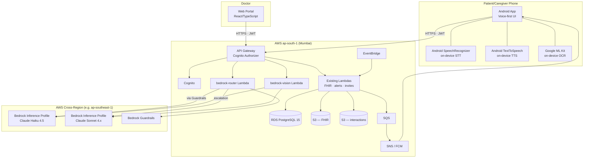
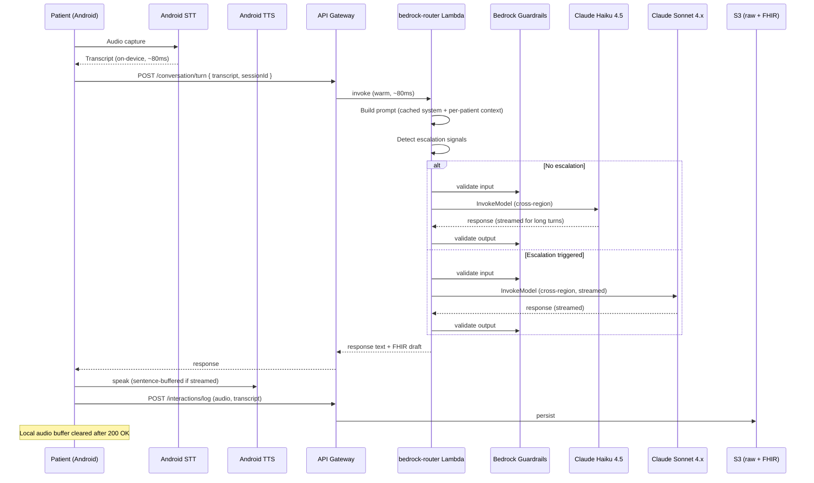
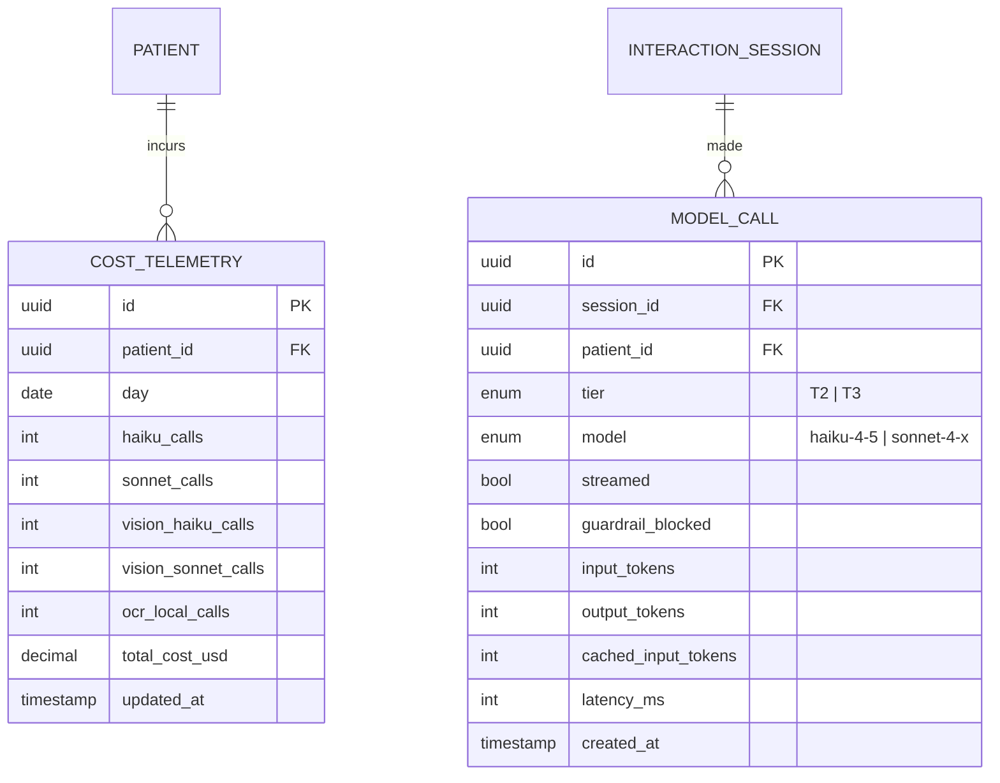

# Matika — Product Requirements Document

**Version:** 2.0
**Date:** May 2026
**Status:** Draft for Review
**Classification:** Confidential
**Replaces:** `docs/carelog_prd.md` v1.0 (April 2026)
**Brand:** Matika (renamed from CareLog)

---

## Changelog from v1.0

| Area | v1.0 | v2.0 |
|---|---|---|
| Inference platform | Mac Mini M4 in each household, LAN-served | AWS Bedrock (cross-region inference) + on-device STT/TTS |
| LLM | Qwen / Gemma 3n on-device | Claude Haiku 4.5 (default) + Claude Sonnet 4.x (escalations) — both via Bedrock cross-region |
| STT | Whisper / IndicWhisper on Mac Mini | Android `SpeechRecognizer` on-device |
| TTS | Piper / Coqui on Mac Mini | Android `TextToSpeech` on-device |
| Vision | Qwen-VL / LLaVA on Mac Mini | ML Kit on-device OCR → Claude Haiku vision → Claude Sonnet vision (cascading) |
| Inference orchestration | App ↔ Mac Mini direct LAN calls | App → API Gateway → `bedrock-router` Lambda → Bedrock |
| Latency target | P95 < 2s end-to-end | T2 short turns < 2s P95; long turns and T3 < 3s P95; first-audio < 1.5s P95 on streamed turns |
| Compliance flow | All inference and storage in ap-south-1 | Storage in ap-south-1; inference cross-region (consent text updated) |
| Household hardware | Mac Mini per household | None (phone + cloud) |
| Brand name | CareLog | Matika |

---

## Table of Contents

1. [Executive Summary](#1-executive-summary)
2. [Problem Statement](#2-problem-statement)
3. [Goals & Success Metrics](#3-goals--success-metrics)
4. [User Personas](#4-user-personas)
5. [Core Requirements](#5-core-requirements)
6. [Core Features](#6-core-features)
7. [Core Components](#7-core-components)
8. [App / User Flows](#8-app--user-flows)
9. [Tech Stack](#9-tech-stack)
10. [Data Model](#10-data-model)
11. [Implementation Plan](#11-implementation-plan)
12. [Security & Compliance](#12-security--compliance)
13. [Risks & Mitigations](#13-risks--mitigations)
14. [Open Questions](#14-open-questions)

---

## 1. Executive Summary

Matika is a conversational, voice-first health monitoring platform for elderly patients, their caregivers, and attending physicians. Patients speak naturally — in English, Hindi, or Bengali — and the system extracts, validates, and stores structured clinical data (FHIR R4 Observations). Caregivers configure monitoring protocols by talking; doctors review longitudinal trends in a web portal.

v2 removes the per-household Mac Mini entirely. Speech-to-text and text-to-speech run on the patient's Android phone using OS-native engines. All language understanding, parameter extraction, and conversational reasoning run on AWS Bedrock — Claude Haiku 4.5 by default, with Claude Sonnet escalations for high-stakes turns. Vision-based device-display reading uses Google ML Kit on-device first, then escalates to Claude vision models on Bedrock when the on-device extractor cannot read the image.

The result: zero household hardware, instant onboarding, simpler operations, and meaningfully better conversational quality from frontier-class models — at the cost of cross-region inference (compliance disclosure required) and a per-turn cloud RTT (mitigated by streaming on long turns and prompt caching).

The pilot deploys to approximately **10 active patients** (close family and friends) and is designed to scale gracefully without re-architecting.

---

## 2. Problem Statement

### The Problem

Elderly patients do not think in terms of forms, fields, or structured inputs. They communicate in stories — how they feel, what they remember measuring. Form-based health apps are cognitively demanding, error-prone, and frequently abandoned, which degrades clinical utility.

### Who It Affects

- **Patients** (elderly, often non-tech-savvy) who need to log vitals regularly but struggle with structured interfaces.
- **Caregivers** (family members) who need visibility into the patient's health and control over what is monitored.
- **Doctors** who need structured longitudinal data to make decisions but don't have time to parse raw notes.

### Why Existing Solutions Fall Short

| Existing Approach | Limitation |
|---|---|
| Manual diaries | Unstructured, illegible, no alerts, no trends |
| Form-based apps | High friction for elderly users |
| Wearable-only | No subjective symptoms; no context |
| Telehealth | Episodic, not designed for daily monitoring |

### v1 Limitation Resolved by v2

v1 required a Mac Mini in every patient's home to run inference. This created hardware cost (~₹70K per household), shipping logistics, household setup time, and an ongoing operational burden — every household became a remote site to manage. v2 eliminates this by moving inference to the cloud and pushing only the latency-sensitive audio I/O (STT/TTS) to the patient's Android phone.

---

## 3. Goals & Success Metrics

### Goals

- Enable elderly patients to log health vitals through natural voice conversation with minimal friction.
- Allow caregivers to design and evolve monitoring protocols conversationally.
- Deliver structured, FHIR-compliant clinical data to doctors via a web portal.
- Achieve perceived response latency (speech-end → first audio out) at **P95 < 1.5s on streamed turns** and total turn latency at **P95 < 2s for short turns, < 3s for long turns and Sonnet escalations**.
- Support English, Hindi, and Bengali at launch.
- Comply with HIPAA (BAA with AWS) and India's DPDP Act (storage in ap-south-1; inference cross-region disclosed in consent).
- Eliminate per-household hardware.

### Success Metrics (Pilot Phase)

| Metric | Target |
|---|---|
| Session completion rate | > 80% of initiated sessions log all required parameters |
| Data accuracy | > 95% of extracted values match patient-intended values (post-confirmation) |
| Daily adherence | > 70% of days with complete logs within configured deadlines |
| Time-to-first-audio (P95, streamed) | < 1.5s |
| Total turn latency (P95, T2 short) | < 2s |
| Total turn latency (P95, T3 / long) | < 3s |
| Cost per active patient per day | Instrumented from day 1; cap set after 4 weeks of data |
| Patient satisfaction | Qualitative — patients find Matika easier than manual logging |

---

## 4. User Personas

| Persona | Interface | Primary Role | Key Needs | Pain Points |
|---|---|---|---|---|
| **Patient** | Android mobile app (voice-first) | Logs health data through conversation | Low-friction interaction; native language support; gentle reminders | Forgets values; intimidated by technology; finds forms confusing |
| **Caregiver** | Android mobile app (voice-first) | Configures monitoring protocols; onboards patient and doctor; receives alerts | Visibility into patient's health; control over what is tracked; anomaly alerts | Cannot always be physically present; needs confidence that logging is happening |
| **Doctor** | Web portal | Reviews structured longitudinal data; sets clinical thresholds; recommends parameters | Trends, charts, structured data; ability to override thresholds | No time for unstructured data; needs clinically actionable summaries |

### Relationships

- One caregiver per patient (1:1).
- One or more doctors per patient.
- Caregiver onboards both patient and doctor.
- Doctor can view and modify monitoring protocols but cannot onboard users.

---

## 5. Core Requirements

### Functional Requirements

| ID | Requirement | Priority | Notes |
|---|---|---|---|
| FR-01 | Conversational voice-first health data logging for patients | **Must** | Primary modality |
| FR-02 | Conversational voice-first protocol configuration for caregivers | **Must** | Parameters, frequency, deadlines |
| FR-03 | Multi-language support: English, Hindi, Bengali | **Must** | STT, TTS, and LLM must handle all three |
| FR-04 | Photo-based device reading (glucometer, BP monitor, etc.) | **Must** | ML Kit OCR primary; Bedrock vision fallback |
| FR-05 | FHIR R4 Observation generation directly from conversation | **Must** | No intermediate unstructured storage |
| FR-06 | Raw interaction logging (audio + transcripts) to cloud | **Must** | For audit, compliance, analytics |
| FR-07 | Caregiver-configured per-parameter frequency and daily deadline | **Must** | Hourly reminders after deadline |
| FR-08 | Push notifications to caregiver for anomalies and missed measurements | **Must** | Via FCM |
| FR-09 | Doctor web portal with structured longitudinal patient view | **Must** | Trends, charts, FHIR data |
| FR-10 | Doctor can modify monitoring parameters and thresholds | **Must** | Reflected in patient's next session |
| FR-11 | Caregiver onboards patient and doctor via invite links (SMS + email) | **Must** | Login credentials included |
| FR-12 | Cloud connectivity health check from mobile app | **Must** | Replaces v1 Mac Mini health check |
| FR-13 | System-recommended parameter additions (from offline analytics) | **Should** | Presented conversationally to caregiver |
| FR-14 | Doctor-recommended parameter additions (via web portal) | **Should** | Logged in backend, surfaced to caregiver |
| FR-15 | Cross-session continuity (new parameters introduced gently) | **Should** | Patient asked if they were informed |
| FR-16 | Edge case handling: implausible values, unreported symptoms, emergencies | **Should** | See Section 6.5; emergency detection runs locally **and** via Bedrock Guardrails |
| FR-17 | Text input as fallback for voice | **Should** | For noisy environments or preference |
| FR-18 | Hybrid streaming for long LLM responses | **Should** | Token-streamed Bedrock → sentence-buffered TTS |
| FR-19 | Cost telemetry per patient per day | **Must** (v2 new) | Metric used to set future cost cap |
| FR-20 | Bedrock Guardrails on every model call | **Must** (v2 new) | PHI redaction + denied medical-advice + emergency triggers |
| FR-21 | Direct Bluetooth device integration | **Won't** | Future roadmap |
| FR-22 | iOS mobile app | **Won't** | Android only at launch |
| FR-23 | Offline mode | **Won't** | Internet required; brief connectivity loss handled with retry banner |
| FR-24 | In-app messaging between caregiver and doctor | **Won't** | Deferred |
| FR-25 | Doctor onboarding patients directly | **Won't** | Caregiver remains sole onboarding hub |

### Non-Functional Requirements

| Category | Requirement | Target |
|---|---|---|
| Latency | Time-to-first-audio (streamed turns) | P95 < 1.5s |
| Latency | Total turn (T2 short, non-streamed) | P95 < 2s |
| Latency | Total turn (T3 escalation or long turn) | P95 < 3s |
| Availability | Cloud backend uptime | 99.9% |
| Availability | Bedrock cross-region inference | Best-effort (AWS-managed; subject to regional failures) |
| Security | Data encryption in transit | TLS 1.2+ |
| Security | Data encryption at rest | AES-256 / SSE-KMS |
| Compliance | HIPAA | BAA with AWS; PHI flows audited via CloudTrail + per-patient call log |
| Compliance | India DPDP Act | Storage in ap-south-1; inference cross-region disclosed in consent text |
| Accessibility | Touch targets | Minimum 48x48dp; 72dp+ for primary actions |
| Accessibility | Contrast | WCAG AA (4.5:1) |
| Languages | Supported at launch | English, Hindi, Bengali |
| Platform | Android minimum version | Android 9 (API 28)+ |

---

## 6. Core Features

### 6.1 Conversational Health Logging (Patient)

The patient interacts through a voice-first conversational interface. The system uses a dynamic conversational protocol anchored to the caregiver-configured parameter set. The Android phone captures audio, transcribes it on-device with Google `SpeechRecognizer`, sends the transcript to the `bedrock-router` Lambda, which routes to Claude Haiku (default) or Claude Sonnet (escalation), then returns the response text. The phone reads the response aloud via Android `TextToSpeech`.

**Flow:**
- Open-ended prompt ("How are you feeling today?")
- Patient responds in their native language
- System extracts health data, confirms each value, asks one follow-up at a time for missing required parameters
- All confirmed values persisted as FHIR R4 Observations

**Acceptance criteria:**
- [ ] Patient initiates a voice conversation from the home screen
- [ ] Numeric health values extracted from natural speech in all 3 languages
- [ ] Each extracted value is confirmed before recording
- [ ] One follow-up at a time for missing parameters
- [ ] FHIR R4 Observation produced per captured parameter
- [ ] Raw audio + transcripts logged to S3
- [ ] Local audio buffer cleared from device after upload acknowledgment
- [ ] Time-to-first-audio < 1.5s P95 on streamed turns

### 6.2 Photo-Based Device Reading

When a patient cannot recall a measurement, the system suggests a photo. ML Kit Text Recognition runs on-device first — for clean 7-segment glucometer/BP-cuff displays it extracts in ~150ms with no network call. If ML Kit returns no clean numeric match (or a low-confidence match), the photo is sent to Claude Haiku vision via Bedrock; if Haiku returns refusal or low confidence, the system retries with Claude Sonnet vision.

**Acceptance criteria:**
- [ ] System prompts for a photo when a value is missing
- [ ] ML Kit on-device extracts numeric values from common device displays in P95 < 300ms
- [ ] Bedrock vision fallback triggers on ML Kit miss; Sonnet escalation on Haiku miss
- [ ] Extracted value is read back to patient for verbal confirmation before recording
- [ ] On extraction failure, patient is asked to re-take or speak the value

### 6.3 Conversational Protocol Configuration (Caregiver)

The caregiver defines and evolves the monitoring protocol through conversation. During initial setup, the system asks about the patient (name, age, gender, conditions, medical history, doctors involved); the caregiver speaks naturally; the system extracts and structures. The caregiver lists health parameters, sets per-parameter frequencies and a daily deadline. Parameters can be added or removed at any time. Dev-configured **topics** (dietary restrictions, medications, hospitalizations) are woven organically into future conversations.

Caregiver onboarding turns are typically longer than patient logging turns — the system uses **streaming** to start TTS playback before generation completes, so the caregiver hears the response begin within ~600ms.

**Acceptance criteria:**
- [ ] Caregiver sets up patient profile entirely through voice
- [ ] Add/remove health parameters conversationally
- [ ] Per-parameter frequency (every N days) and daily deadline configurable
- [ ] Protocol changes reflected in patient's next session
- [ ] Topics grow patient profile organically without explicit "update" workflows

### 6.4 Reminder and Alert System

Unchanged from v1.

**Reminders (to patient):** hourly push notifications begin after the configured daily deadline if logging is incomplete.

**Alerts (to caregiver):** push notifications for anomalous readings (outside thresholds), missed measurements (frequency window expired without a log), and detected emergencies. Delivered via FCM.

### 6.5 Edge Case Handling

| Edge Case | System Behavior |
|---|---|
| **Implausible value** (e.g., BP 300/200) | LLM flags, reads back, asks patient to re-check. Soft implausibility warns; hard implausibility blocks recording. |
| **New unreported symptom** | Acknowledged, recorded as FHIR Observation (coded if possible, free-text if not), flagged to caregiver/doctor. |
| **Emergency / urgent concern** | Detected via (a) on-device keyword matching for fast-path triage, (b) Bedrock Guardrails emergency-topic trigger, (c) Sonnet escalation for nuanced cases. System advises patient to contact caregiver or emergency services; immediate FCM alert to caregiver. |
| **Patient confused or unresponsive** | System pauses, offers to try again later, notifies caregiver of incomplete session. |
| **Value mentioned but not recalled** | System suggests photo (see 6.2). |
| **Connectivity loss mid-session** | App buffers audio + state; shows "Reconnecting…"; resumes from last confirmed turn on reconnection. If down > 30s, prompts patient to retry later. |

### 6.6 System-Guided Parameter Recommendations

Unchanged from v1. Two sources: offline analytics + doctor recommendations. Surfaced to caregiver conversationally; gentle introduction to patient on acceptance.

### 6.7 Doctor Web Portal

Unchanged from v1. View patient list, longitudinal vitals, edit protocol, recommend parameters.

### 6.8 Cloud Connectivity Health Check

Replaces v1's Mac Mini health check. App periodically pings `GET /health` on the cloud API (Cognito-authenticated, returns Bedrock + Lambda + RDS status from a synthetic test). On health failure, the conversational session cannot start; the app surfaces a clear status message.

**Acceptance criteria:**
- [ ] App checks cloud health on launch and at 30s intervals while in conversational state
- [ ] On health failure, app displays a status message and disables session start
- [ ] On recovery, status clears within one poll cycle

---

## 7. Core Components

### 7.1 System Architecture

### 7.2 Component Responsibilities

| Component | Responsibility |
|---|---|
| **Android App** | Voice-first UI; on-device STT (Google `SpeechRecognizer`) and TTS (Android `TextToSpeech`); on-device OCR (ML Kit); Cognito auth; FHIR Observation construction; raw interaction logging to S3 |
| **API Gateway** | Single HTTPS entry point; Cognito JWT authorizer; route to Lambdas |
| **Cognito** | IAM for 3 user groups: `patients`, `caregivers`, `doctors`; custom attributes for persona routing |
| **bedrock-router Lambda** | Wraps every text-based model call: builds prompt, applies prompt cache, calls Bedrock (Haiku default; Sonnet on escalation signals), enforces Guardrails, streams responses where applicable, logs per-patient call telemetry |
| **bedrock-vision Lambda** | Wraps Bedrock vision calls (Haiku → Sonnet fallback) for photo OCR escalation when ML Kit misses |
| **Existing Lambdas** (post-refactor) | Patient/care-team CRUD, FHIR storage, invites, alerts, thresholds, recommendations — unchanged in scope from v1; minor refactors to remove Mac Mini coupling |
| **RDS PostgreSQL 15** | Users, persona links, parameter configs, frequencies/thresholds, consent records, audit metadata, **per-patient call cost telemetry** |
| **S3 (FHIR)** | FHIR R4 Observation JSON at `observations/{patientId}/{YYYY}/{MM}/{DD}/{id}.json`, KMS-encrypted |
| **S3 (Raw)** | Audio recordings, transcripts, photos at `interactions/{patientId}/{YYYY}/{MM}/{DD}/{sessionId}/`, KMS-encrypted |
| **SQS** | Async pipeline for alerts, recommendations |
| **SNS / FCM** | Push notifications |
| **EventBridge** | Daily-deadline checks, missed-measurement scans |
| **Bedrock (cross-region)** | Claude Haiku 4.5 (default) and Claude Sonnet 4.x (escalation) accessed via inference profiles. Bedrock Guardrails attached to every invocation. |
| **Web Portal** | Doctor's React/TypeScript app — unchanged from v1 in scope |

### 7.3 Conversational Engine Architecture (v2)

---

## 8. App / User Flows

### 8.1 Caregiver Registration and Patient Onboarding

1. Caregiver downloads Matika Android app.
2. Cognito self-registration (email/phone + password).
3. **Consent flow** — caregiver reviews and accepts:
   - DPDP consent (versioned text)
   - Voice recording consent
   - **Cross-region inference disclosure** (new in v2): "Some conversations are processed in AWS regions outside India under our agreement with AWS for healthcare data."
4. Conversational onboarding: system asks about patient; extracts and confirms profile.
5. System asks about monitoring parameters, frequencies, daily deadline.
6. Patient receives invite (SMS + email) with credentials.
7. Profile and protocol saved to backend.

### 8.2 Doctor Onboarding

Unchanged from v1. Caregiver sends invite → doctor registers via web portal → linked to patient.

### 8.3 Patient Daily Logging Session

1. Patient opens app (or taps reminder notification).
2. App checks cloud health.
3. Patient taps "Start Conversation".
4. System greets and asks open-ended question.
5. Patient responds in preferred language; on-device STT transcribes; transcript sent to `bedrock-router`.
6. System extracts data, confirms each value, asks follow-ups for missing parameters.
7. On photo request: camera opens → ML Kit OCR → (fallback Haiku → Sonnet vision) → value read back for confirmation.
8. On confirmation, FHIR Observation drafted; on session complete, all observations posted to backend; raw audio and transcript uploaded; local buffer cleared.

### 8.4 Caregiver Protocol Update

Unchanged from v1.

### 8.5 Reminder and Alert Flow

Unchanged from v1.

### 8.6 Doctor Review Flow

Unchanged from v1.

---

## 9. Tech Stack

### 9.1 Mobile App (Patient + Caregiver)

| Layer | Technology | Justification |
|---|---|---|
| Platform | Android (API 28+) | Same as v1 |
| Language | Kotlin | Same |
| UI | Jetpack Compose | Same |
| DI | Hilt | Same |
| State | ViewModel + StateFlow | Same |
| Network (cloud) | Retrofit2 + OkHttp + SSE for streaming | Same plus SSE client for streamed Bedrock responses |
| Auth | AWS Amplify (Cognito) | Same |
| FHIR | HAPI FHIR (Android) | Same |
| **STT** | **Android `SpeechRecognizer`** (on-device language packs preferred) | New in v2 |
| **TTS** | **Android `TextToSpeech`** (offline voice data) | New in v2 |
| **OCR** | **Google ML Kit Text Recognition v2** (on-device) | New in v2 |
| Push | Firebase Cloud Messaging | Same |

### 9.2 Cloud Backend (AWS — ap-south-1 storage; cross-region inference)

| Layer | Technology | Justification |
|---|---|---|
| API entry | Amazon API Gateway | Same as v1 |
| Compute | AWS Lambda (Node.js 20) | Same; new Lambdas: `bedrock-router`, `bedrock-vision` |
| Auth | Amazon Cognito | Same |
| Relational DB | RDS PostgreSQL 15 | Same; new `cost_telemetry` table |
| FHIR storage | Amazon S3 (KMS) | Same |
| Raw storage | Amazon S3 (KMS) | Same |
| Async | Amazon SQS | Same |
| Push | SNS + FCM | Same |
| Scheduling | EventBridge | Same |
| IaC | Terraform | Same |
| Secrets | Secrets Manager | Same |
| **Inference** | **AWS Bedrock (cross-region inference profile)** — Claude Haiku 4.5 + Claude Sonnet 4.x | New in v2 |
| **Inference safety** | **AWS Bedrock Guardrails** — PHI redaction + denied medical-advice + emergency triggers | New in v2 |

### 9.3 Web Portal (Doctor)

Unchanged from v1.

### 9.4 What's gone from v1

- `mac-mini/` directory and all its services (STT/TTS/LLM/Vision/Health Aggregator).
- mDNS/Bonjour discovery code in the Android app.
- `model_health_check.dart`-style polling against LAN endpoints.
- Mac Mini deployment scripts (`mac-mini/deploy/`).
- Documentation around per-household Mac Mini setup (`docs/setup-and-deployment-guide.md` Mac Mini sections).

---

## 10. Data Model

### 10.1 Core Entities

Largely unchanged from v1. Net additions:

All existing v1 tables remain. The `interaction_session` table picks up new optional columns:
- `streaming_used boolean`
- `escalations_triggered jsonb`
- `inference_region varchar` (e.g., `ap-southeast-1`)

### 10.2 Storage Strategy

Unchanged from v1, with one clarification: **inference happens in cross-region Bedrock; storage stays in ap-south-1**. No PHI persists outside ap-south-1; inference invocations transit other regions ephemerally and are subject to AWS BAA.

### 10.3 FHIR Resource Mapping

Unchanged from v1.

---

## 11. Implementation Plan

### 11.1 Phase Overview

| Phase | Name | Focus | Duration |
|---|---|---|---|
| P0 | Foundation | Bedrock setup, Lambda proxy skeleton, Android STT/TTS integration, Mac Mini deletion | 2 weeks |
| P1 | Conversational Core | bedrock-router with Haiku, prompt cache, streaming, basic conversation loop | 4 weeks |
| P2 | Vision + Escalation | ML Kit OCR, vision Lambda, Sonnet escalation triggers, Guardrails | 2 weeks |
| P3 | Caregiver Experience | Onboarding, protocol config, reminders, alerts | 3 weeks |
| P4 | Integration & Polish | Edge cases, multilingual validation, telemetry, latency tuning | 3 weeks |
| P5 | Compliance & Pilot | Updated consent for cross-region inference, BAA verification, pilot deploy | 2 weeks |

**Total: 16 weeks** (vs. 22 weeks in v1 — Mac Mini elimination saves ~6 weeks of model serving and household deployment work).

### 11.2 Phase Detail

See `docs/matika_implementation_plan_v2.md`.

---

## 12. Security & Compliance

### 12.1 HIPAA

| Requirement | Implementation |
|---|---|
| BAA with AWS | Required; covers Bedrock cross-region inference |
| PHI encryption in transit | TLS 1.2+ on all API calls; Bedrock invocations are HTTPS |
| PHI encryption at rest | AES-256 / SSE-KMS for S3 and RDS |
| Audit logging | CloudTrail for all API and Bedrock calls; per-patient call log in `model_call` table |
| Access controls | Cognito groups; IAM roles scoped per Lambda |
| Bedrock Guardrails | PHI redaction on inputs; denied medical-advice topics on outputs; emergency-trigger custom topics |
| Data retention | Configurable S3 lifecycle; default 7 years for FHIR, 30 days for raw audio (configurable per-patient) |
| Breach notification | Operational runbook |

### 12.2 India DPDP Act

| Requirement | Implementation |
|---|---|
| Explicit consent | Caregiver consent on behalf of patient at onboarding; **versioned consent text now includes cross-region inference disclosure** |
| Data localisation | All persisted patient data in ap-south-1 (Mumbai). Inference invocations transit cross-region; **no PHI persists outside India** |
| Cross-border disclosure | Privacy notice and consent text explicitly disclose that inference may execute in `ap-southeast-1` (Singapore) and `us-east-1` (US) under AWS BAA |
| Data principal rights | Export (FHIR Bundle) and deletion supported |
| Purpose limitation | No secondary use without re-consent |

### 12.3 Application Security

| Measure | Details |
|---|---|
| Certificate pinning | All API calls from mobile app to cloud |
| No PHI in logs | Stripped from device logs, analytics, crash reports |
| Token management | JWT access (1hr) + refresh (30 days); Android Keystore |
| Cognito groups | `patients`, `caregivers`, `doctors` |
| Bedrock IAM | `bedrock-router` Lambda has scoped `bedrock:InvokeModel` only on the specific inference profile ARNs; no broad Bedrock access |
| Per-patient rate limit | `bedrock-router` enforces a soft limit (e.g., 100 model calls/day) and a hard limit (500/day) — alerts caregiver and locks session on hard cap |

### 12.4 Infrastructure Security

Unchanged from v1.

---

## 13. Risks & Mitigations

### Technical Risks

| Risk | Severity | Likelihood | Mitigation |
|---|---|---|---|
| Bedrock cross-region inference quotas insufficient | High | Medium | Submit quota increase requests in P0; cache aggressively; pilot at 10 patients well below default quotas |
| First-audio latency above 1.5s P95 | High | Medium | Streaming on long/Sonnet turns; provisioned concurrency on `bedrock-router`; prompt cache; Bedrock TTFT monitored as P0 metric |
| Bedrock Guardrails false-positive on health language | Medium | Medium | Tune denied topics; build a regression test suite of legitimate health utterances (especially Hindi/Bengali idioms for symptoms); allow-list specific phrases |
| Android `SpeechRecognizer` Bengali quality insufficient | Medium | Medium | Track per-language transcription correction rate; if Bengali correction rate > 10%, swap Bengali path to Bhashini IndicConformer in v2.1 |
| Cross-region inference outage (e.g., ap-southeast-1 down) | High | Low | Bedrock inference profiles auto-route to fallback region; circuit-breaker in `bedrock-router` to retry against alternate profile |
| Cost spike from runaway escalations | Medium | Medium | Per-patient rate limit; CloudWatch alarm on Sonnet call rate; daily cost dashboard |
| ML Kit OCR false-positives (wrong number, high confidence) | Medium | Low | Always read value back to patient before recording; mismatch triggers Bedrock vision retry |
| LLM extracts incorrect values from speech | High | Medium | Always confirm before recording; Guardrails contextual grounding for vision; per-call audit |

### Business Risks

| Risk | Severity | Likelihood | Mitigation |
|---|---|---|---|
| Elderly patients uncomfortable with cloud-based conversation | Medium | Low | Caregiver introduces system; on-device STT/TTS means audio doesn't transit cloud during transcription/playback (only the transcript does). Surface this in UX copy. |
| DPDP regulator pushback on cross-border inference | Medium | Medium | Consent disclosure; AWS BAA; documented mitigation; willingness to switch to (a) all-in-region (Llama-only) on regulatory requirement |
| Pilot scope creep | Medium | Medium | Strict MoSCoW; pilot is 10 friends and family |

### Operational Risks

| Risk | Severity | Likelihood | Mitigation |
|---|---|---|---|
| Internet outage prevents conversational session | High | Low–Medium | App displays clear "Reconnecting…" state; resume from last confirmed turn on reconnection; OS-level WiFi/mobile failover at network layer |
| Patient phone OS too old for offline STT/TTS packs | Medium | Low | Pilot enrollment includes device check (Android 9+, Google Play Services current); fallback to online STT when offline pack absent |
| Bedrock model deprecation | Medium | Medium | Subscribe to Bedrock release notes; abstract model selection in `bedrock-router` so swap is config-only |

---

## 14. Open Questions

| # | Question | Context | Decision Needed By |
|---|---|---|---|
| 1 | Should we reintroduce a Bedrock T1 (Llama / Nova in ap-south-1) once telemetry shows where it'd pay off? | Currently we run Haiku-only as default tier; T1 was deferred for pilot simplicity but represents the original "tiered" intent | Post-pilot (after 4 weeks of data) |
| 2 | Cap on cost-per-patient-per-day | Deferred — set after 4 weeks of pilot telemetry | Week 8 of pilot |
| 3 | Bengali STT/TTS quality acceptable in production? | Google's Bengali offline pack is weaker than Hindi | P4 multilingual validation |
| 4 | Vision pipeline accuracy on diverse household devices | Glucometers, BP cuffs, thermometers vary widely | P2 |
| 5 | Streaming TTS sentence-boundary detection in Hindi/Bengali | Punctuation conventions differ | P1 |
| 6 | DPDP regulator interpretation of cross-region inference under BAA | Legal ambiguity around "data localisation" with ephemeral inference | P5, before pilot launch |
| 7 | When does T1 introduction become a cost-justified optimization? | Likely > 200 active patients | Future |
| 8 | iOS app | Deferred to post-pilot | Post-pilot |
| 9 | Direct Bluetooth device integration | Future roadmap | Post-pilot |

---

*Matika PRD v2.0 — May 2026 — Pilot Release — CONFIDENTIAL*
