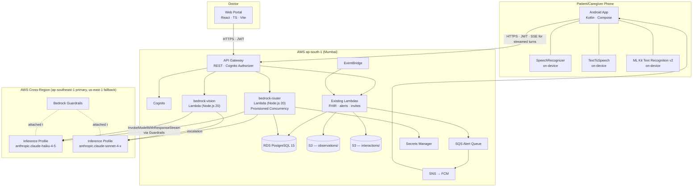

# Matika — Technical Specification

**Version:** 2.0
**Date:** May 2026
**Status:** Draft for Review
**Classification:** Confidential
**Source PRD:** `docs/matika_prd_v2.md` v2.0
**Replaces:** `docs/carelog_spec.md` v1.0 (April 2026)

---

## Table of Contents

1. [Overview](#1-overview)
2. [System Context Diagram](#2-system-context-diagram)
3. [Service Inventory](#3-service-inventory)
4. [API Contracts](#4-api-contracts)
5. [Data Schemas](#5-data-schemas)
6. [Conversation Engine Design](#6-conversation-engine-design)
7. [Inference Architecture](#7-inference-architecture)
8. [Mobile App Architecture](#8-mobile-app-architecture)
9. [Web Portal Changes](#9-web-portal-changes)
10. [Notification & Alert Engine](#10-notification--alert-engine)
11. [Security Implementation](#11-security-implementation)
12. [Testing Strategy](#12-testing-strategy)
13. [Implementation Phases](#13-implementation-phases)
14. [Deployment & Operations](#14-deployment--operations)
15. [Appendix](#15-appendix)

---

## 1. Overview

Matika v2 is a conversational health monitoring system that replaces v1's per-household Mac Mini inference stack with a cloud-native architecture. Speech-to-text and text-to-speech run on the patient's Android device using OS-native engines. Conversational reasoning, parameter extraction, and FHIR construction run on AWS Bedrock — Claude Haiku 4.5 by default, Claude Sonnet 4.x on escalation — accessed via cross-region inference profiles. All persistent data (RDS, S3) stays in ap-south-1; inference invocations transit cross-region under the AWS BAA.

The system comprises three deployable boundaries:

1. **Android mobile app** — patient and caregiver UI; on-device STT/TTS/OCR; Cognito-authenticated cloud calls.
2. **AWS backend** — API Gateway, Lambda, RDS, S3, SQS, EventBridge in ap-south-1; Bedrock + Guardrails accessed via cross-region inference profile.
3. **React web portal** — doctor's review interface (unchanged from v1 in scope; updated for new data model).

### Sections unchanged from v1

These v1 spec sections remain authoritative; v2 introduces no behavior change to:

- §10 Notification & Alert Engine (FCM, threshold evaluation, missed-measurement detection)
- §9 Web Portal API contracts (except `model_call` and `cost_telemetry` queries; see §9 here)
- Most of §5 Data Schemas (existing tables); new tables documented in §5 here
- §14 Deployment & Operations Terraform structure (modifications listed in §14 here)

---

## 2. System Context Diagram



### Communication Protocols

| Path | Protocol | Format | Auth |
|---|---|---|---|
| App ↔ API Gateway (sync turn) | HTTPS | JSON | Cognito JWT (Bearer) |
| App ↔ API Gateway (streamed turn) | HTTPS + Server-Sent Events | SSE event stream of JSON deltas | Cognito JWT |
| Lambda ↔ Bedrock | AWS SDK (`InvokeModel` / `InvokeModelWithResponseStream`) | JSON | IAM Role (cross-region inference profile ARN) |
| Lambda ↔ Bedrock Guardrails | AWS SDK (`ApplyGuardrail` or attached at invoke time) | JSON | IAM Role |
| Lambda ↔ RDS | PostgreSQL (SSL) | SQL | Secrets Manager |
| Lambda ↔ S3 | AWS SDK (HTTPS) | JSON / Binary | IAM Role |
| Lambda ↔ SQS | AWS SDK | JSON | IAM Role |
| EventBridge → Lambda | AWS invocation | JSON | IAM Role |

---

## 3. Service Inventory

### 3.1 On-Device Components

| Component | Engine | Notes |
|---|---|---|
| **STT** | `android.speech.SpeechRecognizer` with `EXTRA_PREFER_OFFLINE = true` | Languages: `en-IN`, `hi-IN`, `bn-IN`. Offline language packs prompted on first use. Falls back to online STT silently if pack missing — telemetry tags whether offline path was used. |
| **TTS** | `android.speech.tts.TextToSpeech` | Same languages. Offline voice data downloaded at onboarding. Uses `QUEUE_ADD` for sentence-buffered streamed responses. |
| **OCR** | Google ML Kit Text Recognition v2 (`com.google.mlkit:text-recognition`) | On-device only. Returns text blocks with bounding boxes + confidence. Numeric extraction layer in app post-processes blocks for value + unit. |

### 3.2 AWS Lambda Functions

#### New in v2

| Lambda | Runtime | Provisioned Concurrency | Responsibility | Trigger |
|---|---|---|---|---|
| **bedrock-router** | Node.js 20 | 1 (pilot scale) | Receives transcript + session context; applies prompt cache; invokes Bedrock (Haiku default; Sonnet on escalation signals); enforces Guardrails; returns response (sync or SSE-streamed); records `model_call` telemetry | API Gateway POST `/conversation/turn` |
| **bedrock-vision** | Node.js 20 | 0 (on-demand; warm via scheduled ping) | Receives photo (S3 presigned key) + parameter context; invokes Haiku vision; on low confidence escalates to Sonnet vision; returns extracted value + confidence | API Gateway POST `/conversation/photo-extract` |

#### Modified in v2

| Lambda | Modification |
|---|---|
| `health-check` (new) | Aggregates Bedrock connectivity test + RDS ping + S3 list; replaces v1 Mac Mini health endpoint |
| `store-interaction` | Unchanged contract; new optional fields `streaming_used`, `inference_region`, `escalations_triggered` |
| `construct-fhir-batch` | Unchanged contract; called by app after session complete |

#### Removed in v2

| Lambda | Reason |
|---|---|
| `fetch-session-config` | Folded into `bedrock-router` — config now loaded server-side per turn instead of fetched by app and forwarded |

#### Unchanged from v1

All other Lambdas (`invite-caregiver`, `invite-doctor`, `accept-invite`, `post-confirmation`, `create-patient`, `threshold-crud`, `alert-crud`, `reminder-crud`, `notification-sender`, `patient-summary`, `care-team`, `device-token`, `evaluate-thresholds-batch`, `check-missed-measurements`, `check-daily-deadline`, `manage-recommendations`).

### 3.3 Bedrock Configuration

| Resource | Configuration |
|---|---|
| Inference profile (Haiku) | `global.anthropic.claude-haiku-4-5-20251001-v1:0` (cross-region global profile; matches `BEDROCK_HAIKU_MODEL_ID` on the dev `bedrock-router` Lambda and the live `model_call.model` values) |
| Inference profile (Sonnet) | `global.anthropic.claude-sonnet-4-6` |
| Guardrail | One Matika guardrail with: PII filters (PHONE, EMAIL, NAME redaction off — we need names; ADDRESS off; CREDIT_CARD/SSN/PASSPORT/IBAN redact); denied topics (medication-dosage-advice, surgical-recommendation, prognosis-statement); custom topic triggers (self-harm, suicide-ideation, chest-pain-emergency); contextual grounding on outputs |
| Prompt caching | Enabled on system prompt (large, stable, ~3K tokens) and on per-patient context block (medium, semi-stable, ~1K tokens). 5-minute TTL. |

### 3.4 Mobile App

| Component | Technology | Description |
|---|---|---|
| Android App | Kotlin · Jetpack Compose · Hilt · Retrofit2 | Single APK, dual persona (patient + caregiver). New modules: `app/src/main/java/com/matika/inference/` (cloud client, SSE), `app/src/main/java/com/matika/audio/` (STT + TTS wrappers), `app/src/main/java/com/matika/vision/` (ML Kit OCR wrapper) |

### 3.5 Web Portal

Unchanged from v1. New API endpoints documented in §9.

---

## 4. API Contracts

### 4.1 Cloud API — `bedrock-router` Lambda

#### `POST /conversation/turn` (sync)

Used for short patient utterances and simple confirmations.

**Request body:**
```json
{
  "sessionId": "uuid-v4",
  "patientId": "uuid-v4",
  "transcript": "BP is one thirty over eighty five",
  "language": "en-IN",
  "turnSequence": 3,
  "clientHints": {
    "preferStreaming": false,
    "deviceLatencyEstimateMs": 80
  }
}
```

**Response 200:**
```json
{
  "responseText": "I heard one thirty over eighty five. Is that correct?",
  "ttsHints": {
    "language": "en-IN",
    "rate": 0.95,
    "spellOutNumbers": false
  },
  "extractedValues": [
    {
      "parameter": "blood_pressure_systolic",
      "value": 130,
      "unit": "mmHg",
      "loincCode": "8480-6",
      "status": "pending_confirmation",
      "confidence": 0.94
    },
    {
      "parameter": "blood_pressure_diastolic",
      "value": 85,
      "unit": "mmHg",
      "loincCode": "8462-4",
      "status": "pending_confirmation",
      "confidence": 0.94
    }
  ],
  "sessionState": {
    "capturedThisSession": ["blood_pressure_systolic", "blood_pressure_diastolic"],
    "pendingConfirmation": ["blood_pressure_systolic", "blood_pressure_diastolic"],
    "stillNeeded": ["blood_glucose", "weight"]
  },
  "actions": [],
  "telemetry": {
    "tier": "T2",
    "model": "claude-haiku-4-5",
    "latencyMs": 612,
    "inputTokens": 1840,
    "cachedInputTokens": 1420,
    "outputTokens": 28,
    "guardrailBlocked": false,
    "inferenceRegion": "ap-southeast-1"
  }
}
```

**Actions vocabulary** (driven by LLM tool-use or structured output):
- `request_photo` — patient should be prompted to take a photo
- `escalate_emergency` — emergency detected; show emergency UI + send caregiver alert
- `pause_session` — patient is confused/unresponsive; pause and offer retry
- `complete_session` — all required parameters captured; finalize FHIR
- `confirm_value` — patient confirmed a previously pending value (server returns updated `extractedValues` with `status: "confirmed"`)

**Response 4xx/5xx:**
- `400` — invalid session/patient
- `401` — missing/invalid JWT
- `403` — patient not linked to authenticated user
- `429` — per-patient rate limit hit (soft cap warning header `X-Matika-Cost-Today: 0.42`)
- `503` — Bedrock or Guardrails unavailable

#### `POST /conversation/turn-stream` (streaming)

Same request body. Response is `text/event-stream` (SSE).

**Event types:**

```
event: prelude
data: {"sessionId":"...","tier":"T3","model":"claude-sonnet-4-x","streamId":"..."}

event: token
data: {"text":"I "}

event: token
data: {"text":"see "}

event: sentence
data: {"text":"I see you mentioned your blood pressure was high earlier this week.","sentenceIndex":0}

event: extracted
data: {"parameter":"blood_pressure_systolic","value":130,"unit":"mmHg","status":"pending_confirmation"}

event: action
data: {"type":"request_photo","reason":"value_not_recalled"}

event: telemetry
data: {"tier":"T3","model":"claude-sonnet-4-x","latencyMs":1842,"inputTokens":2100,"cachedInputTokens":1420,"outputTokens":85,"guardrailBlocked":false}

event: done
data: {"sessionState":{...}}
```

The Android app subscribes to `sentence` events and queues each sentence to TTS as it arrives (`QUEUE_ADD`). `token` events are used only for UI text reveal animation, not TTS. `action` events are processed in real time.

### 4.2 Cloud API — `bedrock-vision` Lambda

#### `POST /conversation/photo-extract`

**Request body:**
```json
{
  "sessionId": "uuid-v4",
  "patientId": "uuid-v4",
  "photoS3Key": "interactions/{patientId}/{YYYY}/{MM}/{DD}/{sessionId}/photos/uuid.jpg",
  "expectedParameter": "blood_glucose",
  "expectedUnit": "mg/dL",
  "deviceHint": "glucometer",
  "localOcrAttempt": {
    "rawText": "142",
    "confidence": 0.62
  }
}
```

`localOcrAttempt` is populated when ML Kit ran on-device but returned low confidence (below 0.85). The Lambda uses this as a hint but does not blindly trust it.

**Response 200:**
```json
{
  "extractedValue": {
    "parameter": "blood_glucose",
    "value": 142,
    "unit": "mg/dL",
    "loincCode": "2339-0",
    "confidence": 0.96,
    "source": "claude-haiku-4-5-vision"
  },
  "telemetry": {
    "tier": "T2_VISION",
    "haikuLatencyMs": 720,
    "sonnetUsed": false,
    "inferenceRegion": "ap-southeast-1"
  }
}
```

If Haiku returns low confidence (< 0.80), Lambda automatically escalates to Sonnet vision and returns Sonnet's result. Telemetry records both attempts.

**Response 4xx:**
- `422` — extraction failed at all tiers; client should ask patient to retry photo or speak the value

### 4.3 Cloud API — `health-check`

#### `GET /health`

Authenticated health check used by the app for connectivity gating.

**Response 200:**
```json
{
  "status": "healthy",
  "checks": {
    "rds": "up",
    "bedrock": "up",
    "bedrock_inference_region": "ap-southeast-1",
    "s3": "up",
    "lambda_warm": true
  },
  "timestamp": "2026-05-02T12:00:00Z"
}
```

**Response 503:**
```json
{
  "status": "degraded",
  "checks": { "bedrock": "down", ... },
  "timestamp": "..."
}
```

App polls every 30 seconds while in conversational state.

### 4.4 Other Cloud APIs

`POST /interactions/log`, `POST /observations/batch`, `GET /patients/{id}/summary`, etc. — unchanged from v1. See `docs/carelog_spec.md` §4.2.

### 4.5 `POST /patients/from-voice` — voice-extracted patient creation

Backs the voice-onboarding path defined in PRD §6.3.1 / §8.1. Distinct from the legacy form-driven `POST /patients` (kept for the form-fallback escape hatch). Authenticated as the caregiver who initiated the voice session; creates the new `patients` row + Cognito user atomically and emits the SMS/email invite.

**Called by:** `bedrock-router` only (not directly by Android). Invoked when a `caregiver_onboarding` session emits `complete_session` action AND the session is in **patient-profile-extraction phase** (see §6.9). Bedrock-router unpacks the LLM-extracted profile from the structured-output `patientProfile` block and POSTs to this endpoint, then transitions the session into protocol-extraction phase using the freshly-minted `patient_cognito_sub`.

**Request body:**
```json
{
  "sessionId": "uuid-v4",
  "caregiverCognitoSub": "uuid-v4",
  "patientProfile": {
    "name": "Mrs. Sharma",
    "ageYears": 72,
    "dateOfBirth": null,
    "gender": "female",
    "conditions": ["hypertension", "type 2 diabetes"],
    "medications": ["metformin 500mg twice daily"],
    "allergies": [],
    "emergencyContactName": "Mr. Sharma",
    "primaryDoctor": "Dr. Iyer",
    "primaryLanguage": "hi-IN"
  },
  "patientCredentials": {
    "email": "m.sharma@gmail.com",
    "phone": "+919876543210"
  }
}
```

`patientProfile.ageYears` and `dateOfBirth` are mutually exclusive — exactly one must be non-null. `patientCredentials.email` and `patientCredentials.phone` are mandatory (collected via the form-modal step in PRD §8.1.4.4 — voice never extracts these).

**Response (200):**
```json
{
  "patientCognitoSub": "uuid-v4",
  "patientShortId": "CL-ABCDEF",
  "patientDbId": "uuid-v4",
  "inviteSent": true
}
```

**Errors:**
- `409 patient_already_exists` — caregiver already has an active `persona_links` row to a patient with the same name; PRD §6.5 disambiguation prompt fires before this endpoint is hit, but defense-in-depth.
- `400 invalid_profile` — required fields missing or malformed.
- `502 cognito_create_failed` — Cognito user creation failed (e.g., email collides with an existing user); rolls back the `patients` insert in the same transaction.

**Atomicity.** All four side effects — `patients` row, `users` row, `persona_links` row linking the caregiver, Cognito user creation, SMS/email invite enqueue — happen in one transaction with rollback on any failure. The synthetic `pending-<sessionId>` `interaction_sessions` row created at session-start gets its `patient_id` updated to the new `patients.id` in the same transaction.

### 4.6 Care Notes API — `care-notes` Lambda (NEW)

Backs the caregiver-side surface defined in PRD §6.9. Three endpoints, all Cognito-authenticated as the caregiver user; auth handler enforces `persona_links` membership before any patient row is dereferenced.

#### `GET /patients/{patientId}/care-notes`

List care notes for the given patient. Caregiver-scoped — the auth handler 403s if the requester is not in an active `persona_links` row for `patientId`.

**Query params:**
- `status` — `unacknowledged` (default) | `acknowledged` | `all`
- `from` / `to` — ISO date bounds (inclusive); defaults to last 30 days
- `limit` — page size (default 50, max 200)
- `cursor` — opaque pagination cursor

**Response (200):**
```json
{
  "items": [
    {
      "id": "uuid-v4",
      "patientId": "uuid-v4",
      "patientShortId": "CL-012W6M",
      "sessionId": "uuid-v4",
      "turnIndex": 4,
      "source": "patient_request",
      "recipientRole": "caregiver",
      "recipientUserId": "uuid-v4",
      "recipientDisplayName": "Priya Sharma",
      "candidateUserIds": null,
      "mentionedName": "Priya",
      "disambiguationStatus": "resolved",
      "noteText": "Patient asked her caregiver to add cholesterol to the tracked vitals.",
      "noteLanguage": "en-IN",
      "acknowledgedAt": null,
      "acknowledgedBy": null,
      "createdAt": "2026-05-25T17:48:37Z"
    }
  ],
  "nextCursor": null,
  "unacknowledgedCount": 1
}
```

#### `POST /patients/{patientId}/care-notes/{noteId}/acknowledge`

Marks the note acknowledged by the calling caregiver. Idempotent — re-acking is a no-op (returns 200 with existing `acknowledgedAt`).

**Response (200):**
```json
{ "id": "uuid-v4", "acknowledgedAt": "2026-05-25T18:00:00Z", "acknowledgedBy": "uuid-v4" }
```

**Errors:**
- `403 not_in_care_team` — caller has no active `persona_links` row for the patient
- `404 note_not_found` — note does not exist OR belongs to a different patient
- `409 already_acknowledged_by_other` (informational, still 200 with `acknowledgedBy` set to the other user — UI shows "Acked by X on Y")

#### `GET /caregivers/{caregiverUserId}/care-notes/unread-count`

Tiny endpoint backing the home-screen badge — aggregates unacknowledged notes across **all** linked patients in one query against `idx_care_notes_recipient_unacked`.

**Response (200):**
```json
{ "count": 4, "perPatient": [ { "patientShortId": "CL-012W6M", "count": 2 }, { "patientShortId": "CL-PNDN1P", "count": 2 } ] }
```

Lambda named `matika-{env}-care-notes`, deployed via Terraform. Shares the `lambda_rds_cognito` IAM role pattern (adds the `care_notes` table to the SELECT/INSERT/UPDATE grant). Cold-start budget: < 1.5s P95.

---

## 5. Data Schemas

### 5.1 New Tables

```sql
-- Per-call telemetry for cost and latency analysis
CREATE TABLE model_call (
    id              UUID PRIMARY KEY DEFAULT gen_random_uuid(),
    session_id      UUID NOT NULL REFERENCES interaction_session(id),
    patient_id      UUID NOT NULL REFERENCES patient(id),
    tier            VARCHAR(16) NOT NULL CHECK (tier IN ('T2','T3','T2_VISION','T3_VISION')),
    model           VARCHAR(64) NOT NULL,  -- e.g. 'claude-haiku-4-5'
    streamed        BOOLEAN NOT NULL DEFAULT FALSE,
    guardrail_blocked BOOLEAN NOT NULL DEFAULT FALSE,
    input_tokens        INTEGER NOT NULL,
    cached_input_tokens INTEGER NOT NULL DEFAULT 0,
    output_tokens   INTEGER NOT NULL,
    latency_ms      INTEGER NOT NULL,
    inference_region VARCHAR(32) NOT NULL,
    escalation_reason VARCHAR(64),  -- 'implausible_value', 'emergency', 'caregiver_protocol', 'long_response', null for T2 default
    cost_usd        NUMERIC(10,6) NOT NULL,  -- computed at insert time
    created_at      TIMESTAMPTZ NOT NULL DEFAULT NOW()
);

CREATE INDEX idx_model_call_patient_day ON model_call (patient_id, created_at);
CREATE INDEX idx_model_call_session ON model_call (session_id);

-- Daily roll-up for fast cost dashboards
CREATE TABLE cost_telemetry (
    id              UUID PRIMARY KEY DEFAULT gen_random_uuid(),
    patient_id      UUID NOT NULL REFERENCES patient(id),
    day             DATE NOT NULL,
    haiku_calls     INTEGER NOT NULL DEFAULT 0,
    sonnet_calls    INTEGER NOT NULL DEFAULT 0,
    vision_haiku_calls INTEGER NOT NULL DEFAULT 0,
    vision_sonnet_calls INTEGER NOT NULL DEFAULT 0,
    ocr_local_calls INTEGER NOT NULL DEFAULT 0,
    total_input_tokens  INTEGER NOT NULL DEFAULT 0,
    total_cached_input_tokens INTEGER NOT NULL DEFAULT 0,
    total_output_tokens INTEGER NOT NULL DEFAULT 0,
    total_cost_usd  NUMERIC(10,4) NOT NULL DEFAULT 0,
    updated_at      TIMESTAMPTZ NOT NULL DEFAULT NOW(),
    UNIQUE (patient_id, day)
);

CREATE INDEX idx_cost_telemetry_day ON cost_telemetry (day);

-- V016 (Care Notes — patient-originated asides during a session; built as a
-- generic notes substrate so future Matika-agent observations and doctor
-- notes can share the same table without re-shaping. PRD §6.9.)
CREATE TYPE care_note_source AS ENUM (
    'patient_request',     -- captured from a patient session turn (v2.0)
    'matika_observation',  -- agent-surfaced; emitted by Matika prompts (v2.1)
    'doctor_note'          -- written from the doctor portal (Phase 2)
);

CREATE TYPE care_note_recipient_role AS ENUM ('caregiver', 'doctor');

CREATE TYPE care_note_disambiguation_status AS ENUM (
    'resolved',          -- exactly one match in the care team
    'resolved_default',  -- no name spoken; defaulted to primary caregiver
    'ambiguous',         -- multiple matches; candidate_user_ids populated
    'no_match'           -- spoken name not in the care team
);

CREATE TABLE care_notes (
    id                      UUID PRIMARY KEY DEFAULT gen_random_uuid(),
    patient_id              UUID NOT NULL REFERENCES patients(id) ON DELETE CASCADE,
    session_id              UUID REFERENCES interaction_sessions(id) ON DELETE SET NULL,
    -- nullable to allow non-session origin (future: doctor portal, scheduled jobs)
    turn_index              INTEGER,  -- which turn in the session emitted this, if applicable
    source                  care_note_source NOT NULL,
    recipient_role          care_note_recipient_role NOT NULL DEFAULT 'caregiver',
    recipient_user_id       UUID REFERENCES users(id) ON DELETE SET NULL,
    -- The resolved-to user. Null when disambiguation_status IN ('ambiguous', 'no_match').
    candidate_user_ids      UUID[] DEFAULT NULL,
    -- Populated only when disambiguation_status = 'ambiguous'; the list of users
    -- that matched the spoken referent.
    mentioned_name          TEXT,
    -- Raw spoken name/nickname as the LLM heard it ("Priya", "Bittu", "Dr. Mehta").
    -- Always populated when source = 'patient_request' AND a name was spoken,
    -- regardless of resolution outcome — so the caregiver UI can show the raw
    -- referent on ambiguous/no_match rows.
    disambiguation_status   care_note_disambiguation_status NOT NULL,
    note_text               TEXT NOT NULL,
    -- The structured note content (NOT the raw transcript snippet — that's
    -- joinable via session_id + turn_index against interaction_sessions.transcript_history).
    note_language           VARCHAR(8) NOT NULL DEFAULT 'en-IN',
    -- Match the patient session language so the caregiver UI can show with
    -- the right script + optional translation.
    acknowledged_at         TIMESTAMPTZ,
    acknowledged_by         UUID REFERENCES users(id),
    -- Caregiver who hit "Acknowledge" in the UI. Null until acked.
    created_at              TIMESTAMPTZ NOT NULL DEFAULT NOW(),
    updated_at              TIMESTAMPTZ NOT NULL DEFAULT NOW()
);

CREATE INDEX idx_care_notes_patient_unacked
    ON care_notes (patient_id, created_at DESC)
    WHERE acknowledged_at IS NULL;
-- Hot path: caregiver opening the Notes screen for a patient — list unacked
-- newest-first. Partial index keeps it small as resolved notes accumulate.

CREATE INDEX idx_care_notes_recipient_unacked
    ON care_notes (recipient_user_id, created_at DESC)
    WHERE acknowledged_at IS NULL;
-- For the unread-count badge: caregiver dashboard fans out across all linked
-- patients with one query keyed by recipient_user_id.

CREATE INDEX idx_care_notes_session ON care_notes (session_id)
    WHERE session_id IS NOT NULL;
-- For the detail view: pull the surrounding transcript turns by session_id.
```

### 5.2 Modified Tables

```sql
-- V005 (Bedrock telemetry, shipped with v2.0 base)
ALTER TABLE interaction_session
    ADD COLUMN streaming_used BOOLEAN NOT NULL DEFAULT FALSE,
    ADD COLUMN escalations_triggered JSONB,  -- e.g. ["implausible_value","emergency"]
    ADD COLUMN inference_region VARCHAR(32);

-- V006 (F17 push transport — endpoint persistence)
ALTER TABLE device_tokens
    ADD COLUMN endpoint_arn VARCHAR(256);   -- SNS Platform Endpoint ARN
CREATE INDEX idx_device_tokens_endpoint_arn
    ON device_tokens (endpoint_arn) WHERE endpoint_arn IS NOT NULL;

-- V007 (device_tokens dedup — no duplicate (user, device) rows)
CREATE UNIQUE INDEX uq_device_tokens_user_device
    ON device_tokens (user_id, device_id);

-- V008 (F23 voice patient onboarding — caregiver-driven session has no
-- patient_id yet at session creation; resolves at session-end when the
-- patient row is committed)
ALTER TABLE interaction_session
    ALTER COLUMN patient_id DROP NOT NULL;

-- V009 (F23 step 5 — caregiver-onboarding two-pass FSM states)
ALTER TYPE interaction_session_state
    ADD VALUE 'CG_ONBOARD_GREETING';
ALTER TYPE interaction_session_state
    ADD VALUE 'CG_ONBOARD_PROFILE_EXTRACT';
ALTER TYPE interaction_session_state
    ADD VALUE 'CG_ONBOARD_PROTOCOL_EXTRACT';
ALTER TYPE interaction_session_state
    ADD VALUE 'CG_ONBOARD_CONFIRM';
```

> **Migration ordering:** V001–V004 came from v1; V005–V009 ship with v2.0. Run `flyway info` after a clean migrate — all nine should be `Success`. See `docs/setup-and-deployment-guide.md` §3.3.
>
> **Schema rename deferred to v2.1:** the `alerts` table still uses v1 column names (`value`, `user_id`) and the older `alert_reads` table is absent; doctor-side queries (`doctor-patients`, `alert-crud`) carry forward the v1 shape. The v2.0 fix sweep covers the live join paths but does not rename columns — see `docs/matika_v2_migration.md` for the v2.1 rename plan.

### 5.3 S3 Key Conventions

Unchanged from v1.

### 5.4 FHIR Resource Templates

Unchanged from v1.

---

## 6. Conversation Engine Design

### 6.1 Where the engine lives

In v1 the engine ran on the Mac Mini as `mac-mini/services/llm_service.py` with in-memory Python session state. In v2 the engine is split:

- **Stateful session store**: `bedrock-router` Lambda is stateless per invocation; session state is read from RDS at the start of each turn and written back at the end. Session timeout is 30 minutes (matches v1).
- **Stateless turn handler**: each call to `bedrock-router` builds the full prompt from session state + per-patient context, invokes Bedrock, parses structured output, persists state.
- **Bedrock-side reasoning**: Claude (Haiku or Sonnet) does extraction, follow-up generation, plausibility reasoning, FHIR drafting — all in the model.

### 6.2 Session State Machine

```
[CREATED] --start--> [GREETING] --first-utterance--> [EXTRACTING]
[EXTRACTING] --value-extracted--> [PENDING_CONFIRMATION]
[PENDING_CONFIRMATION] --patient-confirms--> [EXTRACTING] (next param)
[PENDING_CONFIRMATION] --patient-corrects--> [EXTRACTING]
[EXTRACTING] --photo-needed--> [AWAITING_PHOTO] --photo-received--> [PENDING_CONFIRMATION]
[EXTRACTING] --emergency-detected--> [EMERGENCY] --notify-caregiver--> [TERMINAL]
[EXTRACTING] --implausible-value--> [PLAUSIBILITY_CHALLENGE] --confirmed/corrected--> [EXTRACTING]
[EXTRACTING] --all-required-captured--> [COMPLETE] --persist-fhir--> [TERMINAL]
[*] --idle-timeout-30min--> [TERMINAL_INCOMPLETE]
[*] --explicit-pause--> [PAUSED] --resume--> (prior state)
[*] --connectivity-lost--> [SUSPENDED] --reconnect--> (prior state)
```

The state machine is enforced in `bedrock-router` against the `interaction_session` row. Bedrock returns structured output (see §6.4) which drives transitions.

### 6.3 Prompt Templates

System prompt is large (~3K tokens) and aggressively cached. It includes:

- Persona definition ("You are Matika, a warm, patient health assistant…")
- Language rules (respond in the language the patient used; do not switch unprompted)
- Required-parameters table (LOINC codes + plausibility ranges + units)
- Conversation rules (one follow-up at a time; always confirm before recording; etc.)
- Output format spec (see §6.4)

Per-patient context block (~1K tokens, separately cached with patient-keyed cache breakpoint):

- Patient demographics, conditions, medical history
- Active monitoring protocol (parameters, frequencies, deadlines, thresholds)
- Active topics with status
- Last 3 sessions' summaries
- Pending recommendations (analytics + doctor)

Per-turn context (uncached):

- Current session state (`extractedValues`, `pendingConfirmation`, `stillNeeded`)
- Recent turn history (last 6 turns; sliding window)
- Current transcript

**Cache budget**: ~4K cached tokens × pilot conversation rate = effectively free after warm-up.

### 6.4 Structured Output Format

Claude returns JSON within `<output>` tags:

```json
{
  "responseText": "I heard one thirty over eighty five. Is that correct?",
  "ttsHints": { "language": "en-IN", "spellOutNumbers": false },
  "extractedValues": [
    { "parameter": "blood_pressure_systolic", "value": 130, "unit": "mmHg", "confidence": 0.94 }
  ],
  "actions": [],
  "stateTransition": "EXTRACTING -> PENDING_CONFIRMATION",
  "escalationReason": null
}
```

Parsed by `bedrock-router` and enforced (regex + JSON schema validation). On parse failure, retry once with a stricter system prompt; on second failure, return error 503 to client.

**Action types** (subset of `actions[].type`):

| Type | When | Payload | Handler effect |
|---|---|---|---|
| `complete_session` | All configured vitals captured OR patient explicitly opts to stop | `{ reason: string }` | Sets `interaction_session.status='complete'`; closes the session |
| `request_photo` | Patient mentions a measurement but not the value | `{ parameter: string }` | Surfaces photo-capture UI on the client |
| `escalate_emergency` | Emergency keyword detected (rule 11 of `system_v2.md`) | `{ reason: string }` | FCM alert to caregiver; halts logging flow |
| `pause_session` | Patient confused/unresponsive across two turns | `{ reason: string }` | Sets FSM to `PAUSED`; offers to resume next launch |
| `record_note` **(NEW — care notes)** | Patient surfaces a directed aside ("tell my daughter Priya to…") | See below | Inserts a `care_notes` row; resolves recipient against `persona_links` |

#### `record_note` action shape

```json
{
  "type": "record_note",
  "noteText": "Patient asked her caregiver to add cholesterol to the tracked vitals.",
  "mentionedName": "Priya",
  "recipientRole": "caregiver",
  "noteLanguage": "en-IN"
}
```

Field semantics:
- `noteText` — the LLM's structured summary of the aside, in the same language as the patient's session. **Not** the raw transcript — the LLM rewrites the patient's mention as a third-person actionable note. The full transcript snippet is reconstructable in the caregiver UI by joining `care_notes.session_id` + `turn_index` against `interaction_sessions.transcript_history`.
- `mentionedName` — the literal name/nickname/role the patient spoke (`"Priya"`, `"Bittu"`, `"my daughter"`, `"Dr. Mehta"`). Null if the patient said "tell my caregiver" with no specific name.
- `recipientRole` — `"caregiver"` (v2.0 default) or `"doctor"` (allowed in the schema but Phase 2 surface).
- `noteLanguage` — IETF language tag, matches `interaction_session.language` at the time of capture.

The handler post-processes this into a `care_notes` row. Recipient resolution flow (in `handler.ts`, after the LLM response is validated):

1. Look up the patient's active care team:
   ```sql
   SELECT u.id, u.full_name, u.preferred_name, pl.relationship
     FROM persona_links pl
     JOIN users u ON u.id = pl.user_id
    WHERE pl.patient_id = $1 AND pl.is_active = true
      AND pl.relationship IN ('caregiver', 'relative');
   ```
   (Plus a doctor lookup when `recipientRole = 'doctor'` — Phase 2.)
2. Match `mentionedName` against the result set (case-insensitive substring match against `full_name`, `preferred_name`, AND `relationship` — so "my daughter" can resolve via `relationship` even when no name is spoken).
3. Apply the disambiguation outcome table from PRD §6.9:
   - 1 match → `disambiguation_status='resolved'`, set `recipient_user_id`
   - 0 matches AND `mentionedName` IS NOT NULL → `disambiguation_status='no_match'`
   - 0 matches AND `mentionedName` IS NULL → `disambiguation_status='resolved_default'`, set `recipient_user_id` to the patient's primary caregiver (most-recent active `persona_links` row)
   - 2+ matches → `disambiguation_status='ambiguous'`, populate `candidate_user_ids`, and re-emit the next system response with a clarifying question generated by a follow-up Haiku call OR by an inline prompt directive (see §6.11)
4. Insert the `care_notes` row before returning the lambda response.

**Validation rules:**
- The handler enforces a max of **2 `record_note` actions per turn** (defends against runaway capture from a single noisy utterance). Subsequent records in the same turn are dropped and logged as `care_notes_capacity_exceeded` WARN.
- Empty `noteText` is rejected — the LLM is expected to produce a usable summary even for terse asides.
- `noteText` is hard-capped at 1000 characters before insert.

### 6.5 Escalation Logic (T2 → T3)

`bedrock-router` triggers Sonnet on these signals (computed before the model call where possible):

| Signal | Source | Why Sonnet |
|---|---|---|
| `implausible_value` | Plausibility ranges in turn handler before invoking model | Hard reasoning about whether the value is real or misheard |
| `emergency_keyword` | On-device keyword match in app, or Guardrails trigger | Empathetic + safety-first response generation |
| `caregiver_protocol_design` | Session type = `caregiver_config` AND turn involves new-parameter introduction or recommendation negotiation | Long, nuanced multi-turn |
| `cross_session_continuity` | Patient session has `pending_recommendations` with `requiresGentleIntroduction` flag | Gentle introduction of new parameters needs care |
| `low_confidence_extraction` | Previous Haiku turn returned `confidence < 0.70` on a parameter | Sonnet retry for ambiguous extraction |
| `code_switch_density_high` | Transcript contains > 30% non-primary-language tokens | Sonnet handles code-switching better |
| `long_response_expected` | System prompt indicates response will be > 100 tokens | Streaming Sonnet feels comparable to Haiku |

Escalation reasons are persisted in `model_call.escalation_reason` for telemetry analysis. After 4 weeks of pilot data, signals will be tuned to balance quality vs. cost.

### 6.6 Streaming Decision Logic

`bedrock-router` decides streaming per turn:

```
streamThis turn IF:
  tier == T3
  OR escalationReason IN (caregiver_protocol_design, cross_session_continuity, long_response_expected)
  OR clientHints.preferStreaming == true
ELSE: non-streamed response
```

Streamed responses use SSE on the API Gateway → Lambda path (`InvokeModelWithResponseStream`). Non-streamed uses regular `InvokeModel`.

### 6.7 Multi-Turn Context Management

Sliding window of last 6 turns kept in `interaction_session.transcript_history` (JSONB). On window overflow, oldest turns are summarized into a single context-summary message and pushed off the window. Summarization is itself a Haiku call (cheap, ~50 tokens output).

### 6.8 Language Detection and Switching

Language is set per-session in `interaction_session.language` (default from patient profile). On every turn, the app passes the actual `SpeechRecognizer` locale used. If it differs from session language for 2 consecutive turns, the engine switches the session language and acknowledges ("ঠিক আছে, আমরা বাংলায় কথা বলব।").

Mid-utterance code-switching is handled by the LLM directly — both Haiku and Sonnet handle Hindi/English and Bengali/English code-mixing well; Sonnet handles dense code-switching better and is the escalation target for `code_switch_density_high`.

### 6.9 `caregiver_onboarding` Session — Two-Pass Shape

Backs the voice patient onboarding flow defined in PRD §6.3.1 / §8.1. One continuous voice session that spans **two extraction phases** with a single mid-session pivot when the patient row is created.

#### Phases

| Phase | FSM bracket | Patient context | Extraction target | Persistence |
|---|---|---|---|---|
| **profile** | `CREATED` → `EXTRACTING_PROFILE` → `AWAITING_PROFILE_CONFIRMATION` → `PROFILE_CONFIRMED` | Synthetic `pending-<sessionId>` placeholder (no `patients` row yet) | Patient profile fields (PRD §6.3.1 table) | None mid-phase. At `PROFILE_CONFIRMED` + `complete_session` action → `POST /patients/from-voice` (§4.5). |
| **protocol** | `PROFILE_CONFIRMED` → `EXTRACTING` → `PENDING_CONFIRMATION` → `COMPLETE` → `TERMINAL` | Real patient context (loaded fresh from `patients` row created at the pivot) | `parameter_configs` + `patient_topics` rows | Existing T-V2-302 protocol-extraction pass at `complete_session` writes both. |

#### Session-bootstrap path

When the bedrock-router receives a turn for a session whose `interaction_sessions` row doesn't exist AND the request's `sessionType === 'caregiver_onboarding'` AND the request's `patientId` matches the synthetic `pending-<sessionId>` shape, the context loader returns a `PatientContext` stub with `patient.id = null` instead of throwing. The system prompt for caregiver_onboarding-profile knows how to drive a profile-extraction conversation without any seeded patient data.

The placeholder session row IS created in `interaction_sessions` (so F2's idle sweep can collect abandoned ones; see PRD §6.5 row "synthetic placeholder leak"). Its `patient_id` column is initially NULL — schema needs a migration to allow NULL on this column for `caregiver_onboarding` rows only (or a sentinel UUID `00000000-0000-0000-0000-000000000000` if the FK constraint can't be relaxed).

#### Mid-session pivot

On the turn that emits `complete_session` while in `PROFILE_CONFIRMED`, bedrock-router:

1. Calls `POST /patients/from-voice` with the consolidated profile + the form-collected email/phone block (passed from Android in `event.patientCredentials`).
2. On success, UPDATEs the active `interaction_sessions` row's `patient_id` to the freshly-created `patients.id`.
3. Emits a special LLM turn that pivots the conversation: "I've created Mrs. Sharma's profile. Now let's set up what we'll monitor for her." This is generated by a small dedicated prompt template (`prompts/system_v2_caregiver_onboarding_pivot.md`) — does not require a Bedrock turn; Sonnet has already emitted the closing readback.
4. Subsequent turns hit the protocol-extraction path with the real `patientId` populated, and existing T-V2-302 logic kicks in at the eventual `complete_session`.

#### Structured output extension

The LLM's structured output (§6.4) gains an optional `patientProfile` block, present only on turns within the profile phase. Schema:

```json
{
  "responseText": "...",
  "ttsHints": { "language": "hi-IN", "spellOutNumbers": false },
  "extractedValues": [],
  "actions": [{ "type": "complete_session" }],
  "stateTransition": "AWAITING_PROFILE_CONFIRMATION -> PROFILE_CONFIRMED",
  "escalationReason": null,
  "patientProfile": {
    "name": "Mrs. Sharma",
    "nameConfidence": 0.95,
    "ageYears": 72,
    "ageConfidence": 0.85,
    "gender": "female",
    "conditions": ["hypertension"],
    "medications": [],
    "allergies": [],
    "emergencyContactName": "Mr. Sharma",
    "primaryDoctor": "Dr. Iyer",
    "primaryLanguage": "hi-IN"
  }
}
```

Confidence fields are used by the LLM to guide its own re-asks; bedrock-router doesn't act on them at the API layer (the LLM already incorporated them into its readback strategy).

#### FSM additions

Two new states added to the §6.2 state machine, valid only on `caregiver_onboarding` sessions:

- `EXTRACTING_PROFILE` — profile-extraction phase active. Reachable from `CREATED`. Successors: `AWAITING_PROFILE_CONFIRMATION`, `PAUSED` (when LLM emits `pause_session` with `reason='awaiting_patient_credentials'` to trigger the form modal).
- `AWAITING_PROFILE_CONFIRMATION` — final readback delivered, waiting for caregiver yes / no / "change <field>". Successors: `PROFILE_CONFIRMED`, `EXTRACTING_PROFILE` (on field-change request), `PAUSED`.
- `PROFILE_CONFIRMED` — atomically reachable only from the `complete_session` action processed by bedrock-router AFTER `create-patient-from-voice` returns 200. Successor: `EXTRACTING` (re-entering the existing protocol-extraction lifecycle).

#### Failure / abandonment

- Voice extraction never confirms → caregiver eventually closes the app or hits the F2 idle window. Sweep marks the session `incomplete`; no `patients` row was ever created; no Cognito user; no invite.
- `create-patient-from-voice` returns `409 patient_already_exists` → bedrock-router emits a special turn surfacing the disambiguation prompt (PRD §6.5 row); session stays in `AWAITING_PROFILE_CONFIRMATION` until caregiver resolves.
- `create-patient-from-voice` returns `502 cognito_create_failed` → bedrock-router emits a turn explaining the email may be in use, and offers the form-fallback escape. Session stays in `AWAITING_PROFILE_CONFIRMATION`.
- App-side bail-out via "Use form instead" → app fires `POST /sessions/{sessionId}/end` (F2's explicit-close endpoint), then routes to the form-based onboarding screen pre-populated from whatever fields the LLM had captured up to that point.

### 6.10 Care Notes Capture (patient_logging session)

PRD §6.9 surface; the conversation engine path that produces `care_notes` rows.

**Per-turn context injection.** When a `patient_logging` session is loaded by `bedrock-router`, the per-patient context block now includes a `## Care team` section listing each active care-team member with name, preferred name (if set), and relationship:

```
## Care team

Active caregivers and family members linked to Jane:
- Priya Sharma — relationship: caregiver (daughter)
- John Doe — relationship: relative (son)
- Dr. Mehta — relationship: doctor (referenced in profile; doctor-portal Phase 2)
```

This block is fed into the system prompt before each turn so the LLM can resolve named referents in-context. The block is regenerated on each turn (cheap query against `persona_links` + `patients.primary_doctor`) to stay current with care-team changes.

**Prompt rule (new in `system_v2.md`).** A new conversation rule directs the LLM to detect directed asides and emit `record_note` actions:

> **N. If the patient asks the agent to relay something to a member of their care team** (e.g. "tell my daughter to bring my pills", "ask the doctor about my dose", "can you let my caregiver know I'm out of strips") OR makes a request that needs caregiver action (e.g. "please add cholesterol to my tracking"), **capture it as a care note** in addition to your spoken acknowledgment. Emit `actions: [{ type: "record_note", noteText: "<third-person actionable summary>", mentionedName: "<spoken referent or null>", recipientRole: "caregiver", noteLanguage: "<session language>" }]`. Your spoken response should acknowledge briefly ("I'll let Priya know.") and then return to the configured protocol — capturing the note is silent from the patient's point of view beyond the brief ack.

The rule explicitly does NOT instruct the LLM to perform name-resolution itself — that's the handler's job after the action lands. The LLM only emits the raw `mentionedName` it heard.

**Handler post-processing flow** (in `bedrock-router/src/handler.ts`):

1. After structured-output validation, scan `actions[]` for `type === 'record_note'`.
2. Enforce the 2-actions-per-turn cap from §6.4.
3. Run the recipient-resolution algorithm from §6.4 against the care-team list. The same list was injected into the prompt block, so the handler queries the same underlying `persona_links` set — keeps prompt-context and handler-resolution in sync.
4. If `disambiguation_status === 'ambiguous'`:
   a. The note row is inserted with `recipient_user_id = null` + `candidate_user_ids = [...]` + `disambiguation_status = 'ambiguous'`.
   b. The handler appends a synthetic system message to `transcript_history` for the **next turn** that says "Earlier the patient mentioned a name that matched multiple people: Priya Sharma, Priya Mehta. Politely ask which one before continuing." On the next patient turn, the LLM picks this up from context and emits a clarifying question.
   c. When the patient answers, the LLM emits a follow-up `record_note` with the disambiguating answer in `noteText` and the resolved `mentionedName` populated. The handler detects the prior ambiguous note via `session_id + recent within 5 minutes`, **updates** it (does not insert a new row) with the resolved `recipient_user_id` + `disambiguation_status = 'resolved'`, and clears `candidate_user_ids`. Sentinel pattern, keeps the note count honest.
5. Insert (or update) the `care_notes` row.
6. Lambda response payload is unchanged — `record_note` is silent to the client beyond the spoken `responseText` the LLM already produced.

**Idempotency.** The handler stores a `care_notes_idempotency` key per (`session_id`, `turn_index`, `noteText` hash). On lambda retry (which `bedrock-router` handler-level retry can do on parse failure), duplicate inserts are no-ops.

**Cost.** The care-team block adds ~80–150 input tokens per `patient_logging` turn (typically 1–4 care-team members). Prompt-cache breakpoint lives just above the `## Active monitoring protocol` block so the care-team block sits IN the cached region — net cost is ~0 after the first turn of the session. Verified via `model_call.cached_input_tokens` post-deploy.

---

## 7. Inference Architecture

### 7.1 Model Selection Per Task

| Task | Default Model | Escalation Model |
|---|---|---|
| Patient short turn (value extraction, confirmation) | Claude Haiku 4.5 | Claude Sonnet 4.x on signals (§6.5) |
| Patient long turn (open-ended monologue) | Claude Haiku 4.5 (streamed) | Sonnet on long-response signal |
| Caregiver protocol configuration | Claude Sonnet 4.x (default for this session type) | — |
| Caregiver onboarding (patient profile extraction) | Claude Sonnet 4.x | — |
| Plausibility challenge / implausible value | Claude Sonnet 4.x | — |
| Emergency detection response | Claude Sonnet 4.x | — |
| Recommendation negotiation with caregiver | Claude Sonnet 4.x | — |
| Vision OCR (clean) | ML Kit on-device | — |
| Vision OCR (ML Kit miss) | Claude Haiku 4.5 vision | Claude Sonnet 4.x vision on Haiku low-confidence |
| Context summarization (window overflow) | Claude Haiku 4.5 | — |

Note: Caregiver sessions default to Sonnet because turns are higher-stakes and longer; the latency cost is acceptable because caregivers tolerate it and the conversations are infrequent.

### 7.2 Inference Pipeline (T2 short turn)

```
[App: STT 80ms]
  → [Network: 60ms]
    → [API Gateway: 20ms]
      → [Lambda warm: 80ms]
        → [Build prompt + cache lookup: 10ms]
          → [Bedrock Guardrails input: 50ms]
            → [Bedrock Haiku invoke (cross-region): 200ms TTFT + 250ms generation]
              → [Bedrock Guardrails output: 50ms]
                → [Parse + persist state: 20ms]
                  → [Lambda response: 10ms]
                    → [API Gateway: 20ms]
                      → [Network: 60ms]
                        → [App: TTS 100ms first audio]
Total: ~810ms median; ~1670ms P95 (mostly Bedrock TTFT variance)
```

### 7.3 Inference Pipeline (T3 long streamed turn)

```
[App: STT] → [Network] → [API Gateway SSE] → [Lambda stream]
  → [Bedrock Sonnet invoke streaming (cross-region)]
    → first token at ~350ms TTFT
    → stream into Lambda → SSE chunk to App
    → App buffers tokens until first sentence-end → TTS speaks
First-audio: ~600-900ms
Full-response: ~2000-3000ms
```

### 7.4 Latency Budget Breakdown

| Stage | T2 short median | T2 short P95 | T3 long streamed (first audio) |
|---|---|---|---|
| On-device STT | 80ms | 200ms | 80ms |
| Network App→APIGW | 60ms | 120ms | 60ms |
| API Gateway | 20ms | 50ms | 20ms |
| Lambda warm | 80ms | 150ms | 80ms |
| Prompt build + cache | 10ms | 20ms | 10ms |
| Guardrails input | 50ms | 100ms | 50ms |
| Bedrock TTFT (cached) | 200ms | 400ms | 350ms |
| Bedrock generation (~30 tokens / first sentence) | 250ms | 500ms | first-sentence ~150ms |
| Guardrails output | 50ms | 100ms | streamed in parallel |
| Parse + persist | 20ms | 50ms | 20ms |
| Network APIGW→App | 60ms | 120ms | 60ms |
| Android TTS first audio | 100ms | 250ms | 100ms |
| **Total** | **~980ms** | **~1960ms** | **~1080ms first audio** |

**SLO compliance:**
- T2 short P95 < 2s ✅ (1960ms with 40ms margin)
- T3 long first-audio P95 < 1.5s ✅ (1080ms; with 420ms margin)

If P95 starts to drift over 2s, mitigations in priority order:
1. Increase prompt cache hit rate (audit which prompt segments aren't cached)
2. Bump provisioned concurrency on `bedrock-router`
3. Consider Llama 3.3 in-region as T1 fast-path for the 50% simplest turns (re-introduces tier 1)
4. Pre-warm Bedrock connection in Lambda init

### 7.5 Resource Allocation

| Resource | Pilot config (10 patients) |
|---|---|
| `bedrock-router` Lambda | 1024 MB; provisioned concurrency 1; reserved concurrency 5 |
| `bedrock-vision` Lambda | 1024 MB; on-demand; reserved concurrency 3 |
| RDS | t4g.micro (existing) |
| Bedrock quotas (Haiku) | Default cross-region quota typically sufficient; monitor `Throttling` exceptions |
| Bedrock quotas (Sonnet) | Default; expect 5-10% of Haiku call rate |
| API Gateway throttling | 100 burst / 50 rate (existing dev config sufficient) |

### 7.6 Health Check Protocol

`health-check` Lambda runs:
- RDS: `SELECT 1`
- S3: `ListObjectsV2` with `MaxKeys=1` on each bucket
- Bedrock: `InvokeModel` with a 1-token "ping" prompt against the Haiku inference profile. Bedrock charge for this is ~$0.000001/call × 1 call/30s × 86400/30 = ~$0.003/day per pilot — negligible.

Returns `degraded` if any check fails. App polls every 30 seconds while in conversational state; every 5 minutes while idle.

### 7.7 Model Update / Rollback

Model identifiers are environment-variable driven in `bedrock-router`:

```
BEDROCK_HAIKU_MODEL_ID=global.anthropic.claude-haiku-4-5-20251001-v1:0
BEDROCK_SONNET_MODEL_ID=global.anthropic.claude-sonnet-4-6
```

Updating to a newer model is a Terraform variable change + Lambda alias swap with traffic shifting (10% / 50% / 100%). Rollback is alias revert. No app update required.

---

## 8. Mobile App Architecture

### 8.1 Module / Package Structure

```
android/app/src/main/java/com/matika/
├── audio/
│   ├── stt/
│   │   ├── SttManager.kt              # Wraps SpeechRecognizer; offline pack mgmt
│   │   ├── SttResult.kt               # Sealed class: Final, Partial, Error
│   │   └── LanguagePackChecker.kt
│   └── tts/
│       ├── TtsManager.kt              # Wraps TextToSpeech; QUEUE_ADD for streamed
│       ├── SentenceQueue.kt           # Buffers sentences from streaming responses
│       └── NumberFormatter.kt         # Pre-format LLM numbers for natural readout
├── vision/
│   ├── OcrManager.kt                  # ML Kit Text Recognition v2 wrapper
│   └── DigitExtractor.kt              # Post-process text blocks → numeric value
├── inference/
│   ├── BedrockClient.kt               # Retrofit + SSE client for /conversation/turn(-stream)
│   ├── ConversationTurnRepository.kt
│   └── ConversationStateMachine.kt    # Mirrors server state machine for UI
├── auth/                               # Cognito (unchanged)
├── fhir/                               # HAPI FHIR (unchanged)
├── api/                                # Cloud REST clients (unchanged)
├── notifications/                      # FCM (unchanged)
└── ui/
    ├── conversation/                  # Voice conversation screen
    ├── photo/                         # Camera + OCR confirmation screen
    └── ...
```

### 8.2 Removed from v1

- `com.carelog.macmini.*` — entire package (mDNS discovery, LAN HTTP client, model health endpoint polling)
- `MacMiniHealthChecker` and related observers
- `LanInferenceClient`

### 8.3 Audio Capture and Streaming Pipeline

1. User taps "Start Conversation" → `SttManager.start(language)`.
2. `SpeechRecognizer.startListening()` with `RecognizerIntent.EXTRA_PREFER_OFFLINE = true`.
3. Partial results consumed for UI ("waveform + transcript preview"); final result triggers turn submission.
4. Final transcript → `ConversationTurnRepository.submitTurn()` → cloud call.
5. Audio waveform data buffered locally; uploaded as part of `POST /interactions/log` after session end; local buffer cleared on 200 OK.

Microphone is only active during STT capture; explicitly released between turns to surface clear "your turn" / "system's turn" UX states.

### 8.4 SSE Streaming Client

OkHttp's `EventSource` is not used directly (limited SSE support); a custom `BufferedReader`-based SSE consumer parses event lines and dispatches by event type. Reconnection on mid-stream errors: stop TTS playback, surface "Reconnecting…", retry once with idempotency key.

### 8.5 State Management for Conversation Sessions

A single `ConversationViewModel` holds:

- `session: SessionState` (CREATED / GREETING / EXTRACTING / …)
- `pendingConfirmation: List<ExtractedValue>`
- `transcript: String` (current turn)
- `responseSentenceQueue: Channel<String>` for streamed sentence delivery to TTS
- `connectivity: ConnectivityState` (HEALTHY / RECONNECTING / DEGRADED)

State updates are unidirectional from the cloud's `sessionState` field; client never authoritatively mutates session state.

### 8.6 Notification Handling

Unchanged from v1.

---

## 9. Web Portal Changes

### 9.1 Delta from v1

- New "Cost & Telemetry" tab (admin-only initially) showing per-patient daily Bedrock cost, escalation rate, latency P95.
- Existing patient detail page gets a "Last session telemetry" card showing tier breakdown + region.
- No changes to clinical views (vitals, FHIR timeline, protocol management).

### 9.2 New API Calls

```ts
// web-portal/src/services/telemetry.ts
GET /admin/telemetry/cost?patientId={id}&from={date}&to={date}
GET /admin/telemetry/cost/aggregate?from={date}&to={date}
GET /admin/telemetry/escalations?from={date}&to={date}
```

Restricted to a new `admins` Cognito group (1-2 internal users at pilot scale).

---

## 10. Notification & Alert Engine

Threshold evaluation + missed-measurement detection logic is unchanged from v1 (see `docs/carelog_spec.md` §10). The transport changed for v2.0:

**Push transport (v2.0, F17):**

- **SNS Platform Application** fronts FCM HTTP v1. Created once per environment via `aws sns create-platform-application --platform GCM ... --attributes PlatformCredential=<service-account-json>,AuthenticationMethod=Token`. ARN form: `arn:aws:sns:ap-south-1:<account>:app/GCM/carelog-<env>-android-fcm`.
- **FCM credential** is a Firebase service-account JSON (GCM legacy server keys deprecated 2024-06-20). Stored at `carelog-<env>/fcm-service-account` in Secrets Manager; copied immutably into the SNS Platform App at create time.
- **Device registration**: `device-token` Lambda calls `sns:CreatePlatformEndpoint` once at device registration, persists the resulting ARN to `device_tokens.endpoint_arn` (V006 column). Token refresh on the client side flows through the same lambda with the existing UUID-keyed row updated in place.
- **Alert delivery**: `notification-sender` (SQS-driven) reads `endpoint_arn` from the device_tokens join, calls `sns:Publish` directly. Fallback path: if the persisted ARN is NULL (legacy row) or the endpoint was disabled, the lambda re-creates the platform endpoint, recovering from the well-known SNS `InvalidParameter: already exists with the same Token` by extracting the existing ARN from the error message.
- **IAM**: the `notification-sender` role requires both `sns:Publish` and `sns:CreatePlatformEndpoint`. Both are in the Terraform module.
- **Android client**: `CareLogFirebaseMessagingService` must be registered in `AndroidManifest.xml` with the `com.google.firebase.MESSAGING_EVENT` intent filter (token retrieval bypasses the service, so a missing manifest entry produces silent push failures). Data-message keys are v2 lowercase: `alert_type ∈ {threshold_breach, missed_measurement, reminder}`, `parameter` follows `parameter_configs.parameter_name`, plus `value`, `threshold`, `patient_id`.

See `docs/setup-and-deployment-guide.md` §6.6 for the deployment runbook.

---

## 11. Security Implementation

### 11.1 TLS Configuration

Unchanged from v1. All HTTPS endpoints use TLS 1.2+. Certificate pinning on app for `*.execute-api.ap-south-1.amazonaws.com` with backup pin rotation.

### 11.2 Cognito Token Flow

Unchanged from v1.

### 11.3 Cross-Region Inference Data Flow

```mermaid
sequenceDiagram
    participant App
    participant APIGW (ap-south-1)
    participant Lambda (ap-south-1)
    participant Bedrock IP (ap-southeast-1)
    participant S3 (ap-south-1)

    App->>APIGW: POST /conversation/turn (PHI in body)
    APIGW->>Lambda: invoke (PHI, in-region)
    Lambda->>Bedrock IP: InvokeModel (PHI in prompt; cross-region)
    Note over Bedrock IP: Inference executes outside India.<br/>No persistent storage.<br/>Subject to AWS BAA.
    Bedrock IP-->>Lambda: response text (cross-region)
    Lambda->>S3: persist transcript + response (in-region)
    Lambda-->>APIGW: response
    APIGW-->>App: response
```

**Compliance notes:**
- AWS BAA covers Bedrock inference globally.
- DPDP consent text discloses cross-region inference explicitly.
- No PHI is persisted outside ap-south-1; inference invocations are ephemeral.
- CloudTrail logs Bedrock invocations; per-call audit available via `model_call` table.

### 11.4 IAM Scoping

`bedrock-router` Lambda execution role:

```json
{
  "Effect": "Allow",
  "Action": ["bedrock:InvokeModel", "bedrock:InvokeModelWithResponseStream"],
  "Resource": [
    "arn:aws:bedrock:ap-south-1:{ACCOUNT}:inference-profile/global.anthropic.claude-haiku-4-5-20251001-v1:0",
    "arn:aws:bedrock:ap-south-1:{ACCOUNT}:inference-profile/global.anthropic.claude-sonnet-4-6",
    "arn:aws:bedrock:*::foundation-model/anthropic.claude-haiku-4-5-20251001-v1:0",
    "arn:aws:bedrock:*::foundation-model/anthropic.claude-sonnet-4-6"
  ]
},
{
  "Effect": "Allow",
  "Action": ["bedrock:ApplyGuardrail"],
  "Resource": "arn:aws:bedrock:ap-south-1:{account}:guardrail/{matika-guardrail-id}"
}
```

No `bedrock:*` wildcard. No access to other foundation models.

### 11.5 Bedrock Guardrails Configuration

| Filter | Action | Notes |
|---|---|---|
| PII: PHONE | Anonymize | Patient/caregiver phone numbers may appear in transcripts |
| PII: EMAIL | Anonymize | |
| PII: NAME | None | We need names for natural addressing |
| PII: ADDRESS | None | Patient addresses are used in care context |
| PII: CREDIT_CARD / SSN / PASSPORT | Block | Should never appear; if they do, hard block |
| Denied topic: `medication_dosage_advice` | Block input/output | LLM should never recommend specific dosages |
| Denied topic: `surgical_recommendation` | Block | |
| Denied topic: `prognosis_statement` | Block | |
| Custom topic trigger: `self_harm_or_suicide` | Output: rewrite + flag | Triggers app-side emergency UI even if LLM didn't escalate |
| Custom topic trigger: `chest_pain_emergency` | Output: rewrite + flag | |
| Contextual grounding | Output filter | Validates vision outputs against image context |

### 11.6 Per-Patient Rate Limit

`bedrock-router` enforces:
- Soft cap: 100 model calls per patient per UTC day → adds `X-Matika-Cost-Today` warning header
- Hard cap: 500 model calls per patient per UTC day → returns 429 + alerts caregiver via FCM ("Unusual session activity — please contact support")

Cap values are pilot-tuned; expected normal usage is ~12 calls/patient/day.

### 11.7 S3 Bucket Policies, Certificate Pinning

Unchanged from v1.

---

## 12. Testing Strategy

### 12.1 Unit Tests

| Component | Coverage target |
|---|---|
| `bedrock-router` prompt builder | All escalation signals; structured output parser; cache key generation |
| `bedrock-router` state machine | All transitions; idle timeout; explicit pause |
| `bedrock-vision` fallback chain | ML Kit → Haiku → Sonnet decision logic |
| Android `SttManager` | Offline pack detection; language switching; partial vs final result |
| Android `TtsManager` | Sentence queueing; barge-in interruption; number formatting |
| Android `OcrManager` | Numeric extraction confidence thresholding |
| Cost calculation | Haiku/Sonnet/cached-token pricing accuracy |

### 12.2 Integration Tests

| Test | Stub strategy |
|---|---|
| End-to-end turn (sync) | Bedrock stubbed to return canned JSON; verifies state persists, telemetry recorded |
| End-to-end turn (streamed) | Bedrock stub emits SSE chunks; verifies app sentence queueing |
| Vision fallback | ML Kit returns low confidence → Bedrock vision called |
| Guardrails block | Bedrock returns guardrail-blocked response → state preserved, error surfaced |
| Cross-region failure | Bedrock returns 503 → fallback inference profile attempted |
| Connectivity loss mid-turn | Network drops mid-stream → app surfaces reconnecting; resumes on reconnect |

### 12.3 End-to-End Scenarios

| Scenario | Languages | Tier mix |
|---|---|---|
| Patient logs BP successfully | en, hi, bn | T2 only |
| Patient logs glucose via photo | en | ML Kit success |
| Patient logs glucose via photo on glare | en | ML Kit miss → Haiku → Sonnet |
| Patient implausible BP value | hi | T2 → T3 escalation |
| Patient mentions chest pain | en, hi | T3 emergency + Guardrail trigger + caregiver alert within 60s |
| Caregiver onboards patient | en | T3 (caregiver default) |
| Caregiver adds new parameter | en | T3 |
| Caregiver receives recommendation | en | T3 |
| Code-switching mid-utterance | hi+en, bn+en | T2 default; T3 if density high |

### 12.4 Multilingual Test Matrix

10 utterances per language × 5 health parameters × 3 noise conditions = 150 utterances per language. Recorded with elderly speakers where possible. Used for STT correction-rate baseline and end-to-end extraction accuracy.

### 12.5 Latency Benchmarking

Run 100 turns per scenario in steady state; compute median, P95, P99. Baseline before pilot launch; monitor in production via `model_call` table.

---

## 13. Implementation Phases

See `docs/matika_implementation_plan_v2.md` for task-level breakdown. Phase summary in `docs/matika_prd_v2.md` §11.

---

## 14. Deployment & Operations

### 14.1 Terraform Changes

| Module | Change |
|---|---|
| `infrastructure/terraform/modules/bedrock` (new) | Inference profile ARNs (config-only); Guardrail resource definition |
| `infrastructure/terraform/modules/lambda` | New Lambdas: `bedrock-router`, `bedrock-vision`, `health-check`. Provisioned concurrency on `bedrock-router` |
| `infrastructure/terraform/modules/iam` | New roles for the new Lambdas; scoped Bedrock policies (§11.4) |
| `infrastructure/terraform/modules/api_gateway` | New routes: `POST /conversation/turn`, `POST /conversation/turn-stream`, `POST /conversation/photo-extract`, `GET /health` |
| `infrastructure/terraform/modules/healthlake` | No changes |
| Removed | None — no Mac Mini infra was in Terraform |

### 14.2 Removed Repository Artifacts

- `mac-mini/` directory (entire)
- Any references in `docs/setup-and-deployment-guide.md` to Mac Mini setup
- Mobile app `com.carelog.macmini.*` package
- v1 Lambda `fetch-session-config` (folded into `bedrock-router`)

### 14.3 Environment Variables (`bedrock-router` Lambda)

```
BEDROCK_HAIKU_MODEL_ID=global.anthropic.claude-haiku-4-5-20251001-v1:0
BEDROCK_SONNET_MODEL_ID=global.anthropic.claude-sonnet-4-6
BEDROCK_GUARDRAIL_ID={matika-guardrail-id}
BEDROCK_GUARDRAIL_VERSION={version-number}
INFERENCE_PROFILE_REGION=ap-south-1
INFERENCE_PROFILE_FALLBACK_REGION=us-east-1
PROMPT_CACHE_TTL_SECONDS=300
SOFT_RATE_LIMIT_PER_PATIENT=100
HARD_RATE_LIMIT_PER_PATIENT=500
DB_SECRET_ARN={...}
SYSTEM_PROMPT_VERSION=v2.0
```

### 14.4 Observability

- **Per-call telemetry**: every Bedrock call written to `model_call`; rolled up to `cost_telemetry` daily.
- **CloudWatch metrics**: `BedrockTtfTMs`, `BedrockTotalLatencyMs`, `GuardrailBlockRate`, `EscalationRate`, `CostPerPatientPerDay`.
- **CloudWatch alarms**: P95 latency > SLO for 10 minutes; Guardrail block rate > 5% for 10 minutes; cost-per-patient above adaptive baseline.
- **Dashboards**: per-patient daily cost, latency P95 by tier, escalation breakdown, language distribution.

### 14.5 Pilot Operations

- 10 patients onboarded over 2 weeks.
- Daily cost review for first 4 weeks.
- Weekly latency P95 review.
- Bi-weekly transcript audit (sampled, with consent) for extraction accuracy.

---

## 15. Appendix

### 15.1 Glossary

- **Tier (T2/T3)**: Bedrock model tier. T2 = Claude Haiku 4.5 (default). T3 = Claude Sonnet 4.x (escalation).
- **Inference profile**: Bedrock cross-region routing abstraction; routes calls to one of multiple regions for capacity and availability.
- **Guardrail**: Bedrock safety layer applied at invoke time; PII redaction + denied topics + custom triggers.
- **Cached input tokens**: Tokens served from Bedrock prompt cache at ~10% of normal input cost.
- **Escalation signal**: Any of the conditions in §6.5 that route a turn to Sonnet.
- **Streamed turn**: A turn using SSE delivery for token-by-token response, enabling sentence-buffered TTS playback before generation completes.

### 15.2 Reference Links

- v1 PRD: `docs/carelog_prd.md`
- v1 Spec: `docs/carelog_spec.md`
- v2 Implementation Plan: `docs/matika_implementation_plan_v2.md`
- v2 Migration: `docs/matika_v2_migration.md`

---

*Matika Spec v2.0 — May 2026 — Pilot Release — CONFIDENTIAL*
